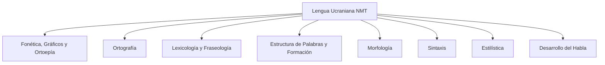
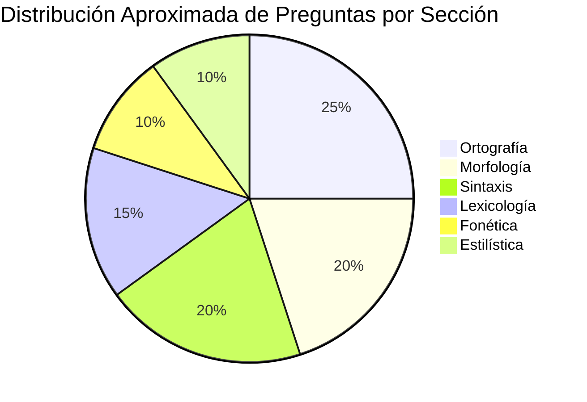

# U00: Curso Completo NMT-2025 - Lengua Ucraniana

## 📚 Información General

**Enlace al curso completo:** [НМТ-2025. Curso Completo - Playlist](https://www.youtube.com/playlist?list=PLH1iFGL1sy5j7zBs5bDgQLVmgxUuClkCi)

## 🎯 Descripción del Examen NMT 2026

El examen de Lengua Ucraniana del NMT (Prueba Nacional Multidisciplinaria) 2026 es una evaluación obligatoria para todos los estudiantes que deseen ingresar a universidades ucranianas.

### Estructura del Examen

- **Total de preguntas:** 30 tareas
- **Tipos de preguntas:**
  - 25 preguntas de opción múltiple
  - 5 preguntas de emparejamiento
- **Duración:** 120 minutos por etapa
- **Formato:** Computarizado
- **Fechas principales:** 20 de mayo - 25 de junio de 2026
- **Sesión adicional:** 17-24 de julio de 2026

### Secciones del Programa

El programa de Lengua Ucraniana para el NMT abarca las siguientes secciones principales:

## 📖 Contenido del Curso Completo

### Módulos Principales

#### 1. **Fonética y Ortografía**
- Fonética, gráficos y ortoepía
- Reglas ortográficas (3 partes)
- Pronunciación correcta
- Acentuación

#### 2. **Léxico**
- Lexicología
- Fraseología
- Sinónimos, antónimos, homónimos
- Palabras prestadas

#### 3. **Morfología**
- Estructura de palabras
- Formación de palabras
- Partes de la oración:
  - Sustantivos
  - Adjetivos
  - Pronombres
  - Verbos
  - Adverbios
  - Numerales
  - Participios
  - Gerundios
  - Partes de servicio

#### 4. **Sintaxis**
- Frases y oraciones
- Sujeto y predicado
- Complementos
- Oraciones simples y compuestas
- Oraciones subordinadas
- Oraciones sin conjunción

#### 5. **Estilística y Desarrollo del Habla**
- Estilos funcionales
- Reproducción del habla ajena
- Desarrollo de competencias comunicativas

## 🎓 Estrategia de Preparación

### Plan de Estudio Recomendado

| Semana | Tema | Horas |
|--------|------|-------|
| 1-2 | Fonética y Ortografía | 10-12 |
| 3-4 | Lexicología y Fraseología | 8-10 |
| 5-7 | Morfología (Sustantivos, Adjetivos, Verbos) | 15-18 |
| 8-9 | Morfología (Otras partes) | 10-12 |
| 10-12 | Sintaxis (Oraciones simples) | 12-15 |
| 13-14 | Sintaxis (Oraciones compuestas) | 10-12 |
| 15-16 | Estilística y Desarrollo del Habla | 8-10 |
| 17-18 | Repaso y Práctica | 12-15 |

### Consejos de Estudio

> [!TIP]
> **Práctica Regular:** Dedica al menos 1-2 horas diarias al estudio de la lengua ucraniana para mantener la consistencia.

> [!IMPORTANT]
> **Recursos Oficiales:** Utiliza siempre los materiales del Centro Ucraniano de Evaluación de la Calidad Educativa (UCEQA) para preparación oficial.

> [!NOTE]
> **Formato Computarizado:** Familiarízate con el formato digital del examen practicando en plataformas en línea.

## 📊 Distribución de Contenidos

## 🔗 Recursos Adicionales

### Plataformas Oficiales
- **UCEQA:** [testportal.gov.ua](https://testportal.gov.ua)
- **Pruebas de demostración:** Disponibles en el portal oficial
- **Tareas de ejemplo:** Actualizadas regularmente

### Material de Apoyo
- Diccionarios de lengua ucraniana
- Gramáticas de referencia
- Aplicaciones móviles para práctica
- Grupos de estudio en línea

## ✅ Lista de Verificación de Preparación

- [ ] Completar todas las 25 unidades del curso
- [ ] Realizar pruebas de práctica oficiales
- [ ] Revisar errores comunes en ortografía
- [ ] Practicar análisis sintáctico
- [ ] Estudiar conjugaciones verbales
- [ ] Memorizar reglas ortográficas clave
- [ ] Practicar con cronómetro (120 minutos)
- [ ] Revisar vocabulario especializado

## 📝 Notas Importantes

> [!WARNING]
> **Cambios en el Formato:** Aunque el formato del NMT 2026 se espera que sea similar al de años anteriores, siempre verifica las actualizaciones oficiales.

> [!CAUTION]
> **Estilística y Desarrollo del Habla:** Estas secciones pueden recibir menos atención en el formato computarizado, pero siguen siendo importantes para la comprensión integral.

## 🎯 Objetivos de Aprendizaje

Al completar este curso, deberás ser capaz de:

1. ✅ Aplicar correctamente las reglas ortográficas ucranianas
2. ✅ Identificar y usar apropiadamente todas las partes de la oración
3. ✅ Analizar estructuras sintácticas complejas
4. ✅ Comprender y aplicar conceptos de estilística
5. ✅ Demostrar competencia en el desarrollo del habla
6. ✅ Completar el examen NMT dentro del tiempo establecido

---

**Última actualización:** Enero 2026  
**Fuente:** Programa oficial NMT 2026 - UCEQA
