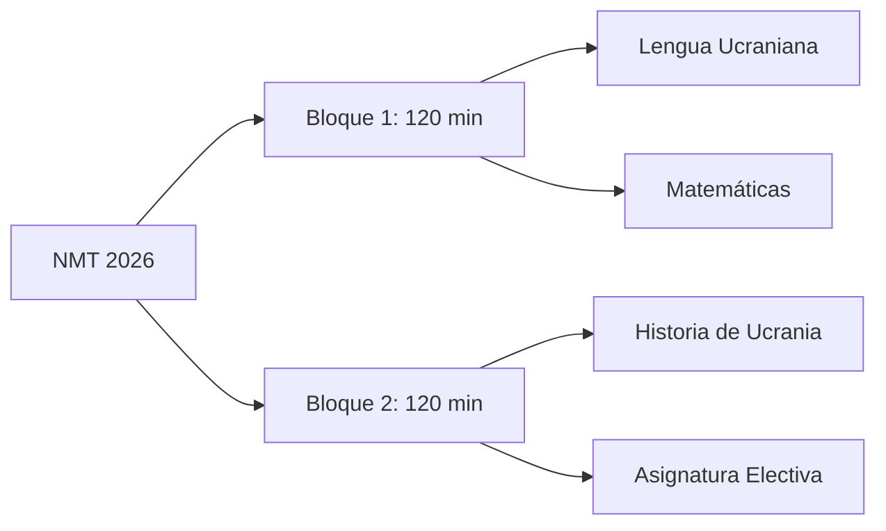

# U01: Introducción - Presentación y Características de la Prueba

## 📹 Video de la Lección

**Enlace:** [Introducción - Presentación y Características de la Prueba](https://www.youtube.com/watch?v=JMYW6GMSsUg)

## 📚 Contenido de la Unidad

### Objetivos de Aprendizaje

Al completar esta unidad, deberás ser capaz de:

- ✅ Conocer la estructura general del examen NMT 2026.
- ✅ Identificar los tipos de tareas en la sección de Lengua Ucraniana.
- ✅ Comprender el sistema de puntuación y la conversión a la escala 100-200.
- ✅ Gestionar el tiempo de manera eficiente durante la prueba.
- ✅ Familiarizarse con la plataforma computarizada del examen.

### Estructura del Examen NMT 2026

El NMT 2026 es una prueba computarizada que se divide en dos bloques de 120 minutos cada uno, con un descanso de 20 minutos entre bloques.

#### Características de la Sección de Lengua Ucraniana:

- **Número de tareas:** 30
- **Tiempo recomendado:** 60 minutos (dentro del bloque de 120 min)
- **Bloque:** Se administra junto con Matemáticas en el Bloque 1.

### Tipos de Tareas y Puntuación

> [!IMPORTANT]
> No hay preguntas de respuesta abierta (ensayos). Todas las tareas son objetivas y se califican automáticamente.

| Tipo de Tarea | Cantidad | Descripción | Puntos |
|---------------|----------|-------------|--------|
| **Opción Múltiple** | 25 | Elegir 1 respuesta correcta de 4 o 5 opciones. | 1 punto por acierto |
| **Emparejamiento** | 5 | Unir elementos de dos columnas (pares lógicos). | 1 punto por cada par (máx 4 por tarea) |

**Total de puntos brutos (test points):** 45 puntos (aproximadamente, dependiendo del número de pares en los emparejamientos).

### Sistema de Calificación

1. **Puntos Brutos:** Se obtienen inmediatamente al finalizar el examen.
2. **Escala de Calificación:** Los puntos brutos se convierten a una escala de **100 a 200 puntos** mediante una tabla de conversión oficial aprobada por el Ministerio de Educación.

### Temario Oficial (Contenido)

El examen se basa en el programa de Evaluación Externa Independiente (ZNO) e incluye:

- **Fonética, Gráficos y Ortoepía:** Sonidos, letras, acentuación.
- **Ortografía:** Reglas de escritura, mayúsculas, guiones.
- **Lexicología y Fraseología:** Significado de palabras, modismos.
- **Morfología:** Partes de la oración y sus categorías.
- **Sintaxis:** Tipos de oraciones y puntuación.
- **Estilística:** Estilos del habla y géneros textuales.

### Consejos para el Día del Examen

> [!TIP]
> **Gestión del Tiempo:** Intenta completar Lengua Ucraniana en 50-55 minutos para dejar tiempo extra para Matemáticas si es necesario.

> [!WARNING]
> **Cuidado con los Emparejamientos:** Lee todas las opciones antes de marcar. Un error en un par no anula los demás pares de la misma tarea.

## 📝 Resumen

- El examen de Lengua Ucraniana tiene 30 tareas.
- Se realiza en computadora.
- Tienes aproximadamente 60 minutos.
- No hay redacción de textos.
- Los resultados brutos se conocen al instante.

## 🔗 Recursos Adicionales

- Video de la lección: https://www.youtube.com/watch?v=JMYW6GMSsUg
- Portal Oficial UCEQA: [testportal.gov.ua](https://testportal.gov.ua)
- Simulador de NMT: [Osvita.ua](https://zno.osvita.ua/nmt/)

## ✅ Autoevaluación

- [ ] He visto el video explicativo.
- [ ] Entiendo cuántas preguntas tiene el examen.
- [ ] Conozco la diferencia entre preguntas de opción múltiple y emparejamiento.
- [ ] Sé cómo se calculan los puntos.
- [ ] He revisado la plataforma de práctica.

---

**Última actualización:** Enero 2026
**Fuente:** Ministerio de Educación y Ciencia de Ucrania / UCEQA
