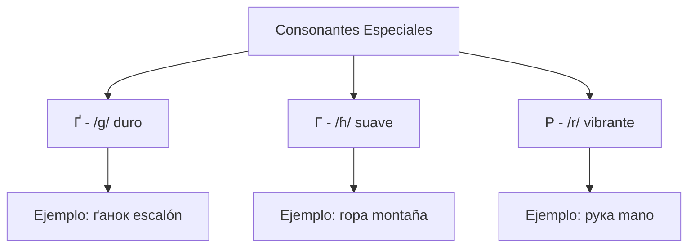
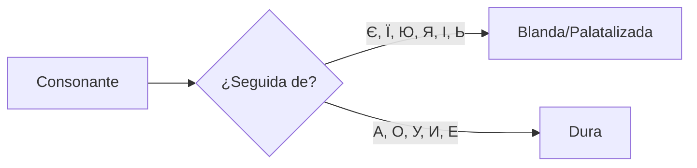
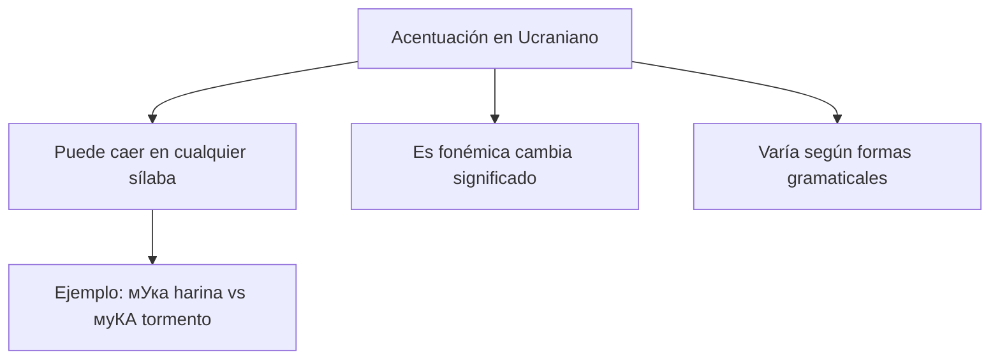
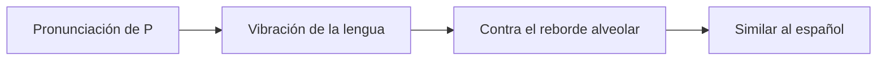

# U02: Fonética, Gráficos y Ortoepía

## 📹 Video de la Lección

**Enlace:** [НМТ 2025. Lengua Ucraniana. Seminario 2. Fonética, Gráficos y Ortoepía](https://www.youtube.com/live/zzaAUQJuDm8)

## 📚 Contenido de la Unidad

### Objetivos de Aprendizaje

Al completar esta unidad, deberás ser capaz de:

- ✅ Comprender el sistema fonético del ucraniano
- ✅ Identificar y pronunciar correctamente los 40 fonemas ucranianos
- ✅ Aplicar las reglas de ortoepía (pronunciación estándar)
- ✅ Distinguir entre consonantes duras y blandas (palatalizadas)
- ✅ Reconocer y usar correctamente los dígrafos ucranianos

### Sistema Fonético Ucraniano

> [!IMPORTANT]
> El alfabeto ucraniano tiene 33 letras que representan aproximadamente 40 fonemas. La pronunciación es relativamente directa, con cada letra correspondiendo generalmente a un sonido específico.

#### Vocales (6 fonemas)

El ucraniano tiene 6 vocales que NO distinguen entre sonidos largos y cortos:

| Letra | Fonema | Pronunciación | Ejemplo |
|-------|--------|---------------|---------|
| А | /a/ | Como "a" en "padre" | **мама** (mamá) |
| Е | /ɛ/ | Como "e" en "meta" | **мене** (me) |
| И | /ɪ~ɨ/ | Similar a "i" en "bit" | **син** (hijo) |
| І | /i/ | Como "i" en "mi" | **ім'я** (nombre) |
| О | /ɔ/ | Como "o" en "sol" | **дом** (casa) |
| У | /u/ | Como "u" en "tú" | **рука** (mano) |

#### Vocales Yotadas

Estas vocales se pronuncian como una combinación del sonido /j/ (como 'y' en 'yes') y su vocal respectiva:

| Letra | Fonema | Pronunciación | Ejemplo |
|-------|--------|---------------|---------|
| Є | /jɛ/ | "ye" como en "yes" | **є** (es/hay) |
| Ї | /ji/ | "yi" | **їжа** (comida) |
| Ю | /ju/ | "yu" como en "yuca" | **юнак** (joven) |
| Я | /ja/ | "ya" como en "ya" | **я** (yo) |

> [!NOTE]
> **Característica única:** A diferencia del ruso, las vocales no acentuadas en ucraniano tienden a mantener su calidad en lugar de reducirse a un sonido neutral, lo que contribuye al ritmo natural del idioma.

### Consonantes

#### Consonantes Únicas del Ucraniano

> [!IMPORTANT]
> **Distinción crucial:** 
> - **Ґ** (/g/): Sonido "g" duro como en "gato"
> - **Г** (/ɦ/): Sonido más suave, similar a la "h" española pero más profundo

#### Dígrafos (dos letras = un sonido)

| Dígrafo | Fonema | Pronunciación | Ejemplo |
|---------|--------|---------------|---------|
| ДЖ | /d͡ʒ/ | Como "j" en "junior" | **джаз** (jazz) |
| ДЗ | /d͡z/ | Como final de "kids" | **дзвін** (campana) |

#### Consonantes Duras y Blandas (Palatalizadas)

**Ejemplos:**
- **ти** [tɪ] (tú) - "т" dura
- **тя** [tʲa] (tía) - "т" blanda/palatalizada

### Reglas de Ortoepía

> [!IMPORTANT]
> La ortoepía establece los estándares para la pronunciación literaria del ucraniano.

#### Principios Fundamentales

1. **Principio Fonético:** Cada fonema se representa generalmente por una letra específica
2. **Eufonía:** Organización armoniosa del sonido mediante el equilibrio de vocales y consonantes
3. **Acentuación:** El acento es fonémico (puede cambiar el significado de la palabra)

#### Acentuación (Наголос)

> [!WARNING]
> **Error común:** Las sílabas no acentuadas NO se reducen como en ruso. Mantienen su calidad vocálica.

### Características Especiales

#### 1. Velarización de Consonantes

Las consonantes no palatalizadas a menudo se velarizan (se producen con el dorso de la lengua elevado):
- La "л" se convierte en [ɫ] (como la "l" inglesa en "ball")

#### 2. La "R" Vibrante

#### 3. Prolongación de Sílabas

Las sílabas no acentuadas pueden prolongarse cuando aparecen en posición final de oración.

### Ejercicios Prácticos

#### Ejercicio 1: Identificación de Vocales

Identifica las vocales en estas palabras:
1. **книга** (libro)
2. **учитель** (maestro)
3. **їжак** (erizo)
4. **юнак** (joven)

#### Ejercicio 2: Consonantes Duras vs Blandas

Determina si la consonante subrayada es dura o blanda:
1. **т**и (tú)
2. **т**я (tía)
3. **д**ім (casa)
4. **д**ень (día)

#### Ejercicio 3: Pronunciación de Dígrafos

Practica la pronunciación de:
1. **джерело** (fuente)
2. **дзвоник** (timbre)
3. **джинси** (jeans)

### Errores Comunes

> [!WARNING]
> **Evita estos errores frecuentes:**

1. **Confundir Г y Ґ:**
   - ❌ Pronunciar "гора" como "gora"
   - ✅ Pronunciar "гора" como "hora" (suave)

2. **Reducir vocales no acentuadas:**
   - ❌ Pronunciar "молоко" como "мълъко"
   - ✅ Mantener la calidad de todas las vocales

3. **No palatalizar consonantes antes de vocales blandas:**
   - ❌ Pronunciar "тя" como "та"
   - ✅ Palatalizar la "т" antes de "я"

### Tabla Comparativa: Ucraniano vs Ruso vs Español

| Característica | Ucraniano | Ruso | Español |
|----------------|-----------|------|---------|
| Reducción vocálica | NO | SÍ | Parcial |
| Г/Ґ distinción | SÍ | NO | NO |
| Vocales yotadas | 4 (Є, Ї, Ю, Я) | 4 | NO |
| R vibrante | SÍ | SÍ | SÍ |
| Palatalizaciones | SÍ | SÍ | Limitadas |

## 📝 Resumen

La fonética ucraniana se caracteriza por:
- **6 vocales** que mantienen su calidad en posiciones no acentuadas
- **4 vocales yotadas** (Є, Ї, Ю, Я)
- **Distinción única** entre Г (/ɦ/) y Ґ (/g/)
- **Consonantes duras y blandas** (palatalizadas)
- **2 dígrafos** principales (ДЖ, ДЗ)
- **Acentuación fonémica** que puede cambiar significados
- **Principio fonético** como base de la ortografía

## 🔗 Recursos Adicionales

- Video de la lección: https://www.youtube.com/live/zzaAUQJuDm8
- Material oficial NMT: [testportal.gov.ua](https://testportal.gov.ua)
- Diccionario ortoépico ucraniano
- Aplicaciones de pronunciación ucraniana

## ✅ Autoevaluación

- [ ] He visto el video completo
- [ ] Puedo identificar las 6 vocales ucranianas
- [ ] Distingo entre Г y Ґ
- [ ] Comprendo las vocales yotadas
- [ ] Puedo identificar consonantes duras y blandas
- [ ] Conozco los dígrafos ДЖ y ДЗ
- [ ] Entiendo el concepto de acentuación fonémica
- [ ] He practicado la pronunciación de ejemplos

---

**Última actualización:** Enero 2026  
**Fuente:** Programa oficial NMT 2026 - UCEQA
