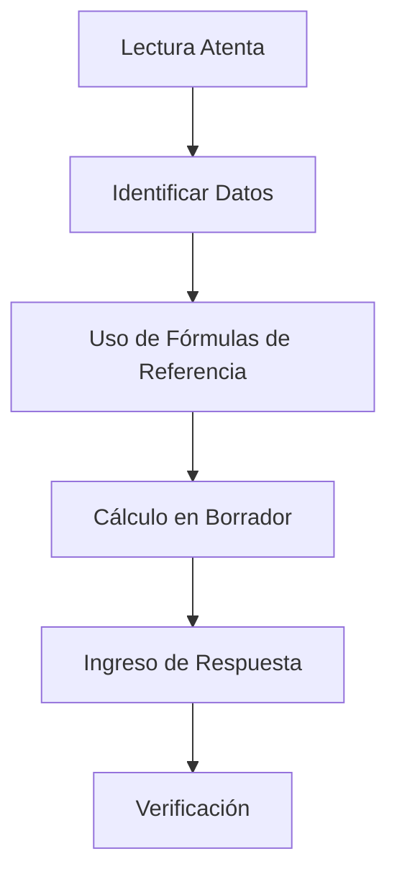

# U01: Repaso General y Ensayo General

## 📹 Video de la Lección

**Enlace:** [НМТ 2025. Matemática. Seminario 25. Resultados. Ensayo General](https://www.youtube.com/live/iRvvFVIJUjI)

## 📚 Contenido de la Unidad

### Objetivos de Aprendizaje

Al completar esta unidad, deberás ser capaz de:

- ✅ Conocer la estructura exacta del examen de matemáticas NMT 2026.
- ✅ Identificar los tres tipos de tareas y su puntuación.
- ✅ Gestionar el tiempo (60 minutos recomendados) de forma óptima.
- ✅ Utilizar los materiales de referencia permitidos durante la prueba.
- ✅ Comprender el umbral mínimo para aprobar (5 puntos brutos).

---

### Estructura del Examen de Matemática NMT 2026

El examen de matemáticas consta de **22 tareas** que deben resolverse, idealmente, en 60 minutos.

#### Tipos de Tareas y Puntuación:

| Tipo de Tarea | Cantidad | Puntos por Tarea | Total Puntos |
|---------------|----------|------------------|--------------|
| **Opción Múltiple** | 15 | 1 punto | 15 |
| **Emparejamiento** | 3 | Hasta 3 puntos | 9 |
| **Respuesta Corta** | 4 | 2 puntos | 8 |
| **TOTAL** | **22** | - | **32** |

> [!IMPORTANT]
> El puntaje máximo bruto es de **32 puntos**, que luego se convierten a la escala de **100-200**.

---

### Temas Clave del Programa

El examen evalúa tres áreas principales:

1. **Álgebra y Análisis:**
   - Números, expresiones y transformaciones.
   - Funciones (lineales, cuadráticas, raíz, potencias, exponenciales, logarítmicas, trigonométricas).
   - Ecuaciones, sistemas e inecuaciones.
   - Derivadas e integrales.
   - Combinatoria y probabilidad.

2. **Geometría Plana (Planimetría):**
   - Triángulos, cuadriláteros y polígonos.
   - Círculo y circunferencia.
   - Coordenadas y vectores.

3. **Geometría del Espacio (Estereometría):**
   - Prismas, pirámides.
   - Cuerpos de revolución (cilindro, cono, esfera).

---

### Estrategias de Resolución

### Materiales Permitidos

> [!TIP]
> Durante el examen tendrás acceso a un **cuaderno de fórmulas (fórmulas de referencia)** integrado en el sistema. ¡Aprende a usarlo antes del examen!

#### Fórmulas Esenciales que DEBES dominar:

- **Álgebra:** $(a \pm b)^2 = a^2 \pm 2ab + b^2$, Propiedades de logaritmos.
- **Geometría:** Teorema de Pitágoras $a^2 + b^2 = c^2$, Teorema del Seno y Coseno.
- **Análisis:** Tabla de derivadas básicas e integrales inmediatas.

---

### Errores Comunes en el NMT

> [!WARNING]
> **Ten cuidado con:**
> - **Unidades de medida:** Asegúrate de que todos los datos estén en las mismas unidades antes de calcular.
> - **Ceros en respuestas cortas:** Lee si piden la respuesta en unidades específicas o si hay condiciones para el redondeo.
> - **Inatención en el enunciado:** ¿Piden el valor de $x$ o la suma de las raíces?

## 📝 Resumen

- 22 preguntas en total.
- 60 minutos recomendados.
- Puntuación máxima: 32 puntos brutos.
- Se permite el uso de tablas de fórmulas proporcionadas por el sistema.
- El umbral mínimo para aprobar es de 5 puntos.

## 🔗 Recursos Adicionales

- Simulador NMT Matemática: [zno.osvita.ua](https://zno.osvita.ua/mathematics/)
- Fórmulas oficiales NMT (PDF): [testportal.gov.ua](https://testportal.gov.ua)
- Video de la lección: https://www.youtube.com/live/iRvvFVIJUjI

## ✅ Autoevaluación

- [ ] ¿Sé cuántos puntos vale cada tipo de pregunta?
- [ ] ¿He revisado el PDF de fórmulas oficiales?
- [ ] ¿Puedo resolver 22 preguntas en 60 minutos?
- [ ] ¿Entiendo la diferencia entre planimetría y estereometría?

---

**Última actualización:** Enero 2026
**Fuente:** UCEQA / Programa oficial NMT 2026
