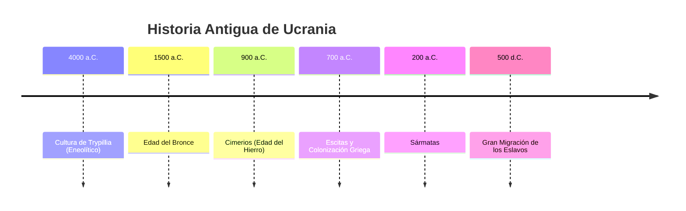
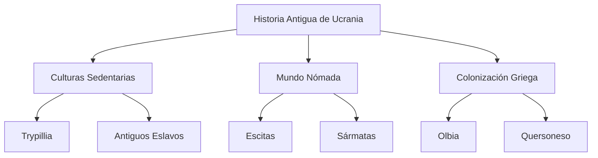

# U01: Introducción - Historia Antigua de Ucrania

## 📹 Video de la Lección

**Enlace:** [Introducción - Historia Antigua de Ucrania](https://www.youtube.com/live/eyAhiGNtqII)

## 📚 Contenido de la Unidad

### Objetivos de Aprendizaje

Al completar esta unidad, deberás ser capaz de:

- ✅ Identificar las características de la cultura de Trypillia.
- ✅ Conocer las oleadas de pueblos nómadas (cimerios, escitas, sármatas).
- ✅ Comprender la importancia de las colonias griegas en el mar Negro.
- ✅ Explicar el proceso de formación y expansión de los antiguos eslavos.

---

### 1. Cultura de Trypillia (IV - III milenio a.C.)

Considerada una de las civilizaciones más avanzadas de la Edad del Cobre (Eneolítico) en Europa.

- **Ubicación:** Entre los ríos Dniéper y Dniéster.
- **Economía:** Agricultura de cereales y ganadería.
- **Asentamientos:** "Protociudades" con casas dispuestas en círculos concéntricos.
- **Arte:** Cerámica pintada con motivos espirales (rojo, blanco, negro).
- **Religión:** Culto a la Diosa Madre (fertilidad).

---

### 2. Pueblos Nómadas de la Estepa

| Pueblo | Período | Características |
|--------|---------|-----------------|
| **Cimerios** | S. IX - VII a.C. | Primeros en usar hierro. Mencionados por Homero. |
| **Escitas** | S. VII - III a.C. | Crearon un poderoso estado (Gran Escitia). Arte animalista en oro. |
| **Sármatas** | S. III a.C. - III d.C. | Guerreros pesados, uso de catafractos (caballería protegida). |

> [!IMPORTANT]
> Los **Escitas** son cruciales para el NMT. Destaca su contacto con los griegos y el "Pectoral de oro" hallado en Tovsta Mohyla.

---

### 3. Colonización Griega (S. VII a.C. - IV d.C.)

Los griegos fundaron ciudades-estado (polis) en la costa norte del mar Negro (Ponto Euxino).

- **Principales ciudades:** Olbia, Panticapeo, Quersoneso, Tira.
- **Impacto:** Introducción de la moneda, escritura, vino, aceite y democracia.
- **Relación:** Exportaban grano escita hacia Grecia e importaban productos de lujo.

---

### 4. Los Antiguos Eslavos y la Gran Migración

Entre el s. I d.C. y el s. VII d.C., los eslavos emergen como un grupo distinto.

- **Primeras menciones:** Veneti (s. I-II), Sclaveni y Antae (s. IV-VII).
- **Gran Migración de los Eslavos (s. V-VII):** Expansión por Europa Central, Oriental y los Balcanes.
- **Antae:** Considerados por muchos historiadores como los ancestros directos de los ucranianos.
- **Economía:** Agricultura de tala y quema, vida en comunidades vecinales.

---

### 📅 Cronología

### 🗺️ Mapa Conceptual

### Errores Comunes

> [!WARNING]
> **No confundas:**
> - Los **Trypillianos** eran agricultores (sedentarios). Los **Escitas** eran nómadas.
> - El **apóstrofo** en lengua ucraniana (unidad anterior) NO tiene nada que ver con la historia antigua (¡pero no te olvides de él!).
> - La **Gran Migración de los Eslavos** ocurrió DESPUÉS de la caída de los Escitas.

## 📝 Resumen

- Ucrania fue el hogar de la avanzada cultura agrícola de **Trypillia**.
- Las estepas del sur fueron dominadas por **Escitas** (famosos por su oro).
- Los **Griegos** trajeron la civilización clásica a las costas del mar Negro.
- Los **Eslavos** se expandieron durante los siglos V-VII, sentando las bases de la futura Rus de Kiev.

## 🔗 Recursos Adicionales

- Video de la lección: https://www.youtube.com/live/eyAhiGNtqII
- Museo Nacional de Historia de Ucrania: [nmiu.org](https://nmiu.org)
- Mapa interactivo de Trypillia: [inst-arch.com.ua](http://inst-arch.com.ua)

## ✅ Autoevaluación

- [ ] ¿Cuáles son los colores típicos de la cerámica de Trypillia?
- [ ] ¿Cómo se llamaba el gran rey escita que resistió a Darío I? (Idantirso).
- [ ] Menciona 3 ciudades griegas en el actual territorio de Ucrania.
- [ ] ¿En qué siglos ocurrió la Gran Migración de los Eslavos?

---

**Última actualización:** Enero 2026
**Fuente:** Programa oficial NMT 2026 - UCEQA
