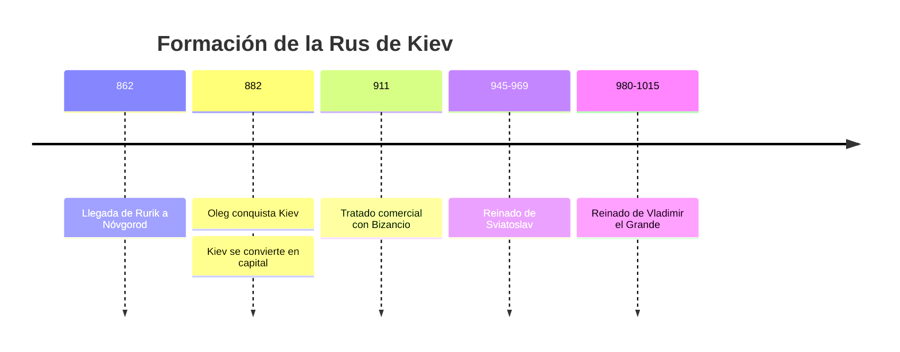
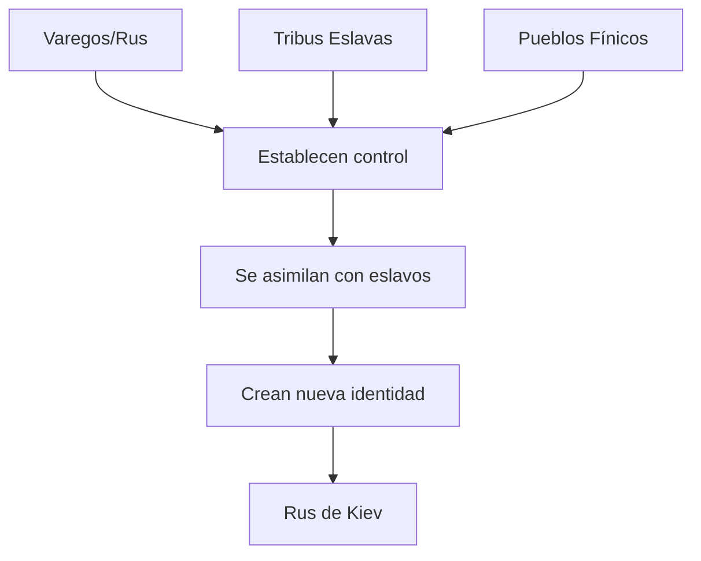
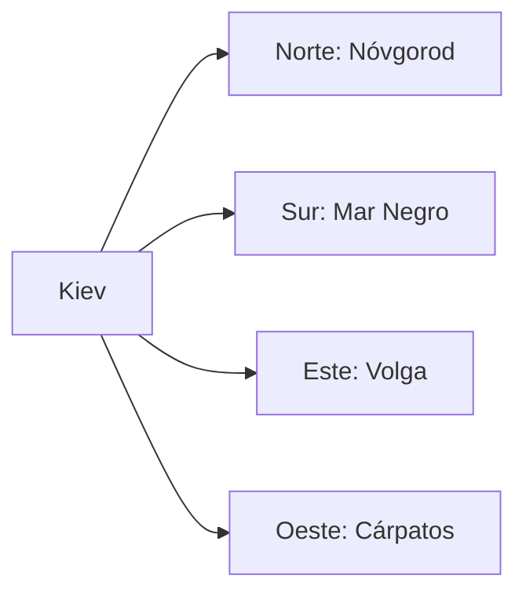
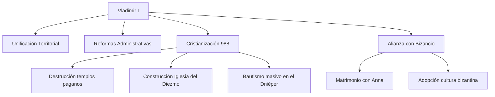
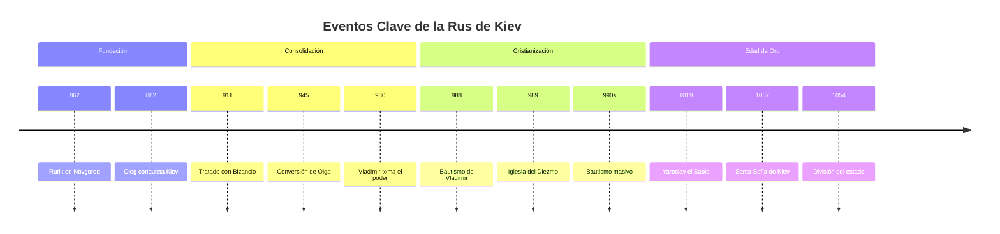
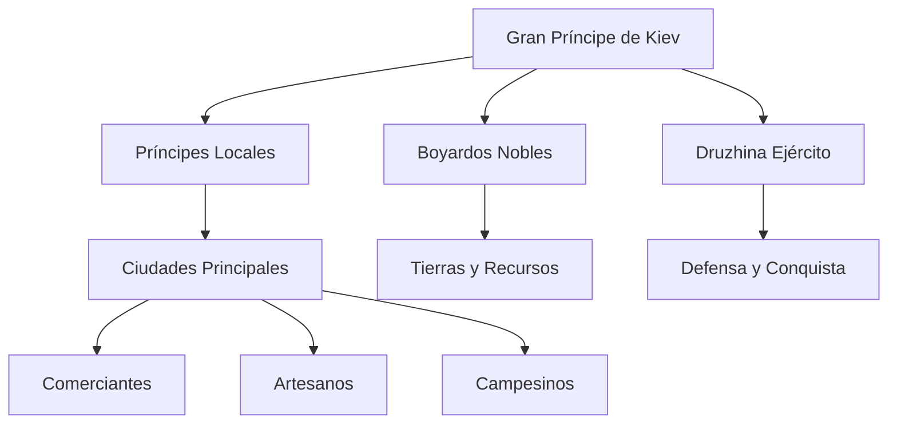
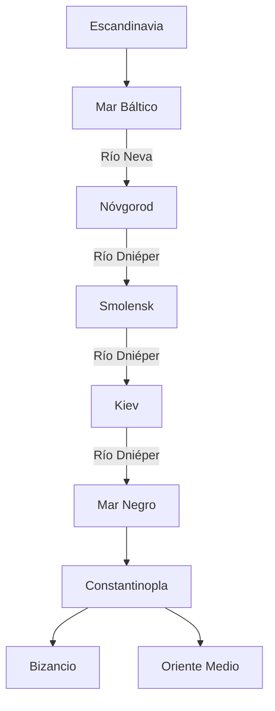
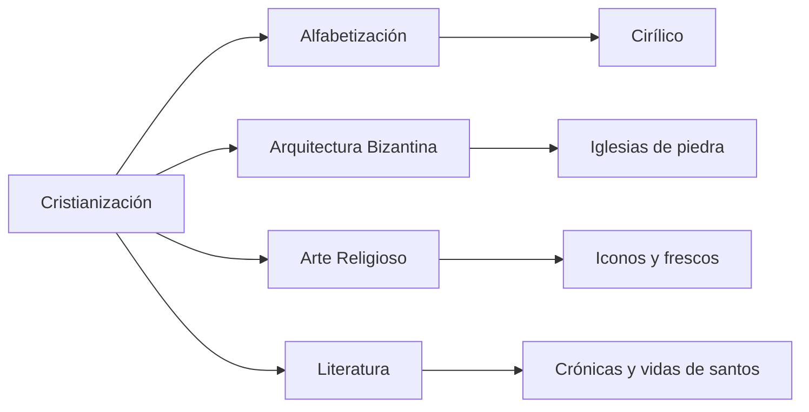
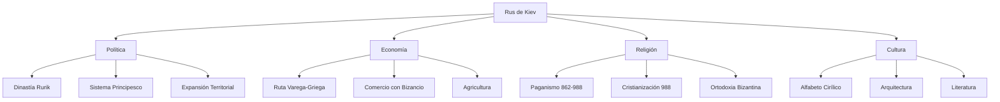

# U02: Rus-Ucrania (Estado de Kiev)

## 📹 Video de la Lección

**Enlace:** [НМТ 2025. Historia de Ucrania. Seminario 2. Rus-Ucrania (Estado de Kiev)](https://www.youtube.com/live/1JYDceiOEfQ)

## 📚 Contenido de la Unidad

### Contexto Histórico

La Rus de Kiev (Київська Русь) fue una federación política medieval que surgió en Europa del Este en el siglo IX d.C., sentando las bases para las modernas Rusia, Ucrania y Bielorrusia. Representó una fusión única de influencias eslavas y vikingas (nórdicas/varangas).

> [!IMPORTANT]
> La Rus de Kiev es considerada el primer estado eslavo oriental y la cuna de la civilización ucraniana, rusa y bielorrusa.

### Formación del Estado de Kiev

#### Orígenes (siglo IX)

#### El Papel de los Varegos

Los **varegos** (vikingos suecos conocidos como "Rus") establecieron una clase gobernante sobre las comunidades eslavas orientales:

### Eventos Principales

#### 1. Fundación por Oleg (882 d.C.)

Según la **Crónica Primaria**, el vikingo **Oleg (Oleh)** fundó el estado alrededor del 882 d.C.:

- ✅ Conquistó **Smolensk** y **Kiev**
- ✅ Hizo de **Kiev** la capital por su ubicación estratégica en el río Dniéper
- ✅ Unió tribus eslavas y finesas locales
- ✅ Derrotó a los jázaros
- ✅ Aseguró acuerdos comerciales con Constantinopla

> [!NOTE]
> La elección de Kiev como capital se debió a su posición privilegiada en la **Ruta Comercial de los Varegos a los Griegos**, que conectaba el Mar Báltico con el Mar Negro y Bizancio.

#### 2. Expansión Territorial

### Personajes Clave

#### Vladimir el Grande (Володимир Великий)

**Reinado:** 980-1015 d.C.

##### Logros Principales

| Ámbito | Logros |
|--------|--------|
| **Político** | Unificó todos los territorios eslavos orientales bajo Kiev |
| **Administrativo** | Estableció burocracia y principios legales |
| **Religioso** | Cristianización oficial en 988 d.C. |
| **Cultural** | Introdujo alfabetización y literatura nativa |
| **Legal** | Abolió pena capital, tortura judicial y mutilación |
| **Internacional** | Alianza con Imperio Bizantino |

> [!IMPORTANT]
> **La Cristianización de 988** fue un evento transformador que:
> - Proporcionó un vínculo religioso unificador
> - Transformó la cultura, el arte y la gobernanza
> - Aumentó significativamente la alfabetización
> - Fortaleció lazos con Bizancio

#### Otros Gobernantes Importantes

**Dinastía Rurik:**
- **Rurik** (fundador de la dinastía, c. 862)
- **Oleg** (882-912) - Fundador del estado
- **Igor** (912-945)
- **Olga** (945-960) - Primera cristiana, abuela de Vladimir
- **Sviatoslav** (945-972) - Gran conquistador militar
- **Vladimir el Grande** (980-1015) - Cristianizador
- **Yaroslav el Sabio** (1019-1054) - Edad de oro

### Cronología Detallada

### Estructura Social y Política

#### Organización del Estado

#### Clases Sociales

| Clase | Descripción |
|-------|-------------|
| **Príncipes** | Familia Rurik, gobernantes |
| **Boyardos** | Nobleza terrateniente |
| **Druzhina** | Guerreros profesionales |
| **Comerciantes** | Clase mercantil urbana |
| **Artesanos** | Trabajadores especializados |
| **Campesinos** | Mayoría de la población |
| **Esclavos** | Prisioneros de guerra |

### Economía y Comercio

#### Ruta Comercial Principal

#### Productos Comerciales

**Exportaciones:**
- Pieles
- Miel
- Cera
- Esclavos
- Ámbar

**Importaciones:**
- Seda
- Especias
- Vino
- Objetos de lujo bizantinos
- Armas

### Cultura y Religión

#### Antes de la Cristianización

**Religión Pagana:**
- Politeísmo eslavo
- Dioses principales: Perun (trueno), Dazhbog (sol), Mokosh (tierra)
- Templos y ídolos en Kiev

#### Después de la Cristianización (988)

**Impactos Culturales:**
- Introducción del **alfabeto cirílico**
- Construcción de **iglesias de piedra** (Iglesia del Diezmo, Santa Sofía)
- Desarrollo de **literatura religiosa**
- Adopción de **ley bizantina** (con reformas humanitarias)
- Florecimiento del **arte iconográfico**

### Importancia Histórica

> [!IMPORTANT]
> **Legado de la Rus de Kiev:**

1. **Fundación Estatal:** Primera entidad política eslava oriental organizada
2. **Identidad Cultural:** Base de las culturas ucraniana, rusa y bielorrusa
3. **Cristianización:** Transformación religiosa y cultural duradera
4. **Desarrollo Urbano:** Kiev como centro de civilización
5. **Tradiciones Legales:** Principios de gobernanza y justicia
6. **Alfabetización:** Introducción de la escritura y literatura

### Mapa Conceptual

### Fuentes Históricas

#### Fuentes Primarias

1. **Crónica Primaria** (Повість временних літ)
   - Principal fuente histórica
   - Compilada por monjes en el siglo XII
   - Narra eventos desde 850 hasta 1110

2. **Tratados con Bizancio**
   - Documentos de 911, 944, 971
   - Evidencia de relaciones diplomáticas

3. **Arqueología**
   - Excavaciones en Kiev, Nóvgorod
   - Artefactos varegos y eslavos
   - Restos de iglesias y fortificaciones

## 📝 Resumen

La **Rus de Kiev** (882-1240) fue:
- El **primer estado eslavo oriental** organizado
- Fundado por **Oleg** en 882, con Kiev como capital
- Gobernado por la **Dinastía Rurik**
- **Cristianizado** por Vladimir el Grande en 988
- Centro de **comercio** entre Escandinavia y Bizancio
- Base de las **culturas ucraniana, rusa y bielorrusa**
- Edad de oro bajo **Yaroslav el Sabio** (1019-1054)

## 🔗 Recursos Adicionales

- Video de la lección: https://www.youtube.com/live/1JYDceiOEfQ
- Material oficial NMT: [testportal.gov.ua](https://testportal.gov.ua)
- Crónica Primaria (traducción al español)
- Mapas históricos de la Rus de Kiev
- Documentales sobre Vladimir el Grande

## ✅ Autoevaluación

- [ ] He visto el video completo
- [ ] Comprendo la formación de la Rus de Kiev
- [ ] Conozco el papel de Oleg y Vladimir
- [ ] Entiendo la importancia de la cristianización de 988
- [ ] Puedo explicar la estructura social y política
- [ ] Conozco la ruta comercial varega-griega
- [ ] Comprendo el legado cultural de la Rus de Kiev
- [ ] Puedo situar los eventos en la cronología

---

**Última actualización:** Enero 2026  
**Fuente:** Programa oficial NMT 2026 - UCEQA
