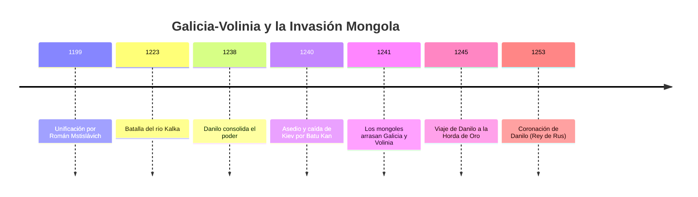
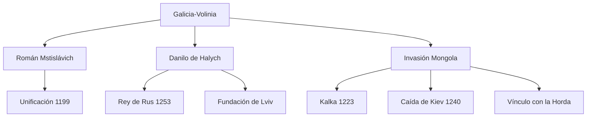

# U03: Reino de Rus (Galicia-Volinia) - Invasión Mongola

## 📹 Video de la Lección

**Enlace:** [Reino de Rus (Galicia-Volinia) - Invasión Mongola](https://www.youtube.com/live/zGVfLJlbfTw)

## 📚 Contenido de la Unidad

### Objetivos de Aprendizaje

Al completar esta unidad, deberás ser capaz de:

- ✅ Explicar la unificación de los principados de Galicia y Volinia por **Román Mstislávich**.
- ✅ Describir el reinado de **Danilo de Halych** y la importancia de su coronación en 1253.
- ✅ Analizar las causas y consecuencias de la **invasión mongola** (1239-1241).
- ✅ Identificar la importancia de la **Batalla del río Kalka** (1223).
- ✅ Comprender la dependencia política de las tierras ucranianas respecto a la **Horda de Oro**.

---

### 1. El Principado de Galicia-Volinia (Unificación 1199)

Tras la fragmentación de la Rus de Kiev, el centro de poder político se desplazó hacia el oeste.

- **Román Mstislávich (1199-1205):** Unió los principados de Galicia y Volinia. Creó un estado poderoso, sometió a los boyardos rebeldes y conquistó Kiev en 1202.
- **Importancia:** Se convirtió en el sucesor legal y político de la Rus de Kiev en territorio ucraniano.

---

### 2. Danilo de Halych (Danilo Romanóvych)

Gobernante más destacado del estado de Galicia-Volinia (reinado efectivo 1238-1264).

- **Lucha por el poder:** Tras la muerte de su padre Román, pasó años recuperando el trono de manos de boyardos y potencias extranjeras.
- **Fundación de Ciudades:** Fundó **Lviv** (en honor a su hijo Lev) y **Kholm** (su capital).
- **Coronación (1253):** Recibió la corona real del Papa Inocencio IV en Dorohochyn. Se convirtió en el primer **Rey de Rus (Rex Russiae)**. Su objetivo era crear una coalición europea contra los mongoles.

---

### 3. La Invasión Mongola

| Evento | Año | Descripción |
|--------|-----|-------------|
| **Batalla del río Kalka** | 1223 | Primer enfrentamiento. Los príncipes de la Rus y los cumanos son derrotados por los generales de Gengis Kan. |
| **Invasión de Batu Kan** | 1239 | Los mongoles destruyen Pereyáslav y Cherníhiv. |
| **Caída de Kiev** | 1240 | Tras un asedio heroico dirigido por el voivoda Dmytró, la ciudad cae y es devastada. |

> [!IMPORTANT]
> La **Invasión de 1240** marca el fin definitivo de la Rus de Kiev como entidad centralizada y el inicio del "Yugo Tártaro".

---

### 4. Relación con la Horda de Oro

- **El Yarlyk:** Los príncipes debían viajar a Sarai (capital de la Horda) para obtener el permiso de gobernar (*yarlyk*).
- **Danilo en la Horda (1245-1246):** Danilo tuvo que reconocer la soberanía de Batu Kan para preservar su estado, aunque siempre buscó aliados en Occidente para liberarse.

---

### 📅 Cronología

### 🗺️ Mapa Conceptual

### Errores Comunes

> [!WARNING]
> **No olvides:**
> - Danilo de Halych **SÍ** reconoció formalmente a la Horda, pero nunca aceptó su cultura, manteniendo el estado orientado hacia Europa.
> - La **Batalla de Kalka** NO fue la invasión definitiva, fue un "ensayo" previo de los mongoles.
> - **Lviv** no fue la capital original de Danilo, fue Kholm.

## 📝 Resumen

- **Galicia-Volinia** fue el "segundo estado ucraniano" tras Kiev.
- **Danilo de Halych** es el único gobernante ucraniano coronado como Rey con apoyo del Papa.
- La **invasión mongola de 1240** cambió el destino de Europa del Este, sometiendo a los principados al pago de tributos.
- El estado de Galicia-Volinia sobrevivió como baluarte cultural frente a la Horda hasta mediados del siglo XIV.

## 🔗 Recursos Adicionales

- Video de la lección: https://www.youtube.com/live/zGVfLJlbfTw
- Crónica de Galicia-Volinia (Texto histórico): [izbornyk.org.ua](http://izbornyk.org.ua)
- Mapa del Imperio Mongol y la Rus: [National Geographic](https://www.nationalgeographic.com)

## ✅ Autoevaluación

- [ ] ¿Quién unificó Galicia y Volinia en 1199?
- [ ] ¿En qué ciudad fue coronado Danilo en 1253?
- [ ] ¿Cuál fue el resultado de la Batalla de Kalka para los príncipes de la Rus?
- [ ] ¿Quién dirigió la defensa de Kiev en 1240 en nombre de Danilo? (Dmytró).

---

**Última actualización:** Enero 2026
**Fuente:** Programa oficial NMT 2026 - UCEQA
