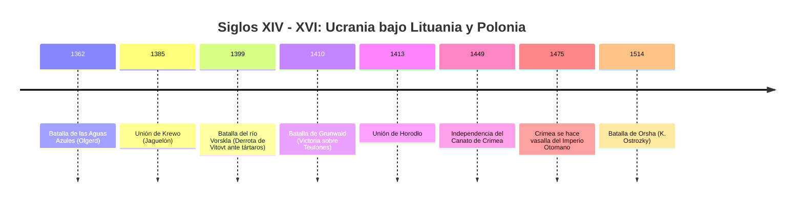
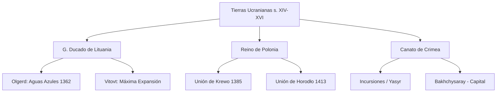

# U04: Principados de Rus en Estados Extranjeros (s. XIV - XVI)

## 📹 Video de la Lección

**Enlace:** [Principados de Rus en Estados Extranjeros](https://www.youtube.com/live/RPED5uZP8Ac)

## 📚 Contenido de la Unidad

### Objetivos de Aprendizaje

Al completar esta unidad, deberás ser capaz de:

- ✅ Explicar la expansión del Gran Ducado de Lituania bajo **Olgerd** y Vitovt.
- ✅ Analizar la importancia de la **Batalla de las Aguas Azules** (1362).
- ✅ Describir las consecuencias de la **Unión de Krewo** (1385) y la **Unión de Horodło** (1413).
- ✅ Identificar el papel de la familia **Ostrozky** en la defensa de las tierras ucranianas.
- ✅ Comprender el surgimiento y la organización del **Canato de Crimea** (1449).

---

### 1. El Gran Ducado de Lituania (GDL): "Lo viejo no lo movemos, lo nuevo no lo introducimos"

Bajo este lema, Lituania absorbió los territorios de la Rus respetando su lengua, leyes y religión ortodoxa.

- **Olgerd (Algirdas):** En **1362**, tras la **Batalla de las Aguas Azules (Syni Vody)**, derrotó a tres hordas tártaras, liberando la mayor parte de las tierras ucranianas (Kiev, Podolia) del control de la Horda de Dorado.
- **Vitovt (Vytautas):** Máximo esplendor del GDL. Extendió las fronteras hasta el Mar Negro y participó en la **Batalla de Grunwald (1410)** contra los Caballeros Teutónicos.

---

### 2. Las Uniones con Polonia

La amenaza mutua (mongoles por un lado, teutones por otro) obligó a Lituania y Polonia a unirse.

| Unión | Año | Contenido Clave |
|-------|-----|-----------------|
| **Unión de Krewo** | 1385 | Matrimonio de Jogaila (Lituania) y Jadwiga (Polonia). Jogaila se convierte en Rey de Polonia y promete cristianizar Lituania al catolicismo. |
| **Unión de Horodło** | 1413 | Se confirma la independencia administrativa del GDL bajo Vitovt, pero se otorgan privilegios exclusivos a los nobles católicos. Inicio de la discriminación ortodoxa. |

---

### 3. La Resistencia Ortodoxa y el Gran Capitán

- **Kostiantyn Ostrozky (Constantino de Ostroh):** Uno de los magnates más poderosos.
- **Batalla de Orsha (1514):** Derrotó al ejército moscovita con una fuerza inferior, convirtiéndose en un héroe nacional y defensor de la fe ortodoxa.

---

### 4. El Canato de Crimea (1449)

- **Fundado por:** Hacı I Giray (Dinastía **Giray**).
- **Relación con el Imperio Otomano:** En 1475 se convirtió en vasallo de los sultanes otomanos.
- **Impacto en Ucrania:** Inicio de las incursiones de saqueo (*yasyr*) para capturar esclavos, lo que motivó el surgimiento de los Cosacos.

---

### 📅 Cronología

### 🗺️ Mapa Conceptual

### Errores Comunes en el NMT

> [!WARNING]
> - No confundas la **Unión de Krewo** (personal/dinástica) con la **Unión de Lublin** (fusión de estados en 1569).
> - La **Batalla de Aguas Azules** es fundamental: marca el fin del yugo mongol directo sobre Kiev.
> - Kostiantyn Ostrozky era **ortodoxo**, no católico, a pesar de servir a príncipes católicos.

## 📝 Resumen

- El GDL fue al principio un "estado lituano-ruso" (respetuoso con la cultura de Rus).
- Las uniones con Polonia fueron debilitando la autonomía lituana y la posición de los ortodoxos.
- La formación del Canato de Crimea creó una amenaza constante en la frontera sur.
- La nobleza ucraniana (Ostrozky) mantuvo viva la tradición de Rus dentro de los nuevos estados.

## 🔗 Recursos Adicionales

- Video de la lección: https://www.youtube.com/live/RPED5uZP8Ac
- Primer Estatuto Lituano (1529): [Izbornyk](http://izbornyk.org.ua)
- Mapa dinámico de la expansión lituana: [E-History](https://history.vn.ua)

## ✅ Autoevaluación

- [ ] ¿En qué año fue la Batalla de las Aguas Azules?
- [ ] ¿Cuál era la religión personal de Kostiantyn Ostrozky?
- [ ] ¿Qué dinastía gobernó el Canato de Crimea?
- [ ] ¿Cuál fue la consecuencia de la Unión de Krewo para Jogaila?

---

**Última actualización:** Enero 2026
**Fuente:** Programa oficial NMT 2026 - UCEQA
