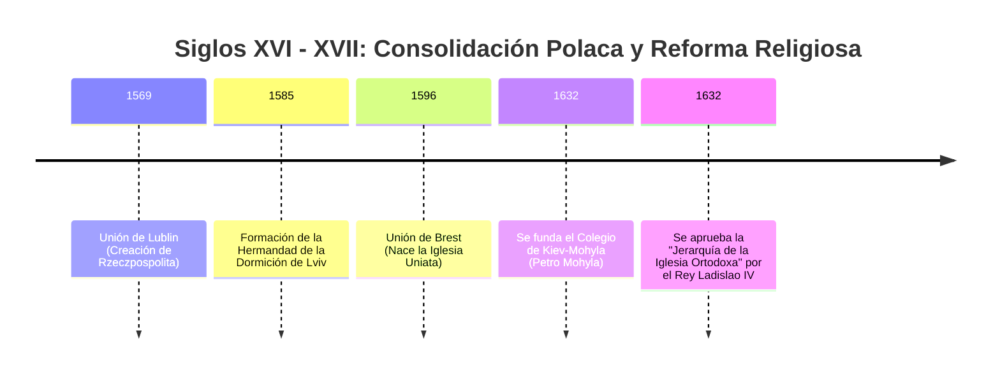
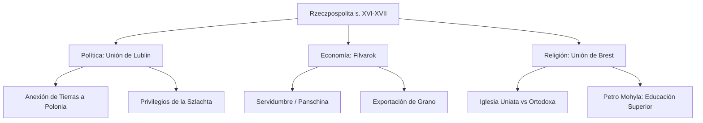

# U05: Territorios Ucranianos en la Mancomunidad Polaco-Lituana (s. XVI-XVII)

## 📹 Video de la Lección

**Enlace:** [Territorios Ucranianos en la Mancomunidad Polaco-Lituana](https://www.youtube.com/live/J4PiVWjButE)

## 📚 Contenido de la Unidad

### Objetivos de Aprendizaje

Al completar esta unidad, deberás ser capaz de:

- ✅ Analizar las causas y consecuencias de la **Unión de Lublin (1569)**.
- ✅ Comprender el impacto de la **Unión de Brest (1596)** en la vida religiosa.
- ✅ Describir la estructura social: **Szlachta**, colonización polaca y servidumbre.
- ✅ Explicar el funcionamiento del sistema de **Filvarok**.
- ✅ Valorar el papel de los **Metropolitanos** (Petro Mohyla) y las **Hermandades (Bratstva)**.

---

### 1. La Unión de Lublin (1569)

Debido a la presión de Moscú, Lituania y Polonia se fusionaron en un solo estado: la **Rzeczpospolita**.

- **Consecuencia para Ucrania:** La mayoría de las tierras ucranianas (Volinia, Kiev, Podolia) pasaron del Gran Ducado de Lituania directamente a la Corona de Polonia.
- **Polonización:** La nobleza ucraniana (*szlachta*) comenzó a adoptar la lengua, cultura y religión católica de Polonia para mantener sus privilegios.

---

### 2. Cambios Socioeconómicos: El Filvarok

- **Filvarok:** Gran finca señorial orientada al mercado (exportación de grano a Europa).
- **Servidumbre (Kripactvo):** Para que los filvaroks fueran rentables, se obligó a los campesinos a trabajar gratis varios días a la semana (*panschina*). Su libertad de movimiento quedó prohibida.

---

### 3. La Cuestión Religiosa y la Unión de Brest (1596)

Ante la crisis de la Iglesia Ortodoxa y la presión jesuita, se buscó una solución:

- **Unión de Brest:** Algunos obispos ortodoxos aceptaron la autoridad del Papa, pero manteniendo sus ritos orientales y el idioma eslavo eclesiástico.
- **Resultado:** Nacimiento de la **Iglesia Uniata** (Griego-Católica). 
- **Conflicto:** Dividió a la población en dos bandos, generando tensiones religiosas que durarían siglos.

---

### 4. Resistencia Cultural: Hermandades y Petro Mohyla

- **Hermandades (Bratstva):** Organizaciones de ciudadanos (burgueses) que defendían la fe ortodoxa mediante la creación de escuelas, imprentas y hospitales. Destaca la **Hermandad de Lviv (1586)**.
- **Petro Mohyla (Metropolitano de Kiev):** 
  - Fundó el **Colegio de Kiev-Mohyla (1632)**, la primera institución de educación superior en Europa del Este de estilo europeo.
  - Reformó la iglesia ortodoxa para que pudiera competir intelectualmente con los jesuitas.

---

### 📅 Cronología

### 🗺️ Mapa Conceptual

### Errores Comunes en el NMT

> [!WARNING]
> - **¡Ojo!** En la **Unión de Lublin**, los territorios ucranianos pasaron de Lituania a **Polonia**, no al revés.
> - La **Iglesia Uniata** NO es lo mismo que la Iglesia Católica Latina; conservó la estética y rituales ortodoxos.
> - Petro Mohyla no solo fue un líder religioso, sino el "padre" de la educación moderna en Ucrania.

## 📝 Resumen

- La **Unión de Lublin** cambió el mapa político, integrando a Ucrania en la órbita polaca.
- El **Filvarok** empeoró drásticamente la vida de los campesinos.
- La **Unión de Brest** creó una tercera vía religiosa pero también mucho conflicto.
- La educación y la imprenta (Mohyla, Hermandades) fueron las armas para preservar la identidad ucraniana.

## 🔗 Recursos Adicionales

- Video de la lección: https://www.youtube.com/live/J4PiVWjButE
- Historia de la Academia Mohyla: [ukma.edu.ua](https://www.ukma.edu.ua/)
- Atlas histórico de Rzeczpospolita: [Encyklopedia PWN](https://encyklopedia.pwn.pl/)

## ✅ Autoevaluación

- [ ] ¿Qué voivodatos ucranianos pasaron a Polonia en 1569?
- [ ] ¿Cómo se llama el trabajo gratuito de los campesinos en el filvarok? (Panschina).
- [ ] ¿Cuál es la diferencia entre un ortodoxo y un uniata tras 1596?
- [ ] ¿Quién fundó la Academia de Kiev-Mohyla?

---

**Última actualización:** Enero 2026
**Fuente:** Programa oficial NMT 2026 - Historia de Ucrania
