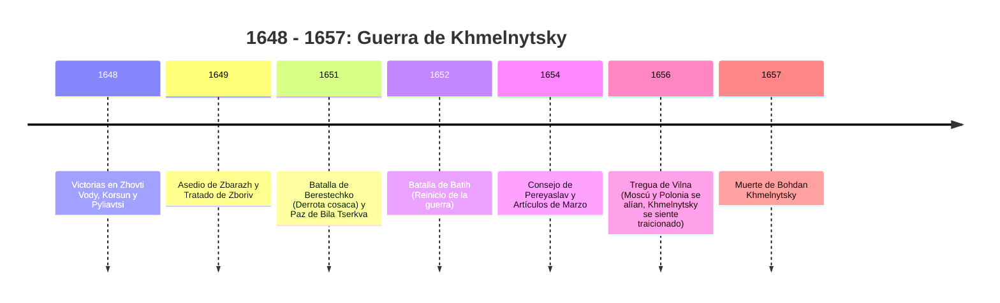
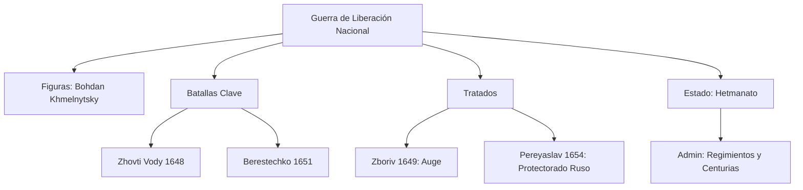

# U06: Guerra de Liberación Nacional (1648-1657)

## 📹 Video de la Lección

**Enlace:** [Guerra de Liberación Nacional (Khmelnytsky)](https://www.youtube.com/live/PsuS7vS1wkI)

## 📚 Contenido de la Unidad

### Objetivos de Aprendizaje

Al completar esta unidad, deberás ser capaz de:

- ✅ Identificar las causas de la rebelión de **Bohdan Khmelnytsky**.
- ✅ Describir las victorias iniciales de 1648 (**Aguas Amarillas, Korsun, Pyliavtsi**).
- ✅ Comparar los tratados de **Zboriv** (1649) y **Bila Tserkva** (1651).
- ✅ Analizar las consecuencias del **Consejo de Pereyaslav** (1654) y los **Artículos de Marzo**.
- ✅ Comprender la estructura estatal del **Hetmanato** (Viysko Zaporozke).

---

### 1. El Inicio de la Epopeya (1648)

Bohdan Khmelnytsky, tras sufrir injusticias personales y ver la opresión del pueblo ucraniano, huyó a la Sich de Zaporozhia y fue elegido Hetman.

- **Alianza con Crimea:** Khmelnytsky logró una alianza histórica con el Kan tártaro **Islam Giray III**, proporcionando a los cosacos la caballería que les faltaba.
- **Triunfos Iniciales:**
  - **Zhovti Vody (Aguas Amarillas):** Primera gran victoria.
  - **Korsun:** Destrucción del ejército polaco principal.
  - **Pyliavtsi:** Derrota humillante de la nobleza polaca (llamada por los cosacos "perinas, niños y latinos").

---

### 2. Tratados y Formación del Estado

| Tratado | Año | Condiciones Principales |
|---------|-----|-------------------------|
| **Tratado de Zboriv** | 1649 | Independencia de facto. Registro de 40,000 cosacos. Control sobre 3 voivodatos (Kiev, Chernihiv, Bratslav). Solo nobles ortodoxos podían ejercer cargos. |
| **Tratado de Bila Tserkva** | 1651 | Tras la derrota en **Berestechko**. Registro se reduce a 20,000. Control solo sobre el voivodato de Kiev. |

---

### 3. El Giro hacia Moscú: Pereyaslav (1654)

Debido al desgaste de la guerra y la traición del Kan de Crimea, Khmelnytsky buscó un nuevo aliado: el Zar de Rusia.

- **Consejo de Pereyaslav (enero 1654):** Juramento de lealtad al Zar Alexei Mikhailovich.
- **Artículos de Marzo:** Se fijan las condiciones de la protección rusa. El Hetmanato mantenía su administración, justicia y ejército (60,000 hombres), pero perdía independencia en política exterior (especialmente con Polonia y Turquía).

---

### 4. Estructura del Estado Cosaco (Hetmanato)

- **Territorio:** Dividido en **Regimientos** (*Polk*) y **Centurias** (*Sotnya*), que servían como unidades administrativas y militares.
- **Poder Supremo:** El **Hetman** junto con el **Consejo General Militar**.
- **Capitales:** Chigirín (en tiempos de Khmelnytsky).

---

### 📅 Cronología

### 🗺️ Mapa Conceptual

### Errores Comunes en el NMT

> [!WARNING]
> - **¡Importante!** El Tratado de Pereyaslav NO fue una fusión de estados, fue una alianza militar con elementos de protección, aunque Moscú lo interpretó como anexión.
> - La **Tregua de Vilna (1656)** es crucial: causó que Khmelnytsky buscara alianzas con Suecia y Transilvania al final de su vida.

## 📝 Resumen

- Khmelnytsky creó el **primer estado ucraniano moderno** (el Hetmanato).
- La guerra pasó de ser una rebelión cosaca a una **Guerra de Liberación Nacional** de todo el pueblo.
- Los cambios de alianzas (Crimea -> Moscú) marcaron el destino geopolítico de Ucrania por los siguientes 300 años.

## 🔗 Recursos Adicionales

- Video de la lección: https://www.youtube.com/live/PsuS7vS1wkI
- Mapa conceptual del Hetmanato: [MoyaOsvita](https://moyaosvita.com.ua)
- Texto original de los Artículos de Marzo: [Izbornyk](http://izbornyk.org.ua)

## ✅ Autoevaluación

- [ ] ¿Quiénes eran los aliados de los cosacos al inicio de 1648?
- [ ] ¿En qué batalla sufrieron los cosacos su mayor derrota en 1651? (Berestechko).
- [ ] ¿Cuáles eran los 3 voivodatos del Tratado de Zboriv?
- [ ] ¿Qué ciudad fue la capital de Khmelnytsky?

---

**Última actualización:** Enero 2026
**Fuente:** Programa oficial NMT 2026 - UCEQA
