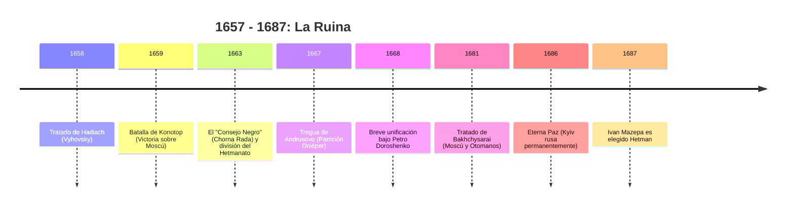
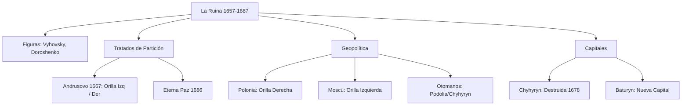

# U07: Ucrania Cosaca: La Ruina (finales s. XVII)

## 📹 Video de la Lección

**Enlace:** [La Ruina y la fragmentación del Hetmanato](https://www.youtube.com/live/ziyqKLLg12Y)

## 📚 Contenido de la Unidad

### Objetivos de Aprendizaje

Al completar esta unidad, deberás ser capaz de:

- ✅ Definir el concepto de **La Ruina (1657-1687)** y sus causas.
- ✅ Analizar el **Tratado de Hadiach (1658)** y la Batalla de Konotop.
- ✅ Explicar la división de Ucrania: **Tregua de Andrusovo (1667)** y **Eterna Paz (1686)**.
- ✅ Evaluar los intentos de unificación de **Petro Doroshenko**.
- ✅ Localizar los cambios de capitales cosacas: **Chyhyryn y Baturyn**.

---

### 1. El Concepto de "La Ruina"

Periodo de guerras civiles, intervención extranjera y decadencia del estado cosaco tras la muerte de Khmelnytsky.

- **Ivan Vyhovsky:** Intentó regresar a la órbita polaca con el **Tratado de Hadiach (1658)**, proponiendo que Ucrania fuera el tercer miembro de la Mancomunidad. Derrotó a los rusos en la **Batalla de Konotop (1659)**, pero perdió el poder por oposición interna.

---

### 2. La Partición de Ucrania: Orilla Izquierda y Derecha

A causa de las disputas entre hetmanes apoyados por diferentes potencias, Ucrania se dividió por el río Dniéper.

- **Tregua de Andrusovo (1667):** Polonia y Moscú se reparten Ucrania sin consultar a los cosacos.
  - **Orilla Izquierda (Left Bank):** Bajo protectorado de Moscú. Capital: **Baturyn**.
  - **Orilla Derecha (Right Bank):** Bajo influencia de Polonia (y brevemente de los Otomanos). Capital: **Chyhyryn**.
  - **Kyiv:** Cedida a Moscú por 2 años (pero nunca se devolvió).

- **Eterna Paz (1686):** Confirmación definitiva de la partición entre el Imperio Ruso y la Mancomunidad Polaca. Moscú obtiene Kyiv permanentemente.

---

### 3. Petro Doroshenko: "El Sol de la Ruina"

Hetman de la Orilla Derecha que intentó reunificar Ucrania bajo su mando.
- Buscó el protectorado del **Imperio Otomano (Turquía)** para librarse de polacos y rusos.
- Tras años de guerra, su proyecto falló y la Orilla Derecha quedó devastada y despoblada.

---

### 4. Ivan Samoilovych y la Consolidación del Este

Hetman de la Orilla Izquierda que fortaleció la administración cosaca bajo Moscú, pero fue depuesto tras el fracaso de las campañas de Crimea. Le sucedió **Ivan Mazepa**.

---

### 📅 Cronología

### 🗺️ Mapa Conceptual

### Errores Comunes en el NMT

> [!WARNING]
> - **¡Truco NMT!** No olvides el año **1667 (Andrusovo)**: es cuando Ucrania deja de ser un solo estado y se divide oficialmente en dos "orillas".
> - Ivan Mazepa NO es parte de la Ruina; él es quien pone fin al caos y trae estabilidad.
> - El **Tratado de Hadiach** no se cumplió porque los cosacos de a pie temían el regreso de los señores polacos.

## 📝 Resumen

- La Ruina fue la mayor tragedia política del estado cosaco, fruto de la falta de unidad.
- El río **Dniéper** se convirtió en la frontera sangrienta entre imperios.
- Las ciudades de **Chyhyryn y Baturyn** representan el auge y la caída de los diferentes centros de poder.

## 🔗 Recursos Adicionales

- Video de la lección: https://www.youtube.com/live/ziyqKLLg12Y
- Novela histórica "Chorna Rada" (Panteleimon Kulish).
- Mapa de la partición de 1667: [Historical Atlas of Ukraine](http://history.org.ua)

## ✅ Autoevaluación

- [ ] ¿QuéHetman ganó la Batalla de Konotop? (Vyhovsky).
- [ ] ¿Qué río servía de frontera según la Tregua de Andrusovo?
- [ ] ¿A qué imperio pidió ayuda Petro Doroshenko? (Otomano).
- [ ] ¿En qué año se firmó la "Eterna Paz"? (1686).

---

**Última actualización:** Enero 2026
**Fuente:** Programa oficial NMT 2026 - Historia de Ucrania
