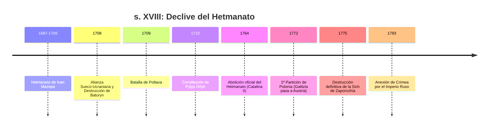
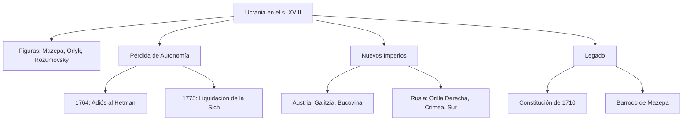

# U08: El Hetmanato en el s. XVIII y su Abolición

## 📹 Video de la Lección

**Enlace:** [El Hetmanato de Mazepa y el fin de la autonomía](https://www.youtube.com/live/Yf0o8_A8U9E)

## 📚 Contenido de la Unidad

### Objetivos de Aprendizaje

Al completar esta unidad, deberás ser capaz de:

- ✅ Analizar el gobierno de **Ivan Mazepa** y su intento de independencia.
- ✅ Evaluar las consecuencias de la **Batalla de Poltava (1709)**.
- ✅ Conocer la **Constitución de Pylyp Orlyk (1710)**, pionera en Europa.
- ✅ Describir el proceso de abolición del Hetmanato por **Catalina II**.
- ✅ Explicar las consecuencias de las **Particiones de Polonia** para Ucrania.

---

### 1. Ivan Mazepa y la Gran Guerra del Norte

- **Auge Cultural:** Mazepa fue un gran mecenas, reconstruyó iglesias en estilo "Barroco Ucraniano" (Academia de Kiev-Mohyla).
- **El Giro de 1708:** Ante la presión de Pedro I, Mazepa se alió con el rey sueco **Carlos XII** para independizar Ucrania.
- **La Tragedia de Baturyn:** En represalia, las tropas rusas destruyeron la capital de Mazepa, masacrando a su población.
- **Batalla de Poltava (1709):** Derrota decisiva de suecos y cosacos. Mazepa huye a territorio otomano (Bender).

---

### 2. Pylyp Orlyk y la Primera Constitución (1710)

Exiliado en Moldavia, los cosacos eligieron a Orlyk como sucesor.
- **Pacta et Constitutiones:** Documento que establecía la separación de poderes (Legislativo, Ejecutivo, Judicial).
- **Importancia:** Es considerada una de las primeras constituciones democráticas del mundo, aunque nunca pudo aplicarse plenamente en el territorio ucraniano.

---

### 3. El Fin de la Autonomía Cosaca

El Imperio Ruso fue eliminando gradualmente los derechos de Ucrania:
- **Colegio de la Pequeña Rusia:** Órganos burocráticos rusos para controlar al Hetman.
- **Kyrylo Rozumovsky (1750-1764):** El último Hetman, intentó reformas ilustradas.
- **1764:** Catalina II ordena la renuncia de Rozumovsky y **abole definitivamente el cargo de Hetman**.
- **1775:** Destrucción de la **Sich de Zaporozhia** (el último fuerte cosaco). Los cosacos son desplazados al Kubán.

---

### 4. Cambios Territoriales (Particiones de Polonia)

A finales del s. XVIII, Polonia deja de existir y sus tierras se reparten:
- **Imperio Austríaco:** Obtiene **Galitzia** (1772).
- **Imperio Ruso:** Obtiene la **Orilla Derecha** (Podolia, Volinia) en 1793-1795.
- **Colonización del Sur:** Tras las guerras contra Turquía, Rusia anexiona Crimea (1783) e inicia la colonización de las tierras del sur (*Novorossiya*).

---

### 📅 Cronología

### 🗺️ Mapa Conceptual

### Errores Comunes en el NMT

> [!WARNING]
> - **Pylyp Orlyk** escribió la constitución en **Bender** (exilio), no en Kiev.
> - La **Sich de Zaporozhia** fue destruida por orden de Catalina II, quien irónicamente había usado a los cosacos poco antes para ganar guerras contra los turcos.
> - No confundas las Particiones: Galitzia pasó a Austria mucho antes que el resto de Ucrania pasara a Rusia.

## 📝 Resumen

- El s. XVIII marca el paso de una Ucrania autónoma (Hetmanato) a una Ucrania integrada en sistemas imperiales.
- Mazepa y Orlyk representan el último gran esfuerzo diplomático y militar por la independencia antes del s. XX.
- La estructura social cambia: los oficiales cosacos se convierten en nobles rusos y los campesinos pierden su libertad.

## 🔗 Recursos Adicionales

- Tour virtual: [Reserva Nacional de Baturyn](https://baturin-capital.gov.ua)
- Facsímil de la Constitución de Pylyp Orlyk.
- Video: "La tragedia de Poltava".

## ✅ Autoevaluación

- [ ] ¿Quién fue el aliado de Mazepa en 1708? (Carlos XII de Suecia).
- [ ] ¿Qué documento de 1710 hablaba de la separación de poderes?
- [ ] ¿Quién fue la emperatriz que abolió el Hetmanato?
- [ ] ¿En qué año fue destruida la última Sich de Zaporozhia? (1775).

---

**Última actualización:** Enero 2026
**Fuente:** Programa oficial NMT 2026 - Historia de Ucrania
