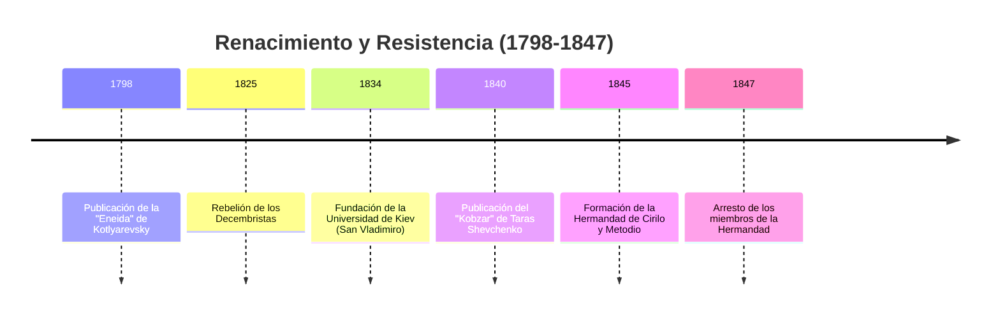
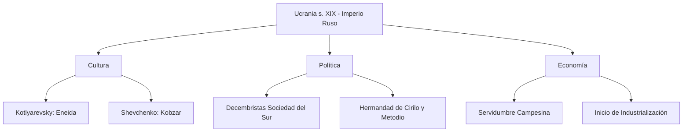

# U09: Ucrania en el Imperio Ruso (finales s. XVIII - med. s. XIX)

## 📹 Video de la Lección

**Enlace:** [El Renacimiento Nacional y Movimientos Políticos](https://www.youtube.com/live/YltDD58EYlQ)

## 📚 Contenido de la Unidad

### Objetivos de Aprendizaje

Al completar esta unidad, deberás ser capaz de:

- ✅ Identificar el inicio del **Renacimiento Nacional Ucraniano** (1798).
- ✅ Analizar el papel de las **Logias Masónicas** y los **Decembristas** en territorio ucraniano.
- ✅ Explicar el programa y la importancia de la **Hermandad de Cirilo y Metodio**.
- ✅ Describir las condiciones socioeconómicas (servidumbre e industrialización temprana).
- ✅ Reconocer la importancia de **Taras Shevchenko** como símbolo nacional.

---

### 1. El Inicio del Renacimiento Nacional (1798)

Tradicionalmente se marca el inicio de la Ucrania moderna con la literatura:
- **Ivan Kotlyarevsky:** Publicó la **"Eneida" (1798)**, la primera obra escrita íntegramente en el ucraniano vernáculo (el habla del pueblo).
- **Importancia:** Transformó a los héroes de Virgilio en cosacos ucranianos, preservando tradiciones, humor y la lengua en un momento de fuerte rusificación.

---

### 2. Movimientos Sociopolíticos

A inicios del s. XIX, Ucrania fue centro de ideas liberales y revolucionarias:
- **Masonería:** Las logias (como *Amor a la Verdad* en Poltava) reunían a la élite intelectual para discutir reformas y autonomía. Kotlyarevsky fue miembro de una.
- **Los Decembristas (1825):** Oficiales rusos que querían derrocar al Zar.
  - **Sociedad del Sur:** Con sede en Ucrania (Tulchýn). Dirigida por Pavel Pestel.
  - **Uprising del Regimiento de Chernihiv:** Una rebelión armada en Ucrania que fue duramente reprimida.

---

### 3. La Hermandad de Cirilo y Metodio (1845-1847)

La primera organización política ucraniana secreta en Kiev.
- **Figuras clave:** Mykola Kostomarov, Panteleimon Kulish y **Taras Shevchenko**.
- **Programa ("Libro del Génesis del Pueblo Ucraniano"):**
  1. Abolición de la servidumbre (esclavitud campesina).
  2. Creación de una **Federación Eslava** democrática con Ucrania como centro.
  3. Igualdad social y libertad religiosa.
- **Consecuencia:** Fueron descubiertos por la policía secreta zarista. Shevchenko fue enviado al exilio como soldado por 10 años con prohibición de escribir y pintar.

---

### 4. Cambios Socioeconómicos

- **Servidumbre (Pánshchyna):** Los campesinos eran propiedad de los terratenientes, trabajando hasta 5-6 días a la semana para el amo.
- **Revolución Industrial:** Comienzo de la mecanización en fábricas de azúcar y las primeras minas en el Donbás.
- **Ciudades:** Odesa se convierte en un puerto franco masivo, atrayendo diversidad europea.

---

### 📅 Cronología

### 🗺️ Mapa Conceptual

### Errores Comunes en el NMT

> [!WARNING]
> - **¡Dato Clave!** La Hermandad de Cirilo y Metodio no buscaba la guerra, sino una federación eslava pacífica y cristiana.
> - No confundas a las sociedades decembristas (que eran principalmente oficiales del ejército) con la Hermandad (que eran intelectuales/académicos).
> - La **"Eneida"** es el punto de partida; sin ella, no se entiende el desarrollo cultural posterior.

## 📝 Resumen

- El Renacimiento Nacional pasó de ser un movimiento literario (Kotlyarevsky) a uno político (Hermandad).
- Taras Shevchenko unificó el sentimiento nacional con su poesía, denunciando la opresión rusa y la injusticia social.
- El Imperio Ruso respondió con represión, exilio y censura para evitar el surgimiento de una identidad ucraniana fuerte.

## 🔗 Recursos Adicionales

- Poemas de Taras Shevchenko (Proyecto Gutenberg).
- Museo virtual: [Casa-Museo de Taras Shevchenko en Kiev](https://museumshevchenko.org.ua)
- Análisis de la Eneida: [Enlace Educativo](https://ukrlit.org)

## ✅ Autoevaluación

- [ ] ¿En qué año se publicó la "Eneida"? (1798).
- [ ] ¿Qué poeta fue exiliado en 1847 por sus ideas nacionales?
- [ ] ¿Cuál era el objetivo principal de la Hermandad de Cirilo y Metodio?
- [ ] ¿Cómo se llamaba la sociedad secreta de los Decembristas en Ucrania?

---

**Última actualización:** Enero 2026
**Fuente:** Programa oficial NMT 2026 - Historia de Ucrania
