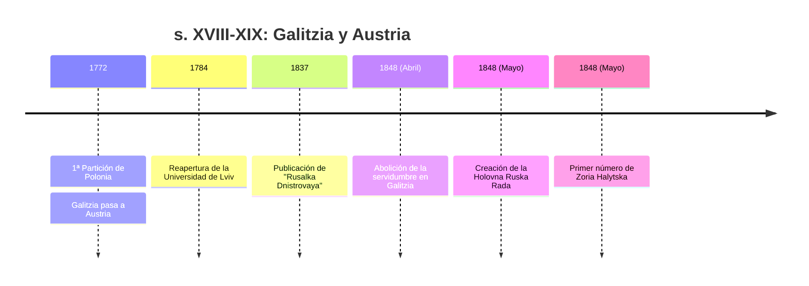
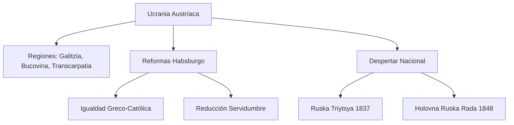

# U10: Ucrania en el Imperio Austríaco (finales s. XVIII - s. XIX)

## 📹 Video de la Lección

**Enlace:** [Las Tierras Ucranianas bajo los Habsburgo](https://www.youtube.com/live/YltDD58EYlQ) *(Referencia al período)*

## 📚 Contenido de la Unidad

### Objetivos de Aprendizaje

Al completar esta unidad, deberás ser capaz de:

- ✅ Identificar los territorios ucranianos en Austria: **Galitzia, Bucovina y Transcarpatia**.
- ✅ Analizar las reformas ilustradas de **María Teresa y José II**.
- ✅ Evaluar el impacto de la **Ruska Triytsya** (Tríada Rutena) en el renacimiento cultural.
- ✅ Describir los eventos de la **Revolución de 1848** en Ucrania Occidental.
- ✅ Conocer la importancia de la **Holovna Ruska Rada** (Consejo Principal Ruteno).

---

### 1. Las Tierras Ucranianas en el Imperio de los Habsburgo

A diferencia del Imperio Ruso, aquí Ucrania se dividía en tres regiones administrativas diferentes:
- **Galitzia Oriental (Halychyna):** El centro del movimiento nacional ("El Piamonte Ucraniano").
- **Bucovina:** Bajo administración austríaca directa (Chernivtsí).
- **Transcarpatia (Zakarpattia):** Bajo control del Reino de Hungría.

---

### 2. Reformas de María Teresa y José II (1770s-1780s)

Estas reformas "ilustradas" mejoraron la vida de los ucranianos:
- **Socio-económicas:** Se limitó la servidumbre (*Pánshchyna*) y se prohibieron los castigos físicos.
- **Religiosas:** Se otorgó **igualdad de derechos** a la Iglesia Greco-Católica frente a la Latina. Los sacerdotes pasaron a ser funcionarios pagados por el Estado.
- **Educativas:** Se fundó la Universidad de Lviv (1784) y se permitió la enseñanza primaria en lengua materna (ruteno/ucraniano).

---

### 3. El Renacimiento Cultural: La "Ruska Triytsya"

En los años 1830, un grupo de seminaristas en Lviv lideró el despertar nacional:
- **Líderes:** **Markiyan Shashkevych**, Ivan Vahylevych y Yakiv Holovatsky.
- **Hito (1837):** Publicaron el almanaque **"Rusalka Dnistrovaya"** (La Ninfa del Dniéster) en Budapest.
- **Importancia:** Fue el primer libro en Galitzia escrito en lengua viva (vernacular), no en eslavo eclesiástico. Introdujo el uso del alfabeto fonético.

---

### 4. La Revolución de 1848 y el Despertar Político

La "Primavera de los Pueblos" trajo cambios radicales:
- **Abolición de la Servidumbre:** El 22 de abril de 1848 se abolió definitivamente la servidumbre en Galitzia (antes que en el Imperio Ruso).
- **Holovna Ruska Rada (Consejo Principal Ruteno):** La primera organización política ucraniana legal.
  - **Demandas:** Autonomía política y división de Galitzia en una parte ucraniana y otra polaca.
  - **Bandera:** Adoptaron oficialmente el color **Azul y Amarillo** y el León Dorado como símbolos.
- **Zoria Halytska:** El primer periódico semanal en lengua ucraniana (iniciado el 15 de mayo de 1848).

---

### 📅 Cronología

### 🗺️ Mapa Conceptual

### Errores Comunes en el NMT

> [!WARNING]
> - **Ojo:** La servidumbre se abolió en Austria en **1848**, mientras que en Rusia fue en **1861**. Es una diferencia cronológica vital para el examen.
> - La **Ruska Triytsya** operaba en Lviv, pero su libro se imprimió en Budapest para evitar la censura local.
> - Galitzia era apodada el **"Piamonte Ucraniano"** porque allí el movimiento nacional era legal y más fuerte que bajo el Zar.

## 📝 Resumen

- El dominio austríaco, aunque imperial, permitió un desarrollo cultural y político más libre que el ruso.
- La Iglesia Greco-Católica fue la columna vertebral de la identidad nacional en estas tierras.
- 1848 marcó el nacimiento de la política ucraniana moderna con símbolos y periódicos propios.

## 🔗 Recursos Adicionales

- Facsímil de la [Rusalka Dnistrovaya](https://polona.pl).
- Biografía de Markiyan Shashkevych.

## ✅ Autoevaluación

- [ ] ¿Cómo se llamaba la primera organización política legal (1848)?
- [ ] ¿Quiénes formaban la "Ruska Triytsya"?
- [ ] ¿Qué iglesia fue clave para la élite intelectual en Galitzia?
- [ ] ¿Cuál fue el primer periódico en ucraniano? (Zoria Halytska).

---

**Última actualización:** Enero 2026
**Fuente:** Programa oficial NMT 2026 - Historia de Ucrania
