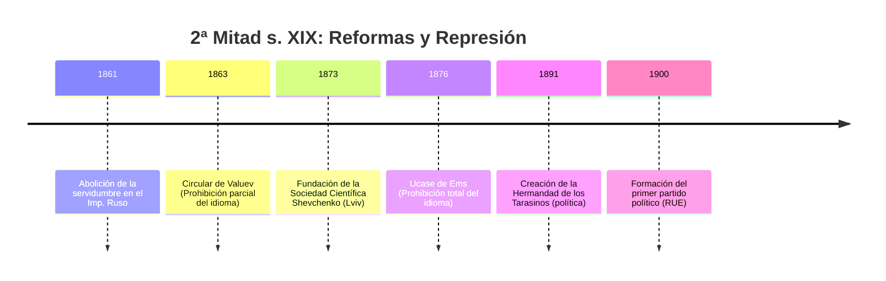
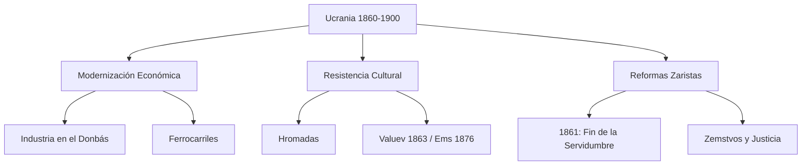

# U11: Modernización y Movimiento Nacional (2ª mitad s. XIX)

## 📹 Video de la Lección

**Enlace:** [Las Grandes Reformas y el Resurgir Ucraniano](https://www.youtube.com/live/j7f9mIfArXw)

## 📚 Contenido de la Unidad

### Objetivos de Aprendizaje

Al completar esta unidad, deberás ser capaz de:

- ✅ Analizar las **Grandes Reformas** de Alejandro II, especialmente la abolición de la servidumbre (1861).
- ✅ Evaluar el impacto del movimiento de las **Hromadas** en el despertar nacional.
- ✅ Conocer el contenido represivo de la **Circular de Valuev** y el **Ucase de Ems**.
- ✅ Describir el auge industrial en el **Donbás** y el sur de Ucrania.
- ✅ Identificar el inicio de la formación de los primeros **partidos políticos** ucranianos.

---

### 1. Las "Grandes Reformas" (1860s-1870s)

Tras la derrota en la Guerra de Crimea, el Imperio Ruso se vio obligado a modernizarse:
- **Reforma Agraria (1861):** Se abolió la servidumbre. Los campesinos ganaron libertad personal, pero debían pagar "rescates" por la tierra (*Vykupni platezhi*), lo que generó pobreza y emigración.
- **Otras reformas:** Zemstvos (gobierno regional), Reforma Judicial (juicios con jurado), Reforma Militar y Educativa.

---

### 2. El Movimiento de las Hromadas

Las **Hromadas** eran sociedades secretas de intelectuales dedicadas a la educación y cultura ucraniana.
- **Old Hromada (Kiev):** Liderada por Volodymyr Antonovych. Publicaron diccionarios y estudios históricos.
- **Mykhailo Drahomanov:** Figura intelectual que vinculó el movimiento ucraniano con el socialismo europeo y defendió el federalismo.
- **Chlopomanstvo:** Movimiento de estudiantes polonizados o rusificados que "volvieron al pueblo" adoptando la cultura campesina ucraniana.

---

### 3. La Represión Imperial contra la Lengua

Ante el temor del separatismo ucraniano, el Zar dictó medidas draconianas:
1. **Circular de Valuev (1863):** Prohibió la publicación de libros religiosos y educativos en ucraniano ("Little Russian"). Afirmaba que el idioma *"no existe, no existió y no existirá"*.
2. **Ucase de Ems (1876):** Prohibición casi total: no se podía importar libros, realizar teatro o conciertos en ucraniano, ni enseñar en las escuelas. **Objetivo:** Rusificación total.

---

### 4. Revolución Industrial y Donbás

Ucrania se convirtió en el motor económico del Imperio:
- **Donbás:** Auge de la minería del carbón y la siderurgia (gracias a inversiones extranjeras como las de John Hughes - fundador de Donetsk).
- **El Sur:** Odesa se consolidó como el mayor puerto exportador de grano del mundo.
- **Ferrocarriles:** Conexión de las tierras agrícolas con los puertos del Mar Negro.

---

### 📅 Cronología

### 🗺️ Mapa Conceptual

### Errores Comunes en el NMT

> [!WARNING]
> - **Cuidado:** El **Ucase de Ems** fue mucho más duro que la **Circular de Valuev**. El primero prohibió hasta el teatro y la música.
> - **Demografía:** Durante este período, las ciudades crecieron mucho, pero se rusificaron. Los ucranianos seguían siendo mayoría en el campo.
> - No asumas que la abolición de la servidumbre trajo riqueza inmediata; muchos campesinos quedaron endeudados por décadas.

## 📝 Resumen

- El período 1861-1900 fue una lucha entre la modernización económica impulsada por el Imperio y la represión cultural contra la identidad ucraniana.
- La intelectualidad ucraniana pasó de lo cultural (Hromadas) a lo político (partidos) para sobrevivir a la censura.
- Ucrania se consolidó como el "Granero" y el "Centro Industrial" del Imperio Ruso.

## 🔗 Recursos Adicionales

- Documento original: [Circular de Valuev (Traducción)](https://izbornyk.org.ua)
- Mapa del Donbás industrial en el s. XIX.

## ✅ Autoevaluación

- [ ] ¿En qué año se abolió la servidumbre en el Imperio Ruso? (1861).
- [ ] ¿Qué documento prohibió el teatro y conciertos en ucraniano? (Ucase de Ems).
- [ ] ¿Quién fue el líder de la Old Hromada de Kiev?
- [ ] ¿Qué puerto ucraniano era el principal exportador de trigo? (Odesa).

---

**Última actualización:** Enero 2026
**Fuente:** Programa oficial NMT 2026 - Historia de Ucrania
