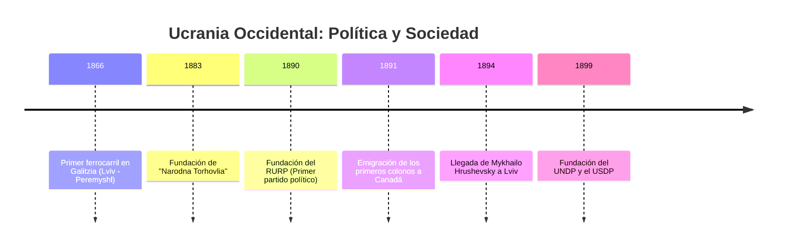
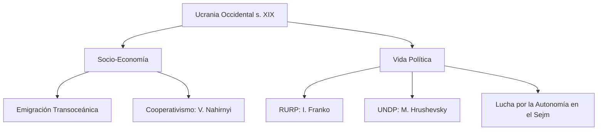

# U12: Ucrania Occidental (2ª mitad s. XIX)

## 📹 Video de la Lección

**Enlace:** [Política y Economía en Galitzia](https://www.youtube.com/live/8sdVeWp4J7I)

## 📚 Contenido de la Unidad

### Objetivos de Aprendizaje

Al completar esta unidad, deberás ser capaz de:

- ✅ Analizar la situación socioeconómica y la **emigración masiva** ucraniana.
- ✅ Evaluar la importancia del movimiento **Cooperativo**.
- ✅ Explicar el nacimiento del **Movimiento Radical** y los primeros partidos políticos.
- ✅ Identificar el papel de Galitzia como el **"Piamonte Ucraniano"**.

---

### 1. Economía y Sociedad: La Lucha por la Tierra

A finales del s. XIX, las tierras bajo el Imperio Austrohúngaro sufrían de "hambre de tierras":
- **Pobreza Rural:** Parcelas minúsculas y gran presión demográfica.
- **Emigración:** Miles de ucranianos emigraron a **Canadá, EE. UU. y Brasil** buscando tierras.
- **Industria:** Desarrollo limitado de la industria petrolera en Boryslav y la extracción de sal.

---

### 2. El Movimiento Cooperativo: "Autoayuda"

Para combatir la pobreza y los usureros, los ucranianos se organizaron económicamente:
- **Narodna Torhovlia (1883):** Primera cooperativa de consumo fundada por **Vasyl Nahirnyi**.
- **Importancia:** Permitía a los campesinos comprar herramientas y víveres a precios justos y recibir educación económica.

---

### 3. El Despertar Político: Los Partidos

Galitzia fue la cuna de la política ucraniana moderna gracias a las libertades constitucionales de Austria:

1. **RURP (Partido Radical Rutenio-Ucraniano, 1890):** El **primer partido político ucraniano** de estilo moderno. Liderado por **Ivan Franko** y Mykhailo Pavlyk. En 1895, declaró la independencia de Ucrania como su objetivo final.
2. **USDP (Partido Socialdemócrata Ucraniano, 1899):** Enfoque en los derechos de los trabajadores.
3. **UNDP (Partido Nacional Democrático Ucraniano, 1899):** Liderado por **Yulian Romanchuk** y **Mykhailo Hrushevsky**. Se convirtió en la fuerza política más influyente, abogando por la autonomía y la futura unidad de todos los territorios ucranianos.

---

### 4. La Lucha en el Sejm de Galitzia

El **Sejm (Parlamento provincial)** era el escenario de conflicto entre ucranianos y polacos. Los ucranianos lucharon por:
- Una universidad ucraniana en Lviv.
- Reforma electoral para tener una representación justa.

---

### 📅 Cronología

### 🗺️ Mapa Conceptual

### Errores Comunes en el NMT

> [!WARNING]
> - **Año clave:** 1890 es el año de fundación del **primer** partido político (RURP). No lo confundas con el UNDP (1899).
> - **Ideología:** Ivan Franko pasó de ideas puramente socialistas a un enfoque nacional-democrático con el tiempo.
> - **Geografía:** Recuerda que la industria petrolera de Boryslav era de las más importantes del mundo en su época, pero estaba mayormente en manos extranjeras.

## 📝 Resumen

- La falta de tierras causó una gran diáspora ucraniana en América.
- El cooperativismo fue la herramienta de supervivencia económica del campesinado.
- Galitzia se consolidó como el centro político de Ucrania, donde se gestaron los programas de independencia que luego llegarían al resto del país.

## 🔗 Recursos Adicionales

- Biografía de Ivan Franko.
- Historia de la primera ola de emigración ucraniana a Canadá.

## ✅ Autoevaluación

- [ ] ¿Cuál fue el primer partido político ucraniano y quién lo lideró? (RURP, Ivan Franko).
- [ ] ¿A qué países emigraron mayoritariamente los campesinos de Galitzia?
- [ ] ¿Qué papel jugó Vasyl Nahirnyi? (Fundador del cooperativismo).
- [ ] ¿Qué reclamaban los ucranianos en el Sejm de Galitzia?

---

**Última actualización:** Enero 2026
**Fuente:** Programa oficial NMT 2026 - Historia de Ucrania
