# U13: Repaso Integral (Siglos XVIII - XIX)

## 📹 Video de la Lección

**Enlace:** [Resumen de los Siglos XVIII y XIX](https://www.youtube.com/live/mr-hkkvuQNQ)

## 📚 Contenido de la Unidad

### Objetivos de Aprendizaje

Al completar esta unidad, deberás ser capaz de:

- ✅ Sintetizar los procesos de **Renacimiento Nacional** en las dos Ucranias.
- ✅ Comparar las políticas imperiales de los **Romanov** y los **Habsburgo**.
- ✅ Identificar los hitos culturales desde la "Eneida" hasta los primeros partidos políticos.
- ✅ Relacionar los cambios económicos con los movimientos sociales.

---

### 1. Comparativa Imperial: Romanov vs Habsburgo

| Aspecto | Imperio Ruso (Dniéper) | Imperio Austríaco (Galitzia) |
|---------|------------------------|------------------------------|
| **Política** | Autocracia, represión total. | Monarquía Constitucional (después de 1867). |
| **Idioma** | Prohibiciones (Valuev, Ems). | Uso permitido en escuelas y religión. |
| **Sociedad** | Servidumbre hasta 1861. | Servidumbre hasta 1848. |
| **Meta** | Rusificación ("Little Russians"). | Integración multinacional (Piamonte Ucraniano). |

---

### 2. Hitos del Despertar Nacional

1. **1798:** Publicación de la **"Eneida"** de I. Kotlyarevsky (Inicio del renacimiento cultural).
2. **1837:** Almanaque **"Rusalka Dnistrovaya"** en Lviv (Primer libro en ucraniano vernáculo en el oeste).
3. **1846:** **Hermandad de Cirilo y Metodio** (Primer programa político nacional).
4. **1848:** **Holovna Ruska Rada** (Primera organización política legal).
5. **1861:** Abolición de la servidumbre en el Este.
6. **1876:** Ucase de Ems (Punto máximo de represión cultural).
7. **1890:** Formación del RURP (Inicio de la fase política moderna).

---

### 3. Figuras Clave del Siglo XIX

- **Taras Shevchenko:** El "Bardo" de la nación. Unió la lucha social con la nacional.
- **Mykola Kostomarov:** Ideólogo del federalismo eslavo.
- **Ivan Franko:** Intelectual "eterno revolucionario" de Galitzia.
- **Mykhailo Hrushevsky:** El historiador que dio base científica a la identidad ucraniana.

---

### 📅 Línea del Tiempo Comparativa

```mermaid
timeline
    title Siglos XVIII - XIX: De la Cultura a la Política
    1798 : I. Kotlyarevsky - Eneida
    1840 : T. Shevchenko - Kobzar
    1848 : Rev. en Austria - Fin de servidumbre
    1861 : Rev. en Rusia - Fin de servidumbre
    1863/1876 : Prohibiciones lingüísticas en Rusia
    1890/1899 : Nacimiento de Partidos Políticos en Galitzia
```

### 🗺️ Mapa del Desarrollo Nacional

```mermaid
graph TD
    A[Movimiento Ucraniano] --> B[Fase Etnográfica]
    A --> C[Fase Cultural]
    A --> D[Fase Política]
    
    B --> B1[Recopilación de cantos y cuentos]
    C --> C1[Literatura y Sociedades Prosvita]
    D --> D1[Hromadas y Partidos Políticos]
```

## 📝 Resumen

- El siglo XVIII terminó con la pérdida de la autonomía (Hetmanato).
- El siglo XIX fue el paso de ser un "pueblo de campesinos" a una **Nación Moderna**.
- Mientras el Este (Rusia) aportaba el genio literario y demográfico, el Oeste (Austria) aportaba el laboratorio político y las libertades.

## 🔗 Recursos Adicionales

- Repaso oficial: [ZNO Osvita - Temas 7-12](https://zno.osvita.ua/ukrainian-history/)

## ✅ Autoevaluación

- [ ] ¿Cuál es la diferencia de fecha entre el fin de la servidumbre en Austria y en Rusia? (13 años: 1848 vs 1861).
- [ ] ¿Qué libro se considera el inicio de la literatura moderna ucraniana? (Eneida).
- [ ] ¿En qué imperio los ucranianos tenían su propio parlamento provincial? (Austria).
- [ ] ¿Quiénes formaron la Hermandad de Cirilo y Metodio?

---

**Última actualización:** Enero 2026
**Fuente:** Resumen de Unidades 07-12 NMT
