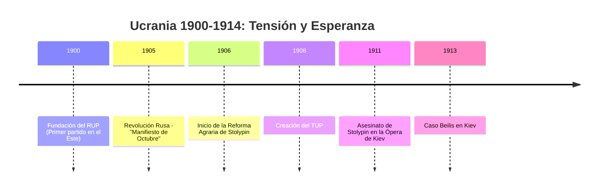
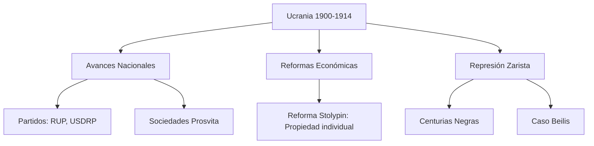

# U14: Ucrania en la Era de las Revoluciones (1900-1914)

## 📹 Video de la Lección

**Enlace:** [Hacia la Gran Guerra](https://www.youtube.com/live/rk5N3EQi5Ms)

## 📚 Contenido de la Unidad

### Objetivos de Aprendizaje

Al completar esta unidad, deberás ser capaz de:

- ✅ Identificar los primeros **partidos políticos** en la Ucrania del Dniéper.
- ✅ Analizar el impacto de la **Revolución de 1905** en el movimiento nacional.
- ✅ Evaluar las consecuencias de la **Reforma de Stolypin**.
- ✅ Comprender el clima de represión (Centurias Negras) y el **Caso Beilis**.

---

### 1. El Despertar Político (1900-1905)

Por primera vez, el movimiento ucraniano en el Imperio Ruso se organiza en partidos:
- **RUP (Partido Ucraniano Revolucionario, 1900):** Fundado en Járkov. Su primer folleto, *"Ucrania Independiente"* de M. Mikhnovsky, pedía la independencia total.
- **USDRP (Partido Obrero Socialdemócrata Ucraniano):** Liderado por **Volodymyr Vynnychenko** y Symon Petliura. Buscaba la autonomía dentro de una Rusia democrática.
- **TUP (Sociedad de Progresistas Ucranianos, 1908):** Organización clandestina que coordinaba a todas las fuerzas nacionales tras el fracaso de la revolución.

---

### 2. La Revolución de 1905 y sus Logros

La crisis del Imperio estalló en 1905, trayendo breves libertades:
- **Fin de las prohibiciones:** Se dejó de aplicar el Ucase de Ems. Surgieron los primeros periódicos en ucraniano (*Khliborob*, *Rada*).
- **Prosvita:** Se fundaron sociedades culturales para educar al pueblo en su idioma.
- **Duma Estatal:** Los ucranianos enviaron representantes al parlamento ruso para exigir autonomía.

---

### 3. La Reacción y la Reforma de Stolypin

Tras 1907, el régimen zarista volvió a la represión:
- **Centurias Negras (Chornasotni):** Organizaciones paramilitares rusas que realizaban pogromos contra judíos y atacaban el movimiento ucraniano.
- **Reforma de Stolypin (1906):** Permitió a los campesinos abandonar la comuna tradicional (*obshchina*) y poseer tierras de forma individual (**khutir**). Esto impulsó la agricultura pero aumentó la desigualdad.
- **Caso Beilis (1913):** Un juicio injusto contra un judío en Kiev basado en libelos de sangre, que mostró el antisemitismo y la crisis del sistema judicial zarista.

---

### 📅 Cronología

### 🗺️ Mapa Conceptual

### Errores Comunes en el NMT

> [!WARNING]
> - **Ideología RUP:** Aunque empezó pidiendo independencia, la mayoría del RUP derivó pronto hacia el socialismo y la autonomía federativa.
> - **M. Mikhnovsky:** No lo confundas con Hrushevsky. Mikhnovsky era el radical defensor de la independencia absoluta (*Samostiinist*).
> - **Stolypin:** Recuerda que fue asesinado en Kiev por un agente doble. Su reforma fue muy exitosa en Ucrania comparada con Rusia.

## 📝 Resumen

- El período 1900-1914 fue una "montaña rusa": desde el nacimiento de partidos y libertades en 1905 hasta el retorno de la represión y el antisemitismo.
- La sociedad ucraniana llegó a 1914 mucho más organizada, con prensa propia y líderes políticos definidos, lista para los desafíos de la Primera Guerra Mundial.

## 🔗 Recursos Adicionales

- Análisis del Caso Beilis: [History.ua](https://history.ua)
- Mapa de las explotaciones agrarias tras Stolypin.

## ✅ Autoevaluación

- [ ] ¿Quién escribió el folleto "Ucrania Independiente"? (Mykola Mikhnovsky).
- [ ] ¿Qué nombre recibían las sociedades culturales fundadas en 1905? (Prosvita).
- [ ] ¿En qué consistía la reforma de Stolypin? (Individualización de la tierra).
- [ ] ¿Qué eran las "Centurias Negras"? (Grupos ultranacionalistas rusos).

---

**Última actualización:** Enero 2026
**Fuente:** Programa oficial NMT 2026 - Ucrania s. XX
