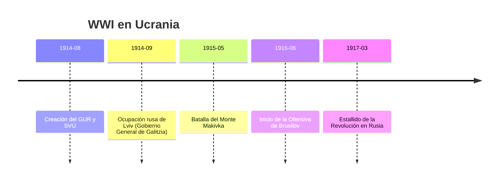

# U15: Ucrania en la Primera Guerra Mundial (1914-1918)

## 📹 Video de la Lección

**Enlace:** [La Gran Guerra en Tierras Ucranianas](https://www.youtube.com/live/U9p6N2P0j_o)

## 📚 Contenido de la Unidad

### Objetivos de Aprendizaje

Al completar esta unidad, deberás ser capaz de:

- ✅ Identificar los objetivos de los imperios beligerantes sobre el territorio ucraniano.
- ✅ Analizar el papel de las organizaciones políticas ucranianas (**GUR, SVU**).
- ✅ Conocer las hazañas militares de la legión de los **Fusileros del Sich (USS)**.
- ✅ Evaluar el impacto de las grandes ofensivas en la población civil.

---

### 1. Ucrania: El Botín de Guerra

Ucrania no fue un actor independiente, sino el campo de batalla entre dos bloques:
- **Imperio Ruso:** Buscaba "reunificar" las tierras rusas anexionando Galitzia, Bucovina y Transcarpatia (Tierras de los Habsburgo).
- **Imperio Austrohúngaro y Alemania:** Querían debilitar a Rusia y crear un estado tapón en Ucrania bajo su influencia para controlar los recursos agrícolas.

---

### 2. Organizaciones Políticas y Militares

Los ucranianos se dividieron según su lealtad:
- **GUR (Consejo Ucraniano Principal):** En Lviv. Leales a Austria, formaron la unidad militar **USS (Fusileros del Sich)**.
- **SVU (Unión para la Liberación de Ucrania):** Emigrantes del Este en Viena. Buscaban la independencia de Ucrania con apoyo alemán.
- **En el Imperio Ruso:** La mayoría de los líderes (como Petliura) apoyaron a Rusia inicialmente, esperando autonomía tras la victoria.

---

### 3. La Legión de los Fusileros del Sich (USS)

Fue la primera unidad militar ucraniana moderna (dentro del ejército austríaco).
- **Hitos:** 
  - **Batalla del Monte Makivka (1915):** Defensa exitosa contra los rusos.
  - **Batalla del Monte Lysonia (1916):** Gran pérdida de efectivos, pero demostración de valor nacional.

---

### 4. Operaciones Militares Principales

| Año | Operación | Consecuencia |
|-----|-----------|--------------|
| **1914** | Batalla de Galitzia | Rusia ocupa Lviv. Empieza la represión contra lo ucraniano. |
| **1915** | Ruptura de Gorlice | Austria recupera Galitzia. Los rusos se retiran. |
| **1916** | Ofensiva de Brusílov | Rusia recupera terreno, pero a un coste humano altísimo. |

---

### 📅 Cronología

### Errores Comunes en el NMT

> [!WARNING]
> - **Gobernación de Galitzia-Bucovina:** Durante la ocupación rusa (1914), el conde Bobrinsky cerró escuelas y periódicos ucranianos. No lo confundas con un período de libertad.
> - **Identidad USS:** Los Fusileros del Sich no eran rusos, eran galitzianos luchando con Austria, pero con el sueño de una Ucrania libre.

## 📝 Resumen

- Ucrania fue dividida y usada como recurso por los imperios.
- Los USS fueron la semilla del futuro ejército nacional ucraniano.
- La guerra agotó a los imperios y abrió la puerta a la Revolución de 1917.

## 🔗 Recursos Adicionales

- Canción de los USS: "Oi u luzi chervona kalyna".
- Mapa detallado del Frente Oriental.

## ✅ Autoevaluación

- [ ] ¿Qué imperio quería anexionar Galitzia bajo el lema "tierra rusa"? (Rusia).
- [ ] ¿Cómo se llamaba la unidad militar ucraniana en el ejército austríaco? (USS).
- [ ] ¿En qué monte lucharon los USS en 1915? (Makivka).
- [ ] ¿Qué organización fundó Levko Levytsky en 1914? (GUR).

---

**Última actualización:** Enero 2026
**Fuente:** Programa oficial NMT 2026 - Historia de Ucrania
