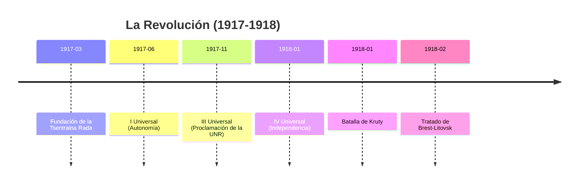
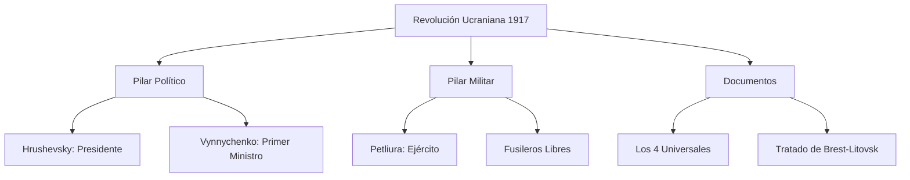

# U16: La Revolución Ucraniana (1917-1918)

## 📹 Video de la Lección

**Enlace:** [La Luta por la Estatalidad: La Tsentralna Rada](https://www.youtube.com/live/U9p6N2P0j_o)

## 📚 Contenido de la Unidad

### Objetivos de Aprendizaje

Al completar esta unidad, deberás ser capaz de:

- ✅ Explicar las causas y el inicio de la **Revolución Ucraniana**.
- ✅ Analizar el contenido y la evolución de los **4 Universales**.
- ✅ Identificar a los líderes clave (**Hrushevsky, Vynnychenko, Petliura**).
- ✅ Comprender la importancia de la **Batalla de Kruty**.

---

### 1. La Tsentralna Rada (Consejo Central)

Formada en marzo de 1917 en Kiev tras la caída del Zar.
- **Líder:** **Mykhailo Hrushevsky** (Presidente).
- **Órgano Ejecutivo:** Secretaría General, liderada por **Volodymyr Vynnychenko**.
- **Apoyo Militar:** Symon Petliura (Secretario de Asuntos Militares).

---

### 2. Los 4 Universals (Leyes Fundamentales)

| Decreto | Fecha | Contenido Principal |
|---------|-------|---------------------|
| **I Universal** | Junio 1917 | Proclamación de la **Autonomía** de Ucrania dentro de una Rusia democrática. |
| **II Universal** | Julio 1917 | Compromiso con el Gobierno Provisional Ruso: Ucrania esperará a la Asamblea Constituyente. |
| **III Universal** | Nov. 1917 | Proclamación de la **República Popular Ucraniana (UNR)** tras el golpe bolchevique en Rusia. |
| **IV Universal** | Enero 1918 | Proclamación de la **Independencia Total** y soberana de la UNR. |

---

### 3. El Conflicto con los Bolcheviques

Rusia Soviética no aceptó la independencia de la UNR y declaró la guerra.
- **Batalla de Kruty (Enero 1918):** Unos 300-600 estudiantes y cadetes ucranianos intentaron detener el avance de miles de tropas bolcheviques hacia Kiev. Se convirtió en un símbolo del sacrificio nacional por la libertad.
- **Tratado de Brest-Litovsk:** La UNR firma la paz con las Potencias Centrales (Alemania/Austria), quienes reconocen su independencia a cambio de suministros de grano.

---

### 📅 Cronología

### 🗺️ Mapa Conceptual

### Errores Comunes en el NMT

> [!WARNING]
> - **Independencia:** Mucha gente cree que Ucrania pidió la independencia desde el principio. ¡Falso! Los dos primeros Universales solo pedían **autonomía**. La independencia total (IV Universal) se proclamó solo tras la invasión bolchevique.
> - **Hrushevsky:** Es el primer "Presidente" (aunque técnicamente era jefe del Consejo), no lo confundas con un Rey o un Zar.

## 📝 Resumen

- La Revolución fue un renacimiento político sin precedentes.
- Los Universales muestran el paso gradual de la lealtad a Rusia a la soberanía total.
- Kruty demostró que la nación estaba dispuesta a luchar por sus ideales, aunque el ejército aún fuera débil.

## 🔗 Recursos Adicionales

- Documental: [La Batalla de Kruty](https://www.youtube.com).
- Texto íntegro de los 4 Universales.

## ✅ Autoevaluación

- [ ] ¿Cuál de los Universales proclamó la independencia total? (IV).
- [ ] ¿Quién fue el presidente de la Tsentralna Rada? (Hrushevsky).
- [ ] ¿Qué importancia tuvo la Batalla de Kruty?
- [ ] ¿Por qué se firmó el Tratado de Brest-Litovsk?

---

**Última actualización:** Enero 2026
**Fuente:** Programa oficial NMT 2026 - Revolución Ucraniana
