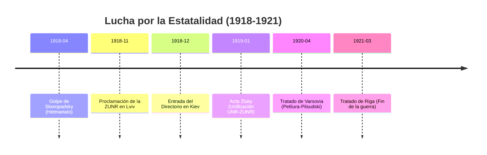
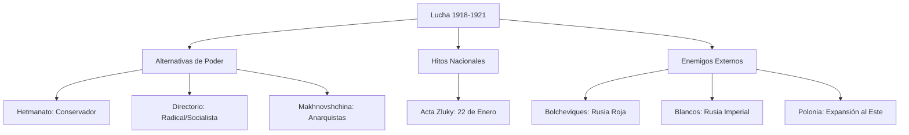

# U17: La Lucha por la Independencia (1918-1921)

## 📹 Video de la Lección

**Enlace:** [El Derrumbe de los Estados Ucranianos](https://www.youtube.com/live/U9p6N2P0j_o)

## 📚 Contenido de la Unidad

### Objetivos de Aprendizaje

Al completar esta unidad, deberás ser capaz de:

- ✅ Comparar el **Hetmanato** de Skoropadsky con la **Directorio** de Petliura.
- ✅ Explicar la importancia del **Acta Zluky** (Unificación) de 1919.
- ✅ Analizar las causas del fracaso del movimiento nacional frente a los **Bolcheviques**.
- ✅ Identificar el papel de los movimientos insurgentes (**Makhno**).

---

### 1. El Hetmanato de Pavlo Skoropadsky (1918)

Tras un golpe apoyado por Alemania, Skoropadsky instauró un régimen conservador.
- **Logros:** Creó la Academia de Ciencias de Ucrania, universidades nacionales y una moneda estable.
- **Debilidad:** Apoyó a los terratenientes, lo que le quitó el apoyo del campesinado.

---

### 2. El Directorio y la UNR Restaurada

Tras la retirada alemana, surge el Directorio liderado por **Volodymyr Vynnychenko** y **Symon Petliura**.
- **Contexto:** Guerra total en varios frentes: los Blancos (monárquicos rusos), los Rojos (bolcheviques) y Polonia.

---

### 3. La ZUNR y el Acta Zluky (1919)

En el oeste, surge la **República Popular de Ucrania Occidental (ZUNR)** tras caer Austria.
- **22 de enero de 1919:** Se firma en Kiev el **Acta Zluky**, la unión simbólica de las dos Ucranias (Oriental y Occidental) en un solo estado. Es hoy el Día de la Unidad de Ucrania.

---

### 4. El Avance Bolchevique y el Fin de la Lucha

- **Guerra Polaco-Soviética:** Petliura se alía con Polonia (Tratado de Varsovia, 1920) para intentar recuperar Kiev, pero tras la paz de Riga (1921), Ucrania queda dividida: el oeste para Polonia y el resto para la Unión Soviética.
- **Nestor Makhno:** Líder anarquista en el sur que luchó contra todos, pero fue vital para derrotar a los Blancos antes de ser traicionado por los Bolcheviques.

---

### 📅 Cronología

### 🗺️ Mapa Conceptual

### Errores Comunes en el NMT

> [!WARNING]
> - **Acta Zluky:** No fue una unión definitiva por la guerra, pero es el evento más importante para la identidad nacional moderna.
> - **Personalidades:** Confundir a Skoropadsky (pro-orden/letras) con Petliura (pro-militar/revolucionario).

## 📝 Resumen

- Ucrania intentó ser un estado moderno pero falló por la división interna y la agresividad externa.
- Las instituciones creadas por Skoropadsky sobrevivieron como base cultural.
- El territorio fue finalmente repartido entre la URSS, Polonia, Rumanía y Checoslovaquia.

## 🔗 Recursos Adicionales

- Biografía de Symon Petliura.
- Mapa de las fronteras de 1919.

## ✅ Autoevaluación

- [ ] ¿Qué se celebra el 22 de enero en Ucrania? (Acta Zluky).
- [ ] ¿Quién fundó la Academia de Ciencias? (Skoropadsky).
- [ ] ¿Contra quiénes luchó el Ejército Insurgente de Makhno?
- [ ] ¿Qué territorios cedió Petliura a Polonia en 1920?

---

**Última actualización:** Enero 2026
**Fuente:** Programa oficial NMT 2026 - Historia de Ucrania
