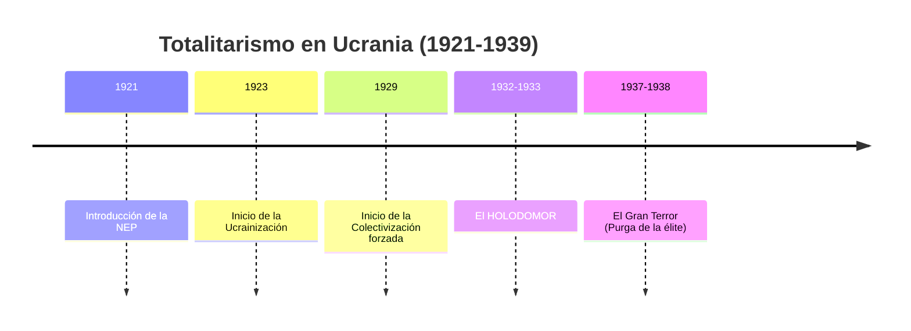
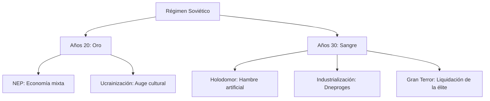

# U18: El Régimen Totalitario Soviético (1920s-1930s)

## 📹 Video de la Lección

**Enlace:** [La Tragedia Ucraniana: Holodomor y Terror](https://www.youtube.com/live/mr-hkkvuQNQ)

## 📚 Contenido de la Unidad

### Objetivos de Aprendizaje

Al completar esta unidad, deberás ser capaz de:

- ✅ Explicar las políticas de la **NEP** y la **Ucrainización** de los años 20.
- ✅ Analizar las causas y consecuencias del **Holodomor** (Genocidio ucraniano).
- ✅ Identificar el impacto de la industrialización forzada y la colectivización.
- ✅ Comprender el concepto de **Renacimiento Fusilado** (Rozstrilyane vidrodzhennya).

---

### 1. Los Años 20: NEP y Ucrainización

Tras la guerra, Lenin permitió cierta libertad económica (**NEP**) y cultural (**Indigenización/Ucrainización**).
- **Ucrainización (1923):** Promovió el idioma ucraniano en escuelas, prensa y gobierno. Líderes como **Mykola Skrypnyk** impulsaron un auge cultural sin precedentes.
- **Renacimiento Cultural:** Surgieron genios como el escritor Mykola Khvylovy, el director de teatro Les Kurbas y el pintor Mykhailo Boichuk.

---

### 2. El Gran Cambio de Stalin (1929)

Stalin puso fin a la NEP e inició una transformación violenta:
- **Industrialización Forzada:** Construcción de gigantes como **Dneproges** (presa del Dniéper).
- **Colectivización:** Eliminación de la propiedad privada rural. Los campesinos independientes (*Kulaks*) fueron despojados y deportados.

---

### 3. El Holodomor (1932-1933): Genocidio

El estado soviético provocó artificialmente una hambruna para quebrar la resistencia campesina y nacional.
- **Ley de las 5 Espigas de Grano:** Castigaba con la muerte recoger sobras de los campos.
- **Tablones Negros (Chorni Doshky):** Pueblos enteros eran aislados y dejados morir de hambre si no entregaban las cuotas de grano imposibles.
- **Víctimas:** Se estima que murieron unos **4 millones** de personas solo en Ucrania.

---

### 4. El Gran Terror y el Renacimiento Fusilado

En los años 30, Stalin liquidó a la élite intelectual ucraniana que había florecido en los años 20.
- **Rozstrilyane vidrodzhennya:** Casi todos los escritores, artistas y académicos fueron ejecutados en Sandarmokh o enviados al GULAG.
- **Russificación:** El ucraniano fue perseguido y se impuso el ruso como lengua "de progreso".

---

### 📅 Cronología

### 🗺️ Mapa Conceptual

### Errores Comunes en el NMT

> [!WARNING]
> - **Culpabilidad:** El Holodomor no fue por una mala cosecha o clima, fue una **decisión política** de Stalin.
> - **Ucrainización:** No creas que Stalin amaba la cultura ucraniana; la permitió temporalmente para consolidar el poder soviético antes de destruirla.

## 📝 Resumen

- Ucrania vivió un auge cultural en los 20 que fue brutalmente aniquilado en los 30.
- El campesinado, base de la nación, fue diezmado por la colectivización y el hambre.
- Para finales de los años 30, Ucrania era una república totalmente subordinada y aterrorizada por Moscú.

## 🔗 Recursos Adicionales

- Museo Nacional del Holodomor en Kiev.
- Lista de figuras del Renacimiento Fusilado.

## ✅ Autoevaluación

- [ ] ¿Cómo se llamó la política de promoción de la cultura local? (Ucrainización).
- [ ] ¿Cuál fue el proyecto industrial más famoso de los años 30? (Dneproges).
- [ ] ¿Qué establecía la Ley de las 5 espigas?
- [ ] ¿Quién fue Mykola Skrypnyk? (Líder de la Ucrainización que se suicidó en 1933).

---

**Última actualización:** Enero 2026
**Fuente:** Programa oficial NMT 2026 - Historia de Ucrania
