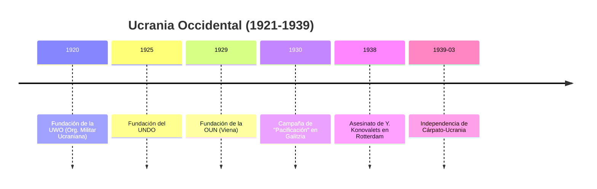
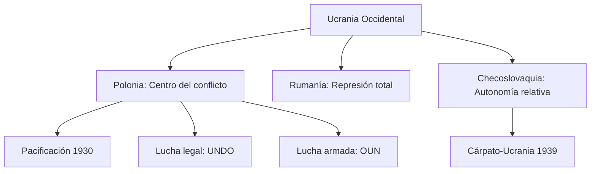

# U19: Ucrania Occidental entre Guerras (1921-1939)

## 📹 Video de la Lección

**Enlace:** [Bajo Banderas Ajenas: Galitzia y Volinia](https://www.youtube.com/live/U9p6N2P0j_o)

## 📚 Contenido de la Unidad

### Objetivos de Aprendizaje

Al completar esta unidad, deberás ser capaz de:

- ✅ Comparar las políticas hacia los ucranianos en **Polonia, Rumanía y Checoslovaquia**.
- ✅ Explicar la campaña de **Pacificación** polaca de 1930.
- ✅ Analizar el surgimiento del nacionalismo integral y la formación de la **OUN**.
- ✅ Identificar la efímera independencia de **Cárpato-Ucrania** (1939).

---

### 1. Ucrania bajo Polonia: Resistencia y Represión

La mayoría de los ucranianos del oeste quedaron en Polonia (Galitzia y Volinia).
- **Polonización:** El estado intentó asimilar a los ucranianos, cerrando escuelas y colonizando tierras con antiguos soldados polacos (**Osadniks**).
- **Pacificación (1930):** Operación militar contra civiles ucranianos para "calmar" las protestas, que resultó en miles de arrestos y destrucción de centros culturales.
- **UNDO:** El partido legal más grande (Unión Nacional Democrática Ucraniana), que buscaba la autonomía por medios parlamentarios.

---

### 2. Surgimiento del Nacionalismo: La OUN (1929)

Ante el fracaso de la diplomacia, surgió la lucha armada clandestina.
- **Formación:** En 1929 se fundó la **Organización de Nacionalistas Ucranianos (OUN)** en Viena, liderada por **Yevhen Konovalets**.
- **Métodos:** Sabotajes, boicots y atentados contra funcionarios polacos. Destacan figuras jóvenes como **Stepan Bandera**.

---

### 3. Rumanía y Checoslovaquia: Dos Contrastes

- **Rumanía (Bucovina):** Política de rumanización muy agresiva. Se prohibió el uso del ucraniano incluso en la iglesia.
- **Checoslovaquia (Transcarpatia):** Fue el régimen más liberal. Permitió el desarrollo cultural y partidos políticos.
- **Cárpato-Ucrania (1939):** Ante el desmembramiento de Checoslovaquia por Hitler, los ucranianos proclamaron su independencia bajo el liderazgo de **Augustyn Voloshyn**, pero fueron invadidos por Hungría días después.

---

### 📅 Cronología

### 🗺️ Mapa Conceptual

### Errores Comunes en el NMT

> [!WARNING]
> - **Pacificación:** No fue un proceso de paz, fue una campaña represiva del gobierno polaco de Pilsudski.
> - **OUN:** Recuerda que nació de la fusión de la UWO (militares) y organizaciones estudiantiles. Su líder fundador fue Konovalets, no Bandera (quien fue líder regional y luego jefe de una facción).

## 📝 Resumen

- Galitzia fue el motor de la resistencia nacional fuera de la URSS.
- Mientras en el Este los ucranianos morían de hambre bajo Stalin, en el Oeste luchaban por sus derechos contra el estado polaco.
- El sueño de la independencia se materializó brevemente en Transcarpatia justo antes de la Segunda Guerra Mundial.

## 🔗 Recursos Adicionales

- Documentos de la OUN de 1929.
- Historia de Augustyn Voloshyn.

## ✅ Autoevaluación

- [ ] ¿Cómo se llamaba la campaña polaca de represión de 1930? (Pacificación).
- [ ] ¿Quién fue el primer líder de la OUN? (Yevhen Konovalets).
- [ ] ¿En qué ciudad se fundó la OUN? (Viena).
- [ ] ¿Quién gobernó Cárpato-Ucrania en 1939? (Augustyn Voloshyn).

---

**Última actualización:** Enero 2026
**Fuente:** Programa oficial NMT 2026 - Historia de Ucrania
