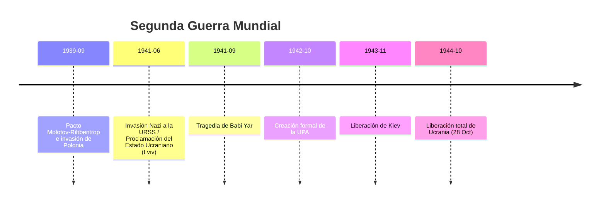

# U20: Ucrania en la Segunda Guerra Mundial (1939-1945)

## 📹 Video de la Lección

**Enlace:** [La Gran Guerra: Ucrania entre dos Fuegos](https://www.youtube.com/live/U9p6N2P0j_o)

## 📚 Contenido de la Unidad

### Objetivos de Aprendizaje

Al completar esta unidad, deberás ser capaz de:

- ✅ Explicar las etapas de la guerra en territorio ucraniano.
- ✅ Diferenciar los regímenes de ocupación nazi.
- ✅ Analizar el papel de la **Resistencia** (Ucranianos en el Ejército Rojo, partisanos y la **UPA**).
- ✅ Comprender la tragedia del **Holocausto** en Ucrania (**Babi Yar**).

---

### 1. 1939-1941: Bajo la Sombra del Pacto Molotov-Ribbentrop

Antes de la invasión nazi a la URSS, Ucrania ya estaba en guerra.
- **1 de sept de 1939:** Alemania invade Polonia.
- **17 de sept de 1939:** La URSS entra en Polonia Oriental; Galitzia y Volinia se unen a la Ucrania Soviética.
- **1940:** La URSS anexiona el norte de Bucovina y Besarabia (de Rumanía).

---

### 2. La Ocupación Nazi (1941-1944)

El 22 de junio de 1941, Alemania rompe el pacto e invade la URSS (**Operación Barbarroja**).
- **Régimen de Ocupación:** Ucrania fue dividida en:
  - **Reichskommissariat Ukraine:** Bajo Erich Koch (terror y explotación extrema).
  - **Distrito de Galitzia:** Bajo administración alemana directa.
  - **Transnistria:** Cedida a Rumanía (aliada de Hitler).
- **Tragedia:** Millones de ucranianos fueron llevados a Alemania como trabajadores forzados (**Ostarbeiter**).

---

### 3. La Resistencia y el Holocausto

- **El Holocausto:** En Ucrania, el genocidio judío se cometió mediante fusilamientos masivos. El barranco de **Babi Yar** en Kiev es el símbolo más trágico (más de 33,000 víctimas en solo dos días).
- **Dos Resistencias:**
  1. **Soviética:** Unidades de partisanos (como Kovpak) que saboteaban a los alemanes por la retaguardia.
  2. **Nacionalista (OUN-UPA):** Liderada por **Stepan Bandera** (OUN-B) y **Andriy Melnyk** (OUN-M). La **UPA** (Ejército Insurgente Ucraniano) fue creada en 1942 para luchar tanto contra nazis como luego contra soviéticos, buscando una Ucrania independiente.

---

### 4. Liberación y Consecuencias

- **Liberación:** Tras la batalla del Dniéper y otras grandes ofensivas, el **28 de octubre de 1944** todo el territorio ucraniano quedó libre de tropas nazis.
- **Coste:** Ucrania perdió a unos **8-10 millones** de personas (entre civiles y militares). El país quedó Literalmente en ruinas.

---

### 📅 Cronología

### Errores Comunes en el NMT

> [!WARNING]
> - **30 de Junio de 1941:** La OUN proclamó la independencia en Lviv esperando apoyo alemán. Hitler respondió arrestando a los líderes (Bandera fue al campo de Sachsenhausen). No fue un gobierno títere exitoso.
> - **Ostarbeiter:** Eran trabajadores forzados, esclavos modernos del Reich. Muchos murieron por maltrato.

## 📝 Resumen

- Ucrania fue el epicentro de las batallas más sangrientas del frente oriental.
- Hubo ucranianos luchando en el Ejército Rojo, en la UPA y en ejércitos aliados.
- La guerra terminó con la "reunificación" de casi todas las tierras ucranianas bajo la URSS.

## 🔗 Recursos Adicionales

- Documental: [Ucrania en la 2GM](https://www.youtube.com).
- Mapa de los regímenes de ocupación.

## ✅ Autoevaluación

- [ ] ¿Cuándo fue liberada Ucrania totalmente de los nazis? (28 oct 1944).
- [ ] ¿Qué era el Reichskommissariat Ukraine?
- [ ] ¿Quiénes formaron la UPA en 1942?
- [ ] ¿Qué ocurrió en Babi Yar en sept de 1941?

---

**Última actualización:** Enero 2026
**Fuente:** Programa oficial NMT 2026 - Historia de Ucrania
