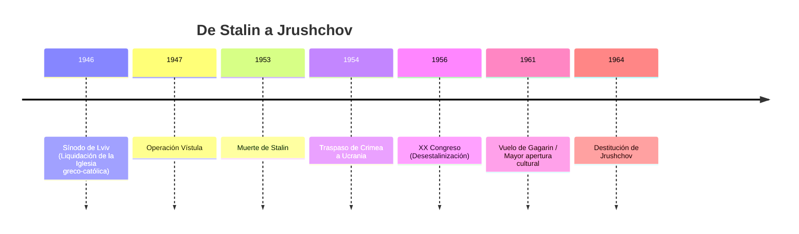

# U21: Posguerra y Desestalinización (1945-1964)

## 📹 Video de la Lección

**Enlace:** [Del Terror de Stalin al Deshielo de Jrushchov](https://www.youtube.com/live/U9p6N2P0j_o)

## 📚 Contenido de la Unidad

### Objetivos de Aprendizaje

Al completar esta unidad, deberás ser capaz de:

- ✅ Explicar las penurias de la **posguerra** y la reconstrucción.
- ✅ Analizar el impacto de la **Desestalinización** (El Deshielo).
- ✅ Identificar el papel de los **Sheshtydesyatnyky** (Generación de los 60).
- ✅ Conocer las razones del traspaso de **Crimea** a Ucrania en 1954.

---

### 1. La Posguerra (1945-1953): Hambre y Acero

- **Reconstrucción:** Se priorizó el IV Plan Quinquenal para restaurar minas y fábricas. Ucrania se convirtió en el "arsenal" de la URSS.
- **Hambre de 1946-1947:** Causada por sequía y requisiciones brutales. Stalin ignoró el hambre en Ucrania mientras exportaba grano.
- **Limpieza Étnica:** Operación **Vístula** (en Polonia) y Operación **Oeste** (en Ucrania) para deportar a familias sospechosas de apoyar a la UPA.

---

### 2. El Deshielo (1953-1964): La Era de Jrushchov

A la muerte de Stalin (1953), Nikita Jrushchov inicia una apertura relativa.
- **XX Congreso del PCUS (1956):** Jrushchov denuncia el "culto a la personalidad" de Stalin. Comienza la liberación de prisioneros de los GULAG.
- **Crimea (1954):** Con motivo del 300 aniversario del Tratado de Pereyaslav, la RSFS de Rusia transfiere la región de Crimea a la RSS de Ucrania por "lazos económicos y geográficos".
- **Reformas Económicas:** Se crearon los **Radnarhospy** (Consejos de Economía Nacional) para descentralizar la gestión.

---

### 3. El Renacimiento de los 60 (Shistdesyatnyky)

Surge una nueva generación de intelectuales que pedían libertad cultural y respeto al idioma ucraniano.
- **Figuras clave:** Vasyl Symonenko, Lina Kostenko, Ivan Drach e Ivan Svitlychnyi.
- **Cierre del periodo:** Jrushchov es destituido en 1964, poniendo fin al deshielo y comenzando el "estancamiento" de Brezhnev.

---

### 📅 Cronología

### Errores Comunes en el NMT

> [!WARNING]
> - **Crimea:** No fue un "regalo" personal de Jrushchov; fue una decisión administrativa para que Ucrania reconstruyera la península (que estaba devastada y sin agua).
> - **Libertad:** El Deshielo NO fue democracia; el Partido Comunista seguía teniendo el control total, solo que se detuvieron los fusilamientos masivos de la época de Stalin.

## 📝 Resumen

- Ucrania pasó de ser tierra de deportaciones y hambre a un centro de innovación industrial y espacial.
- Los intelectuales de los 60 sentaron las bases del futuro movimiento de independencia.
- La descentralización económica (Radnarhospy) dio un breve impulso a la economía local.

## 🔗 Recursos Adicionales

- Poemas de Vasyl Symonenko.
- Documentos del XX Congreso del PCUS.

## ✅ Autoevaluación

- [ ] ¿En qué año se transfirió Crimea a Ucrania? (1954).
- [ ] ¿Cómo se llamaban los organismos de descentralización económica? (Radnarhospy).
- [ ] ¿Qué generación literaria nació en este periodo? (Shistdesyatnyky).
- [ ] ¿Qué evento marcó el inicio oficial de la desestalinización? (XX Congreso en 1956).

---

**Última actualización:** Enero 2026
**Fuente:** Programa oficial NMT 2026 - Historia de Ucrania
