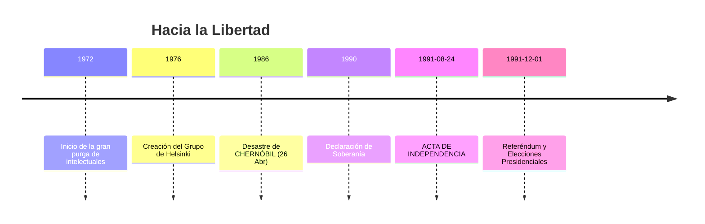

# U22: Crisis del Sistema Soviético e Independencia (1964-1991)

## 📹 Video de la Lección

**Enlace:** [El Camino a la Libertad: De Brézhnev a la Independencia](https://www.youtube.com/live/U9p6N2P0j_o)

## 📚 Contenido de la Unidad

### Objetivos de Aprendizaje

Al completar esta unidad, deberás ser capaz de:

- ✅ Identificar las causas del estancamiento económico (**Zastiy**).
- ✅ Diferenciar el liderazgo de **Shelest** y **Shcherbytskyi**.
- ✅ Analizar el impacto de la catástrofe de **Chernóbil** en la conciencia nacional.
- ✅ Explicar el proceso de independencia de 1991.

---

### 1. El Estancamiento (Zastiy)

Bajo Brézhnev, la URSS entró en una crisis económica y moral profunda. En Ucrania, hubo dos etapas:
- **Petro Shelest (1964-1972):** Defendió tímidamente la cultura y lengua ucraniana. Fue destituido por "nacionalismo".
- **Volodymyr Shcherbytskyi (1972-1989):** Leal a Moscú, impuso una rusificación severa y persiguió a los disidentes.

---

### 2. El Movimiento Disidente

A pesar de la represión, intelectuales valientes alzaron la voz:
- **Grupo de Helsinki de Ucrania (1976):** Liderado por **Mykola Rudenko**, exigía el respeto a los derechos humanos.
- **Mártires:** El poeta **Vasyl Stus** murió en un campo de trabajos forzados en 1985.
- **Samvydav:** Publicaciones clandestinas como "Ukrainskyi Visnyk" de **Vyacheslav Chornovil**.

---

### 3. Chernóbil (1986): El Catalizador

El **26 de abril de 1986**, la explosión del reactor 4 en la central de **Chernóbil** cambió la historia.
- La mentira inicial de Moscú y el peligro radiactivo despertaron al pueblo ucraniano. El desastre demostró que el sistema soviético era ineficiente y peligroso.

---

### 4. La Caída del Telón de Acero (1989-1991)

- **Soberanía:** El 16 de julio de 1990 se aprobó la Declaración de Soberanía Estatal.
- **Revolución sobre el Granito:** Estudiantes en Kiev realizaron una huelga de hambre logrando cambios democráticos.
- **INDEPENDENCIA:** El **24 de agosto de 1991**, tras el fallido golpe en Moscú, el parlamento declaró la independencia de Ucrania.
- **Referéndum (1 de dic de 1991):** El **90.32%** de los ucranianos votó "SÌ". **Leonid Kravchuk** fue elegido primer presidente.

---

### 📅 Cronología

### Errores Comunes en el NMT

> [!WARNING]
> - **Chornovil:** Fue el líder moral y el candidato de la oposición en 1991, pero perdió contra Kravchuk (ex-comunista).
> - **Soberanía vs Independencia:** La soberanía de 1990 permitía seguir en la URSS con más derechos; la independencia de 1991 fue la ruptura total.

## 📝 Resumen

- El estancamiento soviético llevó al renacimiento del sentimiento nacional.
- Chernóbil fue el punto de no retorno para la confianza en Moscú.
- La independencia fue ratificada por una mayoría histórica en todas las regiones (incluyendo Crimea y el Donbás).

## 🔗 Recursos Adicionales

- Vídeo sobre Chernóbil: [Impacto Político](https://www.youtube.com).
- Acta de Independencia Original.

## ✅ Autoevaluación

- [ ] ¿Quién sustituyó a Shelest en 1972? (Shcherbytskyi).
- [ ] ¿En qué fecha exacta fue el desastre de Chernóbil? (26 de abril de 1986).
- [ ] ¿Qué porcentaje votó "SÍ" a la independencia en 1991? (Más del 90%).
- [ ] ¿Cómo se llamó la protesta estudiantil de 1990? (Revolución sobre el Granito).

---

**Última actualización:** Enero 2026
**Fuente:** Programa oficial NMT 2026 - Historia de Ucrania
