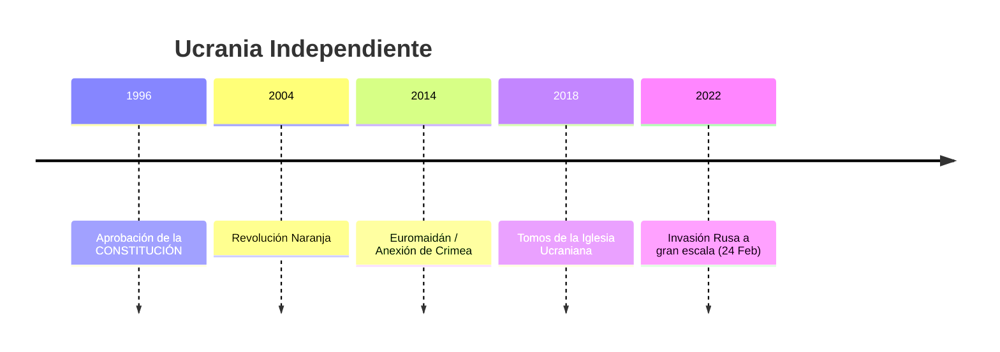

# U23: Formación de Ucrania Independiente (1991-Presente)

## 📹 Video de la Lección

**Enlace:** [Ucrania Moderna: De la Independencia a la Resistencia](https://www.youtube.com/live/U9p6N2P0j_o)

## 📚 Contenido de la Unidad

### Objetivos de Aprendizaje

Al completar esta unidad, deberás ser capaz de:

- ✅ Identificar los principales hitos de la **estatalidad ucraniana** moderna.
- ✅ Analizar las causas y consecuencias de las dos **revoluciones** (Naranja y Dignidad).
- ✅ Comprender el contexto de la **agresión rusa** desde 2014.
- ✅ Conocer las reformas clave (Constitución, moneda, Tomos).

---

### 1. Los Primeros Años (1991-2004)

- **Leonid Kravchuk (1991-1994):** Periodo de hiperinflación y el **Memorándum de Budapest (1994)**, donde Ucrania renunció a su arsenal nuclear a cambio de garantías de seguridad.
- **Leonid Kuchma (1994-2005):** Se aprobó la **Constitución (1996)** y se introdujo la moneda nacional, la **Hryvnia**. Crecimiento económico pero también auge de los oligarcas.

---

### 2. Las Revoluciones por la Democracia

- **Revolución Naranja (2004):** Protestas masivas contra el fraude electoral a favor de Yanukovych. El resultado fue la victoria de **Viktor Yushchenko** tras una repetición electoral histórica.
- **Revolución de la Dignidad (Euromaidán, 2013-2014):** Protestas que comenzaron cuando Yanukovych se negó a firmar el acuerdo con la UE. Terminó con la huida de Yanukovych y la muerte de los "Cien Celestiales" (**Nebyosna Sotnya**).

---

### 3. Agresión Rusa y Guerra (2014-Presente)

- **2014:** Rusia aprovecha la inestabilidad para anexionarse ilegalmente **Crimea** e iniciar una guerra híbrida en el **Donbás**.
- **Petro Poroshenko (2014-2019):** Ucrania firma el Acuerdo de Asociación con la UE, obtiene el régimen sin visados y el **Tomos** de independencia para la Iglesia Ortodoxa de Ucrania.
- **Volodymyr Zelenskyy (2019-Presente):** El 24 de febrero de 2022, Rusia inicia una **invasión a gran escala**. Ucrania resiste con apoyo internacional masivo buscando su integración definitiva en la UE y la OTAN.

---

### 📅 Cronología Moderna

### Errores Comunes en el NMT

> [!WARNING]
> - **Memorándum de Budapest:** Es vital recordar quiénes lo firmaron (Ucrania, Rusia, EE.UU., Reino Unido) y que Rusia violó este acuerdo en 2014.
> - **Estructura Política:** Ucrania ha cambiado de República Presidencial-Parlamentaria a Parlamentaria-Presidencial varias veces por reformas constitucionales.

## 📝 Resumen

- Ucrania ha consolidado su democracia a través de dos revoluciones ciudadanas.
- La identidad nacional se ha fortalecido drásticamente tras el inicio de la agresión rusa.
- El objetivo nacional actual es la victoria militar y la plena integración en la familia europea.

## 🔗 Recursos Adicionales

- Texto de la Constitución de Ucrania.
- Mapa de las zonas ocupadas temporalmente.

## ✅ Autoevaluación

- [ ] ¿En qué año se aprobó la Constitución de Ucrania? (1996).
- [ ] ¿Qué documento firmó Ucrania para entregar sus armas nucleares? (Memorándum de Budapest).
- [ ] ¿Cómo se llama la revolución de 2013-2014? (Euromaidán / Revolución de la Dignidad).
- [ ] ¿Quién es el actual presidente de Ucrania? (Volodymyr Zelenskyy).

---

**Última actualización:** Enero 2026
**Fuente:** Programa oficial NMT 2026 - Historia de Ucrania
