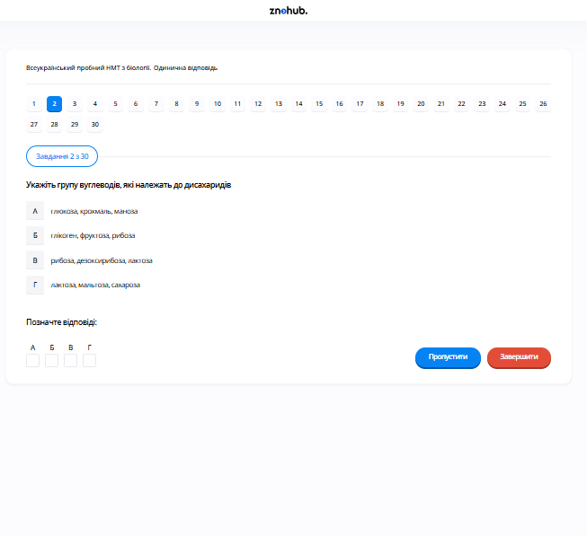

# Завдання 02

## Опис
Укажіть групу вуглеводів, які належать до дисахаридів.

## Аналіз варіантів відповіді

*   **А) глюкоза, крохмаль, маноза (Неправильно)**: Глюкоза та маноза — це моносахариди (гексози). Крохмаль — це полісахарид (складний вуглевод).
*   **Б) глікоген, фруктоза, рибоза (Неправильно)**: Глікоген — це полісахарид. Фруктоза — моносахарид (гексоза), а рибоза — моносахарид (пентоза).
*   **В) рибоза, дезоксирибоза, лактоза (Неправильно)**: Рибоза та дезоксирибоза — це моносахариди (пентози). Лактоза — це дисахарид, але інші два у групі — ні.
*   **Г) лактоза, мальтоза, сахароза (Правильно)**: Усі три є дисахаридами. Лактоза складається з глюкози та галактози; мальтоза — з двох одиниць глюкози; сахароза — з глюкози та фруктози.

## Теорія: Класифікація вуглеводів
Вуглеводи — це органічні сполуки, що складаються з вуглецю, водню та кисню (загальна формула $C_n(H_2O)_m$). Вони поділяються на три основні групи:
1. **Моносахариди**: Прості цукри, що не гідролізуються. Класифікуються за кількістю атомів вуглецю:
    *   *Тріози* (3С): проміжні продукти метаболізму.
    *   *Пентози* (5С): рибоза (в РНК) та дезоксирибоза (в ДНК).
    *   *Гексози* (6С): глюкоза (основне джерело енергії), фруктоза (цукор фруктів), галактоза та маноза.
2. **Олігосахариди**: Складаються з 2-10 залишків моносахаридів, з'єднаних глікозидним зв'язком. Найважливішими є **дисахариди**:
    *   **Сахароза** (глюкоза + фруктоза) — тростинний або буряковий цукор.
    *   **Лактоза** (глюкоза + галактоза) — молочний цукор.
    *   **Мальтоза** (глюкоза + глюкоза) — солодовий цукор.
3. **Полісахариди**: Складні високомолекулярні сполуки, полімери моносахаридів:
    *   *Енергетичні та запасні*: крохмаль (у рослин), глікоген (у тварин і грибів).
    *   *Структурні*: целюлоза (клітинна стінка рослин), хітин (оболонка грибів та екзоскелет членистоногих), муреїн (стінка бактерій).

---

# Pregunta 02

## Descripción
La pregunta pide identificar el grupo de carbohidratos que pertenecen a la categoría de los disacáridos.

## Análisis de las Opciones

*   **A) glucosa, almidón, manosa (Incorrecto)**: La glucosa y la manosa son monosacáridos (hexosas). El almidón es un polisacárido (un carbohidrato complejo).
*   **B) glucógeno, fructosa, ribosa (Incorrecto)**: El glucógeno es un polisacárido. La fructosa es un monosacárido (hexosa) y la ribosa es un monosacárido (pentosa).
*   **C) ribosa, desoxirribosa, lactosa (Incorrecto)**: La ribosa y la desoxirribosa son monosacáridos (pentosas). La lactosa es un disacárido, pero los otros dos del grupo no lo son.
*   **D) lactosa, maltosa, sacarosa (Correcto)**: Los tres son disacáridos. La lactosa está compuesta por glucosa y galactosa; la maltosa está compuesta por dos unidades de glucosa; la sacarosa está compuesta por glucosa y fructosa.

## Teoría: Clasificación de los Carbohidratos
Los carbohidratos (o glúcidos) son biomoléculas fundamentales compuestas por C, H y O. Se clasifican según su complejidad estructural:
1. **Monosacáridos**: Son los monómeros o azúcares simples.
    *   *Según el grupo funcional*: Aldosas (grupo aldehído) o Cetosas (grupo cetona).
    *   *Según el número de carbonos*: Pentosas (Ribosa, Desoxirribosa) — esenciales en los ácidos nucleicos; Hexosas (Glucosa — principal combustible metabólico, Fructosa, Galactosa).
2. **Disacáridos**: Formados por la unión de dos monosacáridos mediante un **enlace o-glucosídico** con liberación de una molécula de agua.
    *   **Sacarosa**: (Glucosa + Fructosa). Se encuentra en la savia de las plantas y el azúcar de mesa.
    *   **Lactosa**: (Glucosa + Galactosa). El azúcar principal de la leche.
    *   **Maltosa**: (Glucosa + Glucosa). Producto de la hidrólisis del almidón.
3. **Polisacáridos**: Largas cadenas de monosacáridos.
    *   **Almidón**: Reserva energética en plantas (amilosa y amilopectina).
    *   **Glucógeno**: Reserva energética en animales (almacenado en hígado y músculos).
    *   **Celulosa**: Función estructural en la pared celular vegetal.
    *   **Quitina**: Forma el exoesqueleto de artrópodos y la pared celular de hongos.

---

# Question 02

## Description
The question asks to identify the group of carbohydrates that belong to the category of disaccharides.

## Analysis of Options

*   **A) glucose, starch, mannose (Incorrect)**: Glucose and mannose are monosaccharides (hexoses). Starch is a polysaccharide (a complex carbohydrate).
*   **B) glycogen, fructose, ribose (Incorrect)**: Glycogen is a polysaccharide. Fructose is a monosaccharide (hexose), and ribose is a monosaccharide (pentose).
*   **C) ribose, deoxyribose, lactose (Incorrect)**: Ribose and deoxyribose are monosaccharides (pentoses). Lactose is a disaccharide, but the other two in the group are not.
*   **D) lactose, maltose, sucrose (Correct)**: All three are disaccharides. Lactose is composed of glucose and galactose; maltose is composed of two glucose units; sucrose is composed of glucose and fructose.

## Theory: Classification of Carbohydrates
Carbohydrates are polyhydroxy aldehydes or ketones with the general formula $C_n(H_2O)_m$. They are categorized into three main groups based on the degree of polymerization:
1. **Monosaccharides**: Simple sugars that cannot be hydrolyzed into smaller units.
    *   *Pentoses (5C)*: Ribose (RNA component) and Deoxyribose (DNA component).
    *   *Hexoses (6C)*: Glucose (primary energy source for cells), Fructose (fruit sugar), and Galactose.
2. **Disaccharides**: Formed by the condensation of two monosaccharides via a **glycosidic bond**.
    *   **Sucrose**: Glucose + Fructose. Commonly known as table sugar.
    *   **Lactose**: Glucose + Galactose. Known as milk sugar.
    *   **Maltose**: Glucose + Glucose. Formed during the breakdown of starch.
3. **Polisaccharides**: Polymers of hundreds or thousands of monosaccharide units.
    *   *Storage Polysaccharides*: Starch (plants) and Glycogen (animals/fungi).
    *   *Structural Polysaccharides*: Cellulose (plant cell walls), Chitin (fungal cell walls and arthropod exoskeletons), and Murein (peptidoglycan in bacteria).
