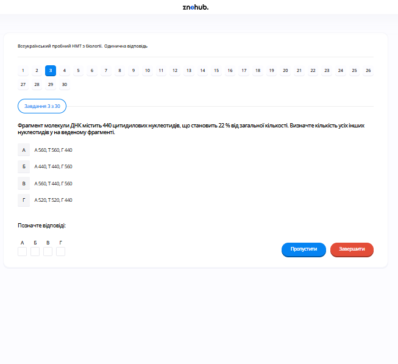

# Завдання 03

## Опис
Фрагмент молекули ДНК містить 440 цитидилових нуклеотидів, що становить 22% від загальної кількості. Визначте кількість усіх інших нуклеотидів у наведеному фрагменті.

## Аналіз та розрахунок

Згідно з правилами Чаргаффа:
1.  **Цитозин (Ц) = Гуанін (Г)**. Оскільки Ц = 440 (22%), то **Г = 440 (22%)**.
2.  Сумарний відсоток Ц та Г становить 22% + 22% = 44%.
3.  Сумарний відсоток **Аденіну (А) та Тиміну (Т)** становить 100% - 44% = 56%.
4.  Оскільки **А = Т**, кожен з них становить 56% / 2 = 28%.
5.  Обчислення кількості:
    *   Загальна кількість нуклеотидів = 440 / 0,22 = 2000.
    *   А = 2000 * 0,28 = 560.
    *   Т = 560.
    *   Г = 440.

Отже, результат: **А 560, Т 560, Г 440**.

## Аналіз варіантів відповіді

*   **А) А 560, Т 560, Г 440 (Правильно)**: Це відповідає розрахункам на основі правил Чаргаффа та наведених відсотків.
*   **Б) А 440, Т 440, Г 560 (Неправильно)**: Тут помилково припущено, що А та Т становлять по 22%.
*   **В) А 560, Т 440, Г 560 (Неправильно)**: Порушується правило А = Т.
*   **Г) А 520, Т 520, Г 440 (Неправильно)**: Цей розрахунок не відповідає пропорції 22%, наведеній для Ц.

## Теорія: Молекулярна структура ДНК та правила Чаргаффа
ДНК (дезоксирибонуклеїнова кислота) — це біополімер, мономерами якого є нуклеотиди. Кожен нуклеотид складається з:
1. Залишку фосфорної кислоти.
2. Цукру пентози (дезоксирибози).
3. Азотистої основи (Аденін, Тимін, Гуанін або Цитозин).

**Правила Чаргаффа (1950 р.)**:
1. Кількість аденінових залишків дорівнює кількості тимінових ($A = T$), а кількість гуанінових — кількості цитидилових ($G = C$).
2. Кількість пуринових основ ($A + G$) дорівнює кількості піримідинових основ ($T + C$).
3. Сума основ одного типу не завжди дорівнює сумі основ іншого типу ($A+T \neq G+C$), що є видовою характеристикою (коефіцієнт специфічності).

Ці правила ґрунтуються на принципі **комплементарності**: у подвійній спіралі ДНК аденін завжди з'єднується з тиміном двома водневими зв'язками ($A=T$), а гуанін з цитозином — трьома водневими зв'язками ($G \equiv C$).

---

# Pregunta 03

## Descripción
Un fragmento de ADN contiene 440 nucleótidos de citosina, lo que representa el 22% de la cantidad total. Determine el número de todos los demás nucleótidos en el fragmento dado.

## Análisis y Cálculo

De acuerdo con las reglas de Chargaff:
1.  **Citosina (C) = Guanina (G)**. Como C = 440 (22%), entonces **G = 440 (22%)**.
2.  El porcentaje combinado de C y G es 22% + 22% = 44%.
3.  El porcentaje combinado de **Adenina (A) y Timina (T)** es 100% - 44% = 56%.
4.  Dado que **A = T**, cada uno representa el 56% / 2 = 28%.
5.  Para hallar los números reales:
    *   Nucleótidos totales = 440 / 0.22 = 2000.
    *   A = 2000 * 0.28 = 560.
    *   T = 2000 * 0.28 = 560.
    *   G = 440 (ya determinado por su igualdad con C).

Por lo tanto, el resultado es: **A 560, T 560, G 440**.

## Análisis de las Opciones

*   **A) A 560, T 560, G 440 (Correcto)**: Coincide con los cálculos basados en las reglas de Chargaff y los porcentajes proporcionados.
*   **B) A 440, T 440, G 560 (Incorrecto)**: Supone incorrectamente que A y T son el 22% cada uno.
*   **C) A 560, T 440, G 560 (Incorrecto)**: Viola la regla de que A debe ser igual a T.
*   **D) A 520, T 520, G 440 (Incorrecto)**: Este cálculo no coincide con la proporción del 22% dada para C.

## Teoría: Estructura del ADN y Reglas de Chargaff
El ADN es una macromolécula de doble hélice que codifica la información genética. Sus unidades básicas, los nucleótidos, se unen para formar cadenas polinucleotídicas.
*   **Componentes del nucleótido**: Grupo fosfato, azúcar desoxirribosa y una de las cuatro bases nitrogenadas: Adenina (A), Guanina (G), Citocina (C) o Timina (T).
*   **Complementariedad de bases**: Gracias a la estructura espacial y los puentes de hidrógeno, A siempre se aparea con T mediante dos enlaces, y G siempre se aparea con C mediante tres enlaces.
*   **Reglas de Chargaff**: Erwin Chargaff descubrió que en cualquier muestra de ADN de doble cadena:
    1.  La proporción de purinas (A+G) es igual a la de pirimidinas (T+C).
    2.  $A = T$ y $G = C$.
Estas equivalencias permiten calcular la composición completa de una molécula de ADN conociendo solo el porcentaje o la cantidad de una de sus bases.

---

# Question 03

## Description
A DNA fragment contains 440 cytosine nucleotides, which account for 22% of the total amount. Determine the number of all other nucleotides in the given fragment.

## Analysis and Calculation

According to Chargaff's rules:
1.  **Cytosine (C) = Guanine (G)**. Since C = 440 (22%), then **G = 440 (22%)**.
2.  The combined percentage of C and G is 22% + 22% = 44%.
3.  The combined percentage of **Adenine (A) and Thymine (T)** is 100% - 44% = 56%.
4.  Since **A = T**, each accounts for 56% / 2 = 28%.
5.  To find the actual numbers:
    *   Total nucleotides = 440 / 0.22 = 2000.
    *   A = 2000 * 0.28 = 560.
    *   T = 2000 * 0.28 = 560.
    *   G = 440 (already given by similarity to C).

So the result is: **A 560, T 560, G 440**.

## Analysis of Options

*   **A) A 560, T 560, G 440 (Correct)**: This matches the calculations based on Chargaff's rules and the provided percentages.
*   **B) A 440, T 440, G 560 (Incorrect)**: This incorrectly assumes A and T are 22% each.
*   **C) A 560, T 440, G 560 (Incorrect)**: This violates the rule that A must equal T.
*   **D) A 520, T 520, G 440 (Incorrect)**: This calculation doesn't match the 22% proportion given for C.

## Theory: DNA Molecular Structure and Chargaff's Rules
Deoxyribonucleic acid (DNA) is a polymer composed of two polynucleotide chains that coil around each other to form a double helix.
*   **Nucleotide Structure**: Composed of a phosphate group, a 5-carbon sugar (deoxyribose), and a nitrogenous base.
*   **Base Pairing**: Bases are classified into Purines (Adenine, Guanine) and Pyrimidines (Thymine, Cytosine). Bases on opposite strands are linked by hydrogen bonds according to the **Complementarity Principle**: $A$ pairs with $T$ (2 bonds), and $G$ pairs with $C$ (3 bonds).
*   **Chargaff's Rules**: 
    1.  The molar ratio of $A$ to $T$ is 1:1, and $G$ to $C$ is 1:1.
    2.  The percentage of $(A+G)$ equals the percentage of $(T+C)$.
    3.  The $(A+T)/(G+C)$ ratio varies between species but is constant within a species.
These rules were critical for Watson and Crick to develop the double helix model.
