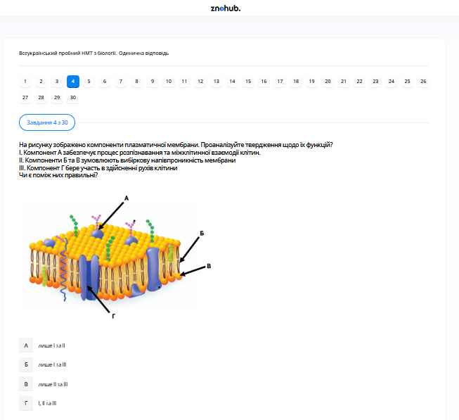

# Завдання 04

## Опис
На рисунку зображено компоненти плазматичної мембрани. Проаналізуйте твердження щодо їх функцій:
I. Компонент А забезпечує процес розпізнавання та міжклітинної взаємодії клітин.
II. Компоненти Б та В зумовлюють вибіркову напівпроникність мембрани.
III. Компонент Г бере участь в здійсненні рухів клітини.

## Аналіз тверджень

*   **Твердження I правильне**: Поверхневі вуглеводи (глікокалікс), позначені літерою А, необхідні для розпізнавання клітин одна одною та адгезії.
*   **Твердження II правильне**: Фосфоліпідний бішар (представлений стрілками Б — хвости та В — головки) є основним структурним елементом, що створює гідрофобний бар'єр та забезпечує напівпроникність.
*   **Твердження III неправильне**: Хоча деякі мембранні білки з'єднуються з цитоскелетом, інтегральні білки, такі як Г (ймовірно, канальний або транспортний білок), в основному беруть участь у транспорті речовин або ферментативних реакціях, а не в "рухах клітини" (це завдання війок, джгутиків або внутрішніх мікрониток).

## Аналіз варіантів відповіді

*   **А) лише I та II (Правильно)**: Твердження I та II є фундаментальними фактами про біологію мембран.
*   **Б) лише I та III (Неправильно)**: Твердження III неправильне.
*   **В) лише II та III (Неправильно)**: Твердження III неправильне.
*   **Г) I, II та III (Неправильно)**: Твердження III неправильне.

## Теорія: Будова та функції плазматичної мембрани
Сучасна модель будови мембрани називається **рідинно-мозаїчною**.
1. **Ліпідний бішар**: Складається з фосфоліпідів. Вони мають гідрофільні «головки» (звернуті назовні) та гідрофобні «хвости» (сховані всередині). Це забезпечує бар'єрну функцію та вибіркову проникність (легко пропускають жиророзчинні речовини та малі молекули, як-от $O_2$ та $CO_2$).
2. **Білки**:
    *   *Інтегральні*: пронизують мембрану наскрізь (транспортні канали, насоси).
    *   *Периферичні*: розташовані на поверхні (рецепторна та ферментативна функції).
3. **Вуглеводи (Глікокалікс)**: Ланцюги олігосахаридів, прикріплені до білків (глікопротеїни) або ліпідів (гліколіпіди). Вони утворюють рецепторний апарат на зовнішній поверхні клітини, відповідаючи за розпізнавання клітин ("свій-чужий") та імунні реакції.
4. **Функції мембрани**: Бар'єрна, транспортна (пасивний та активний транспорт), рецепторна (сигнальна), контактна (утворення тканин).

---

# Pregunta 04

## Descripción
La imagen muestra un diagrama de los componentes de la membrana plasmática. Es necesario analizar las siguientes afirmaciones sobre sus funciones:
I. El componente A (cadenas de carbohidratos) proporciona reconocimiento celular e interacción intercelular.
II. Los componentes B y C (bicapa fosfolipídica) aseguran la permeabilidad selectiva de la membrana.
III. El componente G (proteína integral) participa en el movimiento celular.

## Análisis de las Afirmaciones

*   **La afirmación I es correcta**: Los carbohidratos de superficie (glucocálix), marcados como A, son esenciales para el reconocimiento y la adhesión de célula a célula.
*   **La afirmación II es correcta**: La bicapa fosfolipídica (representada por las flechas B — colas y C — cabezas) es el elemento estructural básico que crea una barrera hidrofóbica y permite la permeabilidad selectiva.
*   **La afirmación III es incorrecta**: Aunque algunas proteínas de membrana participan en los anclajes al citoesqueleto, las proteínas integrales como la G (probablemente una proteína de canal) participan principalmente en el transporte de sustancias, no en los "movimientos celulares" (generados por cilios, flagelos o el citoesqueleto interno).

## Análisis de las Opciones

*   **A) solo I y II (Correcto)**: Las afirmaciones I y II son verdades fundamentales sobre la biología de membranas.
*   **B) solo I y III (Incorrecto)**: La afirmación III es incorrecta.
*   **C) solo II y III (Incorrecto)**: La afirmación III es incorrecta.
*   **D) I, II y III (Incorrecto)**: La afirmación III es incorrecta.

## Teoría: Estructura y Función de la Membrana Plasmática
La membrana celular se describe mediante el modelo del **mosaico fluido**.
1. **Bicapa de Fosfolípidos**: Son moléculas anfipáticas con cabezas polares hidrofílicas y colas no polares hidrofóbicas. Esta organización impide el paso libre de sustancias polares o hidrofílicas, otorgando la propiedad de **semipermeabilidad**.
2. **Proteínas de Membrana**:
    *   *Integrales o transmembrana*: Atraviesan la bicapa y actúan como canales iónicos o transportadores (bombas).
    *   *Periféricas*: Se asocian a una de las superficies y suelen tener funciones enzimáticas o de transducción de señales.
3. **Glúcidos o Carbohidratos**: Forman el **glucocálix** en la cara externa. Su función principal es el reconocimiento celular (identificación de tipos celulares e interacción con mensajeros químicos) y la protección mecánica.
4. **Funciones Principales**: Delimitación celular, transporte de solutos, comunicación intercelular mediante receptores y anclaje al citoesqueleto y a la matriz extracelular.

---

# Question 04

## Description
The image shows a diagram of the plasma membrane components. You need to analyze the following statements about their functions:
I. Component A (carbohydrate chains) provides cell recognition and intercellular interaction.
II. Components B and C (phospholipid bilayer) ensure selective membrane permeability.
III. Component G (integral protein) participates in cell movement.

## Analysis of Statements

*   **Statement I is correct**: Surface carbohydrates (glycocalyx), labeled A, are essential for cell-to-cell recognition and adhesion.
*   **Statement II is correct**: The phospholipid bilayer (represented by arrows B — tails and C — heads) is the basic structural element that creates a hydrophobic barrier and ensures selective permeability.
*   **Statement III is incorrect**: While some membrane proteins are involved in anchoring to the cytoskeleton, integral proteins like G (likely a channel or carrier protein) are primarily involved in molecule transport, not in "cell movements" (which are typically driven by cilia, flagella, or microfilaments).

## Analysis of Options

*   **A) only I and II (Correct)**: Statements I and II are fundamental truths about membrane biology shown in the diagram.
*   **B) only I and III (Incorrect)**: Statement III is incorrect.
*   **C) only II and III (Incorrect)**: Statement III is incorrect.
*   **D) I, II, and III (Incorrect)**: Statement III is incorrect.

## Theory: Structure and Function of the Plasma Membrane
The contemporary view of the membrane is the **Fluid Mosaic Model**.
1. **Phospholipid Bilayer**: Made of amphipathic molecules. Hydrophilic heads face the aqueous environment, while hydrophobic tails face inward. This creates a semi-permeable barrier that regulates the passage of ions and polar molecules.
2. **Proteins**: 
    *   *Integral proteins*: Span the membrane and act as transport channels or pumps (e.g., Sodium-Potassium pump).
    *   *Peripheral proteins*: Attached to the membrane surfaces, serving as enzymes or signaling molecules.
3. **Carbohydrates (Glycocalyx)**: Short oligosaccharide chains attached to lipids or proteins on the extracellular side. They are vital for cell-to-cell recognition, immune response, and tissue formation.
4. **Functions**: Physical isolation, regulation of exchange with the environment (transport), sensitivity to the environment (reception), and structural support.
