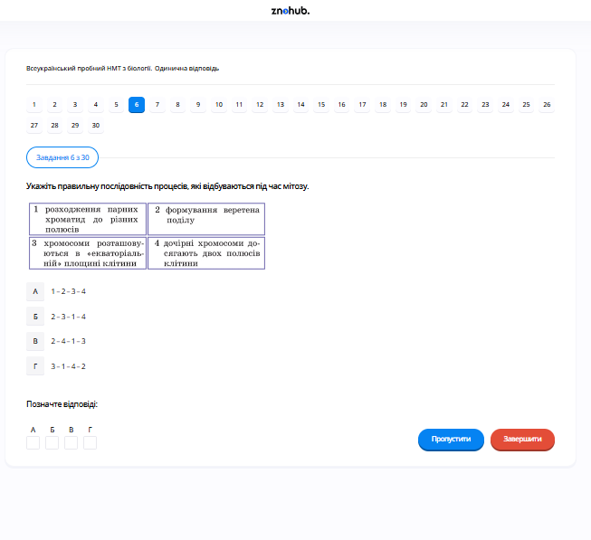

# Завдання 06

## Опис
Укажіть правильну послідовність процесів, які відбуваються під час мітозу.
1 розходження парних хроматид до різних полюсів
2 формування веретена поділу
3 хромосоми розташовуються в «екваторіальній» площині клітини
4 дочірні хромосоми досягають двох полюсів клітини

## Аналіз послідовності

Мітоз складається з чотирьох основних фаз:
*   **Профаза**: Формується веретено поділу (Процес 2).
*   **Метафаза**: Хромосоми вишиковуються в екваторіальній площині (Процес 3).
*   **Анафаза**: Сестринські хроматиди (тепер дочірні хромосоми) розходяться до протилежних полюсів (Процес 1).
*   **Телофаза**: Хромосоми досягають полюсів, клітина готується до поділу (Процес 4).

Правильний хронологічний порядок: **2 -> 3 -> 1 -> 4**.

## Аналіз варіантів відповіді

*   **А) 1-2-3-4 (Неправильно)**: Починається з анафази, що невірно.
*   **Б) 2-3-1-4 (Правильно)**: Це відповідає послідовності Профаза -> Метафаза -> Анафаза -> Телофаза.
*   **В) 2-4-1-3 (Неправильно)**: Телофаза (4) стоїть перед анафазою (1) та метафазою (3).
*   **Г) 3-1-4-2 (Неправильно)**: Починається з метафази і закінчується профазою.

## Теорія: Фази мітозу та їх біологічне значення
Мітоз — це процес поділу ядра еукаріотичної клітини, за якого генетичний матеріал розподіляється рівномірно між дочірніми клітинами.
1. **Профаза**: Конденсація хроматину в хромосоми (стають видимими), зникнення ядерця та розпад ядерної оболонки. Центріолі розходяться до полюсів, утворюється **веретено поділу**.
2. **Метафаза**: Хромосоми (що складаються з двох хроматид) максимально спіралізовані та вишиковуються по екватору клітини, утворюючи **метафазну пластинку**. Нитки веретена поділу прикріплюються до центромер хромосом.
3. **Анафаза**: Найкоротша фаза. Сестринські хроматиди роз'єднуються і стають самостійними дочірніми хромосомами. Нитки веретена тягнуть їх до **протилежних полюсів**.
4. **Телофаза**: Деконденсація хромосом, відновлення ядерних оболонок навколо двох груп хромосом, поява ядерець. Завершується **цитокінезом** (поділом цитоплазми).
*Біологічне значення*: Забезпечує спадкову стабільність, ріст організму, регенерацію тканин та нестатеве розмноження.

---

# Pregunta 06

## Descripción
La pregunta pide la secuencia correcta de los procesos que ocurren durante la mitosis:
1. Separación de cromátidas hermanas hacia diferentes polos.
2. Formación del huso mitótico (huso de división).
3. Los cromosomas se sitúan en el plano "ecuatorial" de la célula.
4. Los cromosomas hijos alcanzan los dos polos de la célula.

## Análisis de la Secuencia

La mitosis consta de cuatro fases principales:
*   **Profase**: Se forma el huso mitótico (Proceso 2). Además, los cromosomas se condensan y la membrana nuclear desaparece.
*   **Metafase**: Los cromosomas se alinean en el plano ecuatorial, formando la placa metafásica (Proceso 3).
*   **Anafase**: Las cromátidas hermanas se separan y se mueven hacia polos opuestos impulsadas por el huso (Proceso 1).
*   **Telofase**: Los cromosomas llegan a los polos, se descondensan y se forman nuevos núcleos (Proceso 4).

El orden cronológico correcto es **2 -> 3 -> 1 -> 4**.

## Análisis de las Opciones

*   **A) 1-2-3-4 (Incorrecto)**: Comienza con la anafase.
*   **B) 2-3-1-4 (Correcto)**: Sigue la secuencia Profase -> Metafase -> Anafase -> Telofase.
*   **C) 2-4-1-3 (Incorrecto)**: Coloca la telofase antes de la anafase.
*   **D) 3-1-4-2 (Incorrecto)**: Secuencia desordenada.

## Teoría: El proceso de la Mitosis
La mitosis es el mecanismo de división nuclear que permite a las células eucariotas somáticas replicarse manteniendo el mismo número de cromosomas (2n o n).
1. **Profase**: La cromatina se empaqueta en cromosomas visibles. Los centríolos migran a los polos opuestos y organizan el **huso mitótico**, una red de microtúbulos.
2. **Metafase**: Los microtúbulos del huso se unen a los cinetocoros (centrómeros) de los cromosomas. Estos se alinean en la **línea ecuatorial** de la célula.
3. **Anafase**: Es el momento crítico del reparto genético. Las proteínas que mantienen juntas las cromátidas se degradan y el huso las arrastra hacia los polos. Cada cromátida pasa a ser un **cromosoma hijo**.
4. **Telofase**: Es la inversa de la profase: los cromosomas se relajan, reaparece el nucléolo y se reconstruye la envoltura nuclear. Finalmente, ocurre la **citocinesis** (el anillo de actina divide el citoplasma en dos).
*Importancia*: Garantiza que cada célula hija reciba una copia idéntica del ADN de la célula madre.

---

# Question 06

## Description
The question asks for the correct sequence of processes occurring during mitosis:
1. Separation of sister chromatids to different poles.
2. Formation of the division spindle (mitotic spindle).
3. Chromosomes are located in the "equatorial" plane of the cell.
4. Daughter chromosomes reach two poles of the cell.

## Analysis of the Sequence

Mitosis consists of four main phases:
*   **Prophase**: The division spindle forms as centrioles move apart (Process 2).
*   **Metaphase**: Chromosomes align at the equatorial plane, forming the metaphase plate (Process 3).
*   **Anaphase**: Centromeres split, and sister chromatids (now daughter chromosomes) separate and move to opposite poles (Process 1).
*   **Telophase**: Chromosomes reach the poles and start decondensing as new nuclear envelopes form (Process 4).

The correct chronological order is **2 -> 3 -> 1 -> 4**.

## Analysis of Options

*   **A) 1-2-3-4 (Incorrect)**: Starts with anaphase.
*   **B) 2-3-1-4 (Correct)**: Matches the Prophase -> Metaphase -> Anaphase -> Telofase sequence.
*   **C) 2-4-1-3 (Incorrect)**: Misordered.
*   **D) 3-1-4-2 (Incorrect)**: Misordered.

## Theory: Phases and Significance of Mitosis
Mitosis is a form of cell division that results in two daughter cells each having the same number and kind of chromosomes as the parent nucleus.
1. **Prophase**: Chromatin condenses into distinct chromosomes. The nuclear envelope breaks down. The **mitotic spindle** is established between centrosomes.
2. **Metaphase**: Microtubules exert tension on chromosomes, lining them up along the **equator** of the cell. This step ensures that each new nucleus will receive one copy of each chromosome.
3. **Anaphase**: The cohesive forces between chromatids are broken. Spindle fibers pull the separated chromatids toward **opposite poles**.
4. **Telophase**: Chromosomes arrive at the poles and decondense back into chromatin. Nuclear membranes reform. The process concludes with **cytokinesis**, the physical division of the cytoplasm.
*Biological Significance*: It is crucial for growth, repair of damaged tissues, asexual reproduction in unicellular eukaryotes, and maintains genetic consistency across cell generations.
