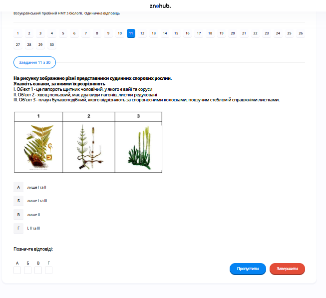

# Завдання 11

## Опис
Для якого з представників вищих спорових рослин характерний життєвий цикл, зображений на схемі?

## Аналіз життєвого циклу

На схемі зображено життєвий цикл **папоротеподібних**:
1.  **Домінуюча стадія** — спорофіт (доросла рослина з великим листям — вайями).
2.  На нижній стороні листків утворюються **соруси** (скупчення спорангіїв), де шляхом мейозу утворюються спори.
3.  Зі спори виростає **заросток** (гаметофіт) — невелика серцеподібна пластинка.
4.  На заростку утворюються антеридії (холові) та архегонії (жіночі).
5.  За наявності **води** сперматозоїд потрапляє до яйцеклітини, відбувається запліднення та утворюється зигота.
6.  Із зиготи розвивається новий молодий спорофіт.

## Аналіз варіантів відповіді

*   **А) баранець звичайний (Неправильно)**: Це представник плауноподібних. У них інша морфологія спорофіта та гаметофіта.
*   **Б) щитник чоловічий (Правильно)**: Це класична папороть, чий життєвий цикл ідеально відповідає схемі.
*   **В) хвощ польовий (Неправильно)**: У хвощів спори утворюються у спороносних колосках (стробілах) на верхівках пагонів.
*   **Г) сфагнум (Неправильно)**: Це мох (мохоподібні), у яких у життєвому циклі домінує гаметофіт, а не спорофіт.

## Теорія: Життєвий цикл папоротеподібних
Папороті — це вищі судинні рослини, у яких спостерігається чітке чергування поколінь з переважанням спорофіта.
1. **Спорофіт ($2n$)**: Нестатеве покоління. Має кореневище, додаткові корені та велике листя — **вайї**. На зрілих листках (спорофілах) розвиваються **спорангії**, зібрані в **соруси**.
2. **Спори**: Утворюються мейозом у спорангіях. Кожна спора дає початок гаметофіту.
3. **Гаметофіт ($n$)**: Статеве покоління, яке називають **заростком**. Він самостійний, фотосинтезуючий, але малий (кілька міліметрів) та зазвичай має серцеподібну форму. На ньому розвиваються органи статевого розмноження: **архегонії** та **антеридії**.
4. **Запліднення**: Критичною умовою є наявність краплиннорідкої **води**, у якій сперматозоїди можуть доплести до яйцеклітини. Це обмежує поширення папоротей вологими місцями проживання.
5. **Зигота**: Дає початок новому спорофіту, який спочатку живиться за рахунок заростка, а потім стає самостійним.

---

# Pregunta 11

## Descripción
¿Para cuál de los representantes de las plantas vasculares de esporas es característico el ciclo de vida mostrado en el diagrama?

## Análisis del Ciclo de Vida

El diagrama representa el ciclo de vida de los **Pteridofitos (helechos)**:
1.  **Etapa dominante**: El esporofito (planta adulta con hojas grandes llamadas frondes).
2.  En el envés de las hojas se forman los **soros** (grupos de esporangios), donde se producen las esporas por meiosis.
3.  De la espora germina el **protalo** (gametofito), que es una pequeña lámina verde con forma de corazón.
4.  En el protalo se desarrollan los anteridios (masculinos) y los arquegonios (femeninos).
5.  En presencia de **agua**, el espermatozoide nada hacia la oosfera, ocurre la fecundación y se forma un cigoto.
6.  Del cigoto se desarrolla un nuevo esporofito joven.

## Análisis de las Opciones

*   **A) barancez común / Lycopodium (Incorrecto)**: Pertenece a los licopodios, cuya morfología es distinta.
*   **B) helecho macho / Dryopteris filix-mas (Correcto)**: Es un helecho típico cuyo ciclo vital coincide perfectamente con la ilustración.
*   **C) cola de caballo / Equisetum (Incorrecto)**: Los equisetos forman esporas en estróbilos situados en el ápice de los tallos.
*   **D) esfagno / Sphagnum (Incorrecto)**: Es un musgo (briofito), donde la fase dominante es el gametofito, no el esporofito.

## Teoría: El Ciclo de Vida de los Helechos
Los helechos son plantas vasculares superiores que presentan una alternancia de generaciones heteromórfica marcada:
1. **Esporofito ($2n$)**: Es la generación diploide persistente. Posee tejidos vasculares verdaderos (xilema y floema), rizoma y raíces. Las esporas se producen en los **esporangios**, que suelen agruparse en estructuras llamadas **soros** en la cara inferior de las frondes.
2. **Meiosis y Esporas**: La meiosis ocurre dentro del esporangio, produciendo esporas haploides que se dispersan por el viento.
3. **Gametofito ($n$) o Protalo**: Es la generación haploide, efímera y de pequeño tamaño. Es autótrofo y bisexual. Produce gametos en los **anteridios** (espermatozoides) y **arquegonios** (óvulos).
4. **Dependencia del Agua**: La fecundación es oogámica y requiere obligatoriamente agua para que los espermatozoides flagelados puedan desplazarse. Esta es una herencia evolutiva de sus antepasados acuáticos.
5. **Cigoto y Desarrollo**: El cigoto diploide resultante de la fecundación crece sobre el protalo para dar lugar al nuevo esporofito, cerrando el ciclo.

---

# Question 11

## Description
For which representative of higher spore plants is the life cycle shown in the diagram characteristic?

## Life Cycle Analysis

The diagram illustrates the life cycle of **Ferns (Pteridophytes)**:
1.  **Dominant stage**: The sporophyte (the mature plant with large leafy structures called fronds).
2.  **Sori** (clusters of sporangia) form on the underside of fronds, where spores are produced via meiosis.
3.  Spores germinate into a **prothallus** (gametophyte) — a small, heart-shaped green structure.
4.  Antheridia (male) and Archegonia (female) structures develop on the prothallus.
5.  In the presence of **water**, sperm swims to the egg cell, fertilization occurs, and a zygote is formed.
6.  A new young sporophyte develops from the zygote.

## Analysis of Options

*   **A) fir clubmoss / Huperzia selago (Incorrect)**: This belongs to Lycopodiophyta, which have different sporophyte and gametophyte morphologies.
*   **B) male fern / Dryopteris filix-mas (Correct)**: This is a classic fern whose life cycle perfectly matches the diagram.
*   **C) field horsetail / Equisetum arvense (Incorrect)**: Horsetails produce spores in strobilus structures at the tips of their stems.
*   **D) sphagnum moss (Incorrect)**: This is a bryophyte (moss) where the gametophyte stage is dominant, not the sporophyte.

## Theory: Life Cycle of Ferns and Spore Plants
Ferns represent a significant evolutionary step as vascular plants with a dominant sporophyte generation.
1. **Sporophyte ($2n$)**: The visible "fern" plant. It consists of a rhizome (underground stem), roots, and compound leaves termed **fronds**. The fronds serve both for photosynthesis and reproduction (sporophylls).
2. **Sporangia and Sori**: On the underside of mature fronds, sporangia group into clusters called **sori**. Meiosis occurs within the sporangia to produce haploid spores.
3. **Gametophyte ($n$) / Prothallus**: A tiny, heart-shaped, independent plant that lacks vascular tissue. It produces gametes in specialized organs: **Archegonia** (female) and **Antheridia** (male).
4. **Fertilization**: Ferns require **external water** (like dew or raindrops) for the flagellated sperm to swim to the egg. This biological constraint binds ferns to moist environments.
5. **Growth**: After fertilization, the zygote grows into a new sporophyte. Initially, it is dependent on the prothallus, but soon develops its own roots and leaves, eventually causing the prothallus to wither.
