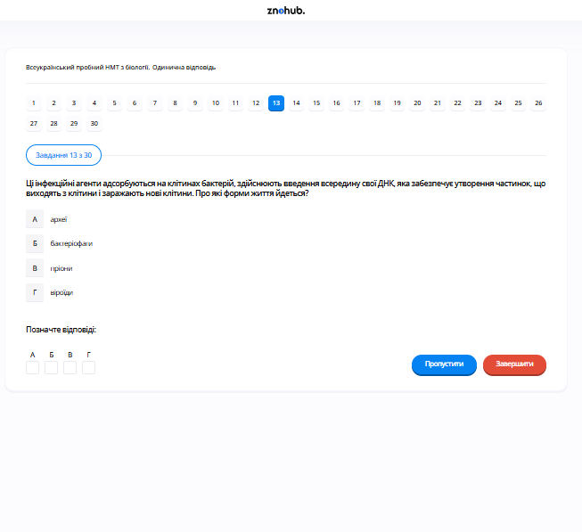

# Завдання 13

## Опис
Збудники яких захворювань здатні вражати бактерії?

## Аналіз

Бактерії, як і будь-які інші організми, мають свої специфічні віруси-паразити. Віруси, що інфікують бактеріальні клітини, називаються **бактеріофагами** (або просто фагами).

## Аналіз варіантів відповіді

*   **А) віруси (Правильно)**: Бактеріофаги — це група вірусів, які використовують бактерії як господарів для свого розмноження. Вони мають складну будову (головка, хвіст, відростки) та специфічний механізм введення генетичного матеріалу в бактерію.
*   **Б) найпростіші (Неправильно)**: Найпростіші (амеби, інфузорії) зазвичай є хижаками, які поглинають бактерії, а не "вражають" їх як інфекційні агенти всередині.
*   **В) гриби (Неправильно)**: Деякі гриби можуть конкурувати з бактеріями або виділяти антибіотики (наприклад, пеніцилін), але вони не є внутрішньоклітинними патогенами бактерій.
*   **Г) комахи (Неправильно)**: Комахи — це багатоклітинні тварини, вони занадто великі і не можуть інфікувати мікроскопічні одноклітинні бактерії.

## Теорія: Бактеріофаги — віруси бактерій
Віруси — це неклітинні форми життя, що є облігатними внутрішньоклітинними паразитами.
1. **Будова бактеріофага**:
    *   *Головка*: Містить генетичний матеріал (ДНК або РНК), оточений білковою оболонкою (капсидом).
    *   *Відросток (хвіст)*: Порожниста трубка, через яку нуклеїнова кислота впорскується в клітину.
    *   *Базальна пластинка та нитки*: Допомагають фагу розпізнавати специфічні рецептори на стінці бактерії та прикріплюватися до неї.
2. **Життєвий цикл**:
    *   *Адсорбція*: Прикріплення до поверхні бактерії.
    *   *Ін'єкція*: Введення геному всередину.
    *   *Реплікація та збірка*: Клітинна машина бактерії починає синтезувати вірусні білки та копіювати вірусний геном.
    *   *Лізис*: Клітина бактерії руйнується, вивільняючи сотні нових фагів.
3. **Значення**: Бактеріофаги регулюють чисельність бактерій у природі. У медицині їх використовують для **фаготерапії** — лікування бактеріальних інфекцій, особливо тих, що стійкі до антибіотиків.

---

# Pregunta 13

## Descripción
¿Qué agentes infecciosos son capaces de infectar a las bacterias?

## Análisis

Las bacterias, al igual que cualquier otro organismo vivo, tienen sus propios virus parásitos específicos. Los virus que infectan exclusivamente a las células bacterianas se denominan **bacteriófagos** (o simplemente fagos).

## Análisis de las Opciones

*   **A) virus (Correcto)**: Los bacteriófagos son un grupo especializado de virus que utilizan a las bacterias como huéspedes para replicarse. Poseen una estructura compleja y un mecanismo preciso para inyectar su material genético a través de la pared bacteriana.
*   **B) protozoos (Incorrecto)**: Los protozoos suelen ser depredadores de bacterias (fagocitosis), pero no actúan como agentes infecciosos microscópicos que las parasiten internamente.
*   **C) hongos (Incorrecto)**: Los hongos pueden competir con las bacterias o matarlas mediante antibióticos (como la penicilina), pero no son patógenos intracelulares de bacterias.
*   **D) insectos (Incorrecto)**: Los insectos son organismos multicelulares demasiado grandes para infectar a una bacteria unicelular.

## Teoría: Los Bacteriófagos
Los virus son entidades acelulares formadas por un ácido nucleico y proteínas. No tienen metabolismo propio y dependen totalmente de la maquinaria de una célula viva para reproducirse.
1. **Morfología del Fago**: Un bacteriófago típico (como el fago T4) consta de una cabeza icosaédrica donde reside el ADN, un cuello, una vaina contráctil (cola) y fibras basales que actúan como "sensores" para identificar a la bacteria adecuada.
2. **Mecanismo de Infección**: El fago se ancla a la pared celular bacteriana y utiliza enzimas para perforarla. Luego, contrae su vaina y "dispara" su genoma al interior del citoplasma bacteriano. La cápside vacía se queda fuera.
3. **Ciclos Replicativos**:
    *   **Ciclo Lítico**: El virus toma el control inmediato, fabrica nuevas copias y rompe (lisa) la bacteria para salir.
    *   **Ciclo Lisogénico**: El ADN viral se integra en el cromosoma bacteriano (profago) y permanece latente, replicándose cada vez que la bacteria se divide, hasta que un estímulo ambiental activa el ciclo lítico.
4. **Uso Médico**: Debido a su especificidad, los fagos se estudian como alternativa a los antibióticos para destruir bacterias patógenas sin dañar la microbiota beneficiosa del cuerpo humano.

---

# Question 13

## Description
Infectious agents of which diseases are capable of targeting bacteria?

## Analysis

Bacteria, like all other organisms, have their own specific viral parasites. Viruses that infect bacterial cells are called **bacteriophages** (or simply phages).

## Analysis of Options

*   **A) viruses (Correct)**: Bacteriophages are a group of viruses that use bacteria as hosts for their reproduction. They have a complex structure (head, tail, fibers) and a specific mechanism for injecting their genetic material into the bacterium.
*   **B) protozoa (Incorrect)**: Protozoa are generally larger single-celled organisms that graze on or consume bacteria; they are not intracellular infectious agents of bacteria.
*   **C) fungi (Incorrect)**: While some fungi produce antibiotics to kill bacteria, they do not infect them as intracellular pathogens.
*   **D) insects (Incorrect)**: Insects are multicellular colonial or independent animals that are far too large to infect microscopic unicellular bacteria.

## Theory: Bacteriophages — The Viruses of Bacteria
Viruses are non-cellular life forms that are obligate intracellular parasites. They cannot reproduce outside of a host cell.
1. **Structure of a Bacteriophage**:
    *   **Head (Capsid)**: Contains the genome (DNA or RNA).
    *   **Tail Unit**: A hollow tube used to pass the genome into the host.
    *   **Base Plate and Tail Fibers**: These structures act as "landing gear," recognizing specific chemical receptors on the bacterial cell wall via molecular locks.
2. **The Infection Process**:
    *   **Adsorption**: The phage attaches to the bacterial surface.
    *   **Entry**: The phage injects its nucleic acid into the host while the protein coat remains outside.
    *   **Biosynthesis**: The host cell is hijacked to produce viral components.
    *   **Assembly and Release**: New phages are assembled, and the bacterium ruptures (**lysis**), releasing the next generation of viruses.
3. **Phage Therapy**: Unlike broad-spectrum antibiotics, phages are highly specific, often targeting only one species of bacteria. This specificity allows for targeted medical treatments of bacterial infections without disrupting the patient's healthy microbial flora.
