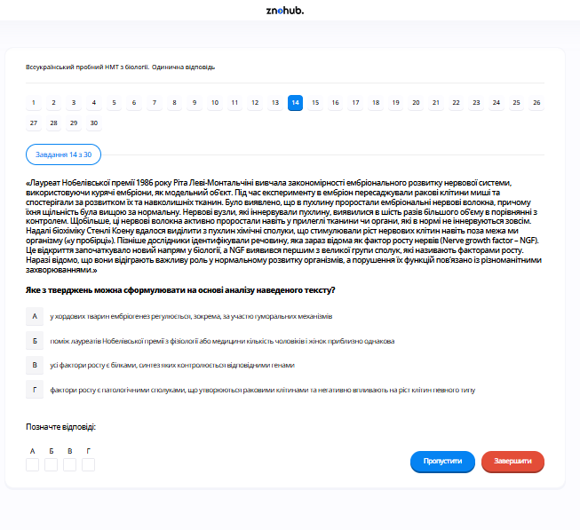

# Завдання 14

## Опис
До факторів гуморальної регуляції, що діють на клітини організму через рідини внутрішнього середовища, належать...

## Аналіз варіантів відповіді

*   **А) лише вітаміни (Неправильно)**: Вітаміни — це біологічно активні речовини, більшість яких є коферментами, але вони не є основними специфічними факторами регуляції фізіологічних функцій.
*   **Б) гормони та фактори росту (Правильно)**: Гуморальна регуляція здійснюється за допомогою хімічних речовин, що переносяться кров'ю, лімфою та тканинною рідиною. Гормони та фактори росту (наприклад, соматотропін, інсуліноподібні фактори росту) є ключовими молекулами, що координують роботу органів та поділ клітин.
*   **В) лише фактори росту (Неправильно)**: Гормони також є частиною гуморальної регуляції.
*   **Г) лише гормони (Неправильно)**: Фактори росту також виконують гуморальну регуляторну функцію.

## Теорія: Гуморальна регуляція функцій
Гуморальна регуляція — це один із найдавніших механізмів координації процесів життєдіяльності в організмі за допомогою хімічних речовин через рідкі середовища (кров, лімфу, міжклітинну рідину).
1. **Основні агенти**:
    *   **Гормони**: Виробляються залозами внутрішньої секреції. Мають високу біологічну активність, діють дистанційно та специфічно на клітини-мішені (через рецептори).
    *   **Фактори росту**: Білкові молекули, що регулюють поділ (проліферацію) та диференціацію клітин. На відміну від гормонів, вони часто виробляються неспеціалізованими клітинами і можуть діяти локально.
    *   **Метаболіти**: Продукти обміну речовин (наприклад, вуглекислий газ $CO_2$ регулює частоту дихання).
2. **Особливості гуморальної регуляції**:
    *   Повільна швидкість передачі сигналу (швидкість току крові).
    *   Тривала дія сигналу.
    *   Відсутність точного адресата (діє на всі клітини, що мають відповідні рецептори).
3. **Взаємозв'язок**: У вищих тварин гуморальна регуляція підпорядкована нервовій регуляції, утворюючи єдину **нейрогуморальну регуляцію**. Центральною ланкою цього зв'язку є гіпоталамо-гіпофізарна система.

---

# Pregunta 14

## Descripción
Los factores de regulación humoral que actúan sobre las células del organismo a través de los fluidos del medio interno incluyen...

## Análisis de las Opciones

*   **A) solo vitaminas (Incorrecto)**: Las vitaminas son biocatalizadores (coenzimas) esenciales para el metabolismo, pero no son los efectores primarios de la regulación sistémica de funciones orgánicas.
*   **B) hormonas y factores de crecimiento (Correcto)**: La regulación humoral se basa en sustancias químicas transportadas por la sangre, la linfa o el líquido intersticial. Las hormonas y los factores de crecimiento son las moléculas principales que orquestan el crecimiento, el metabolismo y la homeostasis celular.
*   **C) solo factores de crecimiento (Incorrecto)**: Las hormonas también forman parte de la regulación humoral.
*   **D) solo hormonas (Incorrecto)**: Los factores de crecimiento también cumplen funciones reguladoras de forma humoral.

## Teoría: Regulación Humoral de las Funciones
La regulación humoral es el mecanismo de control coordinado mediante el cual las sustancias químicas influyen en la actividad de células y órganos.
1. **Componentes clave**:
    *   **Hormonas**: Mensajeros químicos producidos por las glándulas endocrinas (como la insulina, la adrenalina o la tiroxina). Se vierten directamente a la sangre y actúan en órganos diana específicos que poseen los receptores adecuados.
    *   **Factores de Crecimiento**: Polipéptidos que estimulan la proliferación celular, la cicatrización y la diferenciación. Ejemplos incluyen el factor de crecimiento epidérmico (EGF) o las eritropoyetinas.
    *   **Metabolitos y Electrolitos**: Sustancias como el $CO_2$ (que regula el centro respiratorio) o los iones calcio y glucosa.
2. **Características**:
    *   La transmisión del mensaje es relativamente lenta (depende del flujo circulatorio).
    *   La respuesta suele ser duradera.
    *   El alcance es general, ya que la sustancia se distribuye por todo el cuerpo, aunque solo responden las células "sensibles".
3. **Integración**: En organismos complejos, la regulación humoral trabaja en conjunto con el sistema nervioso. El hipotálamo actúa como el centro de integración principal, convirtiendo impulsos nerviosos en señales hormonales a través de la hipófisis.

---

# Question 14

## Description
Humoral regulation factors that act on the body's cells through the internal environment's fluids include...

## Analysis of Options

*   **A) only vitamins (Incorrect)**: Vitamins are essential organic compounds that mainly act as cofactors for enzymes, but they are not the primary signaling molecules for the regulation of physiological systems.
*   **B) hormones and growth factors (Correct)**: Humoral regulation is achieved through chemical substances transported by blood, lymph, and tissue fluid. Hormones and growth factors (like somatotropin or insulin-like growth factors) are key signaling molecules that coordinate organ functions and cell division.
*   **C) only growth factors (Incorrect)**: Hormones are also a vital part of humoral regulation.
*   **D) only hormones (Incorrect)**: Growth factors also perform vital humoral regulatory functions.

## Theory: Humoral Regulation of Functions
Humoral regulation (from Latin *humor* — liquid) is the coordination of physiological processes in the body mediated by chemical substances circulating in the blood and other body fluids.
1. **Primary Agents**:
    *   **Hormones**: Produced by endocrine glands. They exhibit high biological activity at very low concentrations and act on specific target cells that possess the corresponding receptors.
    *   **Growth Factors**: Proteins that stimulate cell proliferation, wound healing, and cellular differentiation. They can act systemically or locally within tissues.
    *   **Metabolites**: Byproducts of metabolism, such as carbon dioxide ($CO_2$), which regulates the activity of the respiratory center in the brain.
2. **Features of Humoral Regulation**:
    *   **Speed**: Slower than nervous regulation because it depends on the circulatory rate.
    *   **Duration**: Typically provides long-lasting effects.
    *   **Targeting**: While the signal reaches the whole body, only cells with compatible receptors respond.
3. **Neuro-Humoral Integration**: While humoral regulation is ancient, in higher animals, it is tightly coupled with the nervous system. The nervous system acts quickly and precisely, whereas the humoral system maintains broad, long-term homeostatic balance. The endocrine and nervous systems meet at the hypothalamus-pituitary axis.
