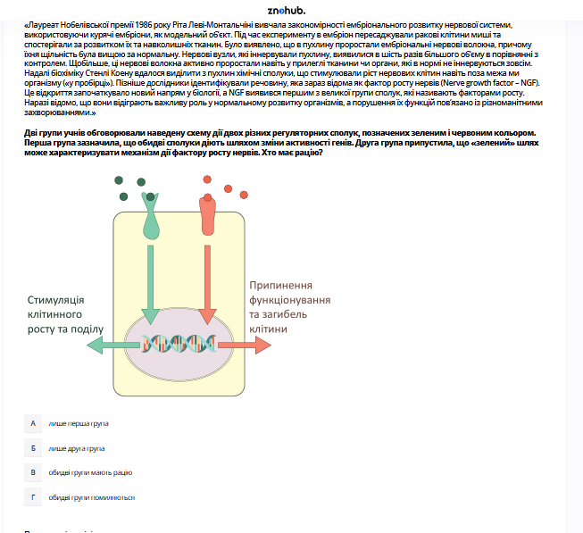

# Завдання 15

## Опис
На ілюстрації зображено шлях регуляції росту клітин. Зазначте правильну назву залози (1), гормону (2) та наслідок гіперфункції у молодому віці (3).

## Аналіз ілюстрації

1.  **Залоза (1)**: На малюнку стрілка вказує на основу головного мозку, де розташований **гіпофіз** (центральна залоза внутрішньої секреції).
2.  **Гормон (2)**: Гіпофіз виділяє **соматотропін** (гормон росту), який стимулює печінку до вироблення факторів росту та безпосередньо впливає на кістки та м'язи.
3.  **Наслідок гіперфункції (3)**: Надлишок соматотропіну в період інтенсивного росту (у молодому віці) призводить до **гігантизму**.

## Аналіз варіантів відповіді

*   **А) 1-наднирники, 2-адреналін... (Неправильно)**: Малюнок чітко показує голову, а не наднирники.
*   **Б) 1-гіпофіз, 2-соматотропін, 3-гігантизм (Правильно)**: Усі три параметри відповідають біологічній функції гормону росту та його джерелу.
*   **В) 1-підшлункова залоза, 2-інсулін... (Неправильно)**: Інсулін регулює рівень цукру, а не основний ріст тіла.
*   **Г) 1-гіпофіз, 2-соматотропін, 3-акромегалія (Неправильно)**: Акромегалія розвивається при гіперфункції у *дорослому* віці, коли зони росту кісток уже закриті.

## Теорія: Гіпофіз та Соматотропін
Гіпофіз — це невелика залоза внутрішньої секреції, розташована в гіпофізарній ямці турецького сідла основи черепа. Він складається з двох часток: передньої (аденогіпофіз) та задньої (нейрогіпофіз).
1. **Соматотропін (СТГ)**: Гормон передньої частки гіпофізу. Він стимулює синтез білків, поділ клітин хрящової тканини та ріст кісток у довжину.
2. **Механізм дії**: Соматотропін діє на печінку, стимулюючи вироблення соматомединів (ІФР-1), які безпосередньо сприяють росту скелета.
3. **Порушення секреції**:
    *   **Гіпофункція** в дитинстві: **карликовість** (затримка росту при збереженні пропорцій тіла та розумового розвитку).
    *   **Гіперфункція** в дитинстві: **гігантизм** (надмірний ріст, що може досягати 2-2.5 метрів).
    *   **Гіперфункція** у дорослому віці: **акромегалія** (розростання периферійних частин тіла — носа, губ, щелеп, кистей та стоп, оскільки кістки вже не можуть рости у довжину).

---

# Pregunta 15

## Descripción
La ilustración muestra una vía de regulación del crecimiento celular. Indique el nombre correcto de la glándula (1), la hormona (2) y la consecuencia de la hiperfunción a una edad joven (3).

## Análisis de la Ilustración

1.  **Glándula (1)**: La flecha señala la base del cerebro, donde se sitúa la **hipófisis** (glándula pituitaria), la glándula maestra del sistema endocrino.
2.  **Hormona (2)**: La hipófisis libera **somatotropina** (hormona del crecimiento), que estimula la producción de factores de crecimiento en el hígado y actúa directamente sobre huesos y músculos.
3.  **Consecuencia de la hiperfunción (3)**: El exceso de somatotropina durante el periodo de crecimiento (juventud) provoca un crecimiento excesivo del esqueleto conocido como **gigantismo**.

## Análisis de las Opciones

*   **A) 1-glándulas suprarrenales, 2-adrenalina... (Incorrecto)**: El dibujo muestra claramente el cerebro, no los riñones.
*   **B) 1-hipófisis, 2-somatotropina, 3-gigantismo (Correcto)**: Los tres parámetros coinciden con la función biológica de la hormona del crecimiento y su origen.
*   **C) 1-páncreas, 2-insulina... (Incorrecto)**: La insulina regula la glucosa, no el crecimiento corporal primario.
*   **D) 1-hipófisis, 2-somatotropina, 3-acromegalia (Incorrecto)**: La acromegalia es el resultado de la hiperfunción en la edad *adulta*, cuando los discos de crecimiento óseo ya se han cerrado.

## Teoría: La Hipófisis y la Hormona del Crecimiento
La hipófisis es una glándula endocrina compleja conectada al hipotálamo.
1. **Somatotropina (GH)**: Es producida por el lóbulo anterior (adenohipófisis). Sus funciones principales son estimular la síntesis de proteínas y la división celular en los cartílagos de crecimiento (fisis).
2. **Acción indirecta**: Gran parte de sus efectos se deben a que estimula al hígado para producir **somatomedinas** (como el IGF-1), que promueven el crecimiento de los tejidos blandos y huesos.
3. **Trastornos relacionados**:
    *   **Deficiencia (en niños)**: Enanismo hipofisario (baja estatura con proporciones corporales armónicas).
    *   **Exceso (en niños)**: **Gigantismo**. Se caracteriza por un crecimiento longitudinal masivo antes de que se cierren las epífisis de los huesos largos.
    *   **Exceso (en adultos)**: **Acromegalia**. Dado que los huesos ya no pueden crecer en longitud, aumentan de grosor. Se nota un agrandamiento de las manos, los pies, la mandíbula y las facciones faciales.

---

# Question 15

## Description
The illustration shows a cell growth regulation pathway. Indicate the correct name of the gland (1), the hormone (2), and the consequence of hyperfunction at a young age (3).

## Illustration Analysis

1.  **Gland (1)**: The arrow in the diagram points to the base of the brain, specifically to the **pituitary gland** (hypophysis), which is the primary endocrine gland.
2.  **Hormone (2)**: The pituitary secretes **somatotropin** (growth hormone, GH), which stimulates the liver to produce growth factors and directly affects bones and muscles.
3.  **Consequence of hyperfunction (3)**: An excess of somatotropin during the period of active development (at a young age) leads to **gigantism**.

## Analysis of Options

*   **A) 1-adrenals, 2-adrenaline... (Incorrect)**: The drawing depicts the head, not the adrenal glands located above the kidneys.
*   **B) 1-pituitary, 2-somatotropin, 3-gigantism (Correct)**: All three components correctly identify the source, the growth hormone, and its associated condition.
*   **C) 1-pancreas, 2-insulin... (Incorrect)**: Insulin regulates blood sugar levels, not primary body growth.
*   **D) 1-pituitary, 2-somatotropin, 3-acromegaly (Incorrect)**: Acromegaly occurs when there is excessive growth hormone in *adults*, after the bone growth plates have closed.

## Theory: The Pituitary Gland and Somatotropin
The pituitary gland is a pea-sized organ at the base of the skull, often called the "master gland" because it controls other endocrine glands.
1. **Somatotropin (GH)**: Secreted by the anterior lobe (adenohypophysis). It plays a crucial role in regulating metabolism and physical growth. It stimulates protein synthesis and cell division in cartilage and bone.
2. **Physiology**: It enhances the absorption of amino acids and promotes the use of fats for energy. Its effect on growth is mostly mediated by **insulin-like growth factors (IGFs)** produced in the liver.
3. **Sickness and Disorders**:
    *   **Hyposecretion** in childhood: Pituitary **dwarfism** (stunted growth but proportional body development).
    *   **Hypersecretion** in childhood: **Gigantism** (excessive height, often exceeding 2 meters).
    *   **Hypersecretion** in adulthood: **Acromegaly** (thickening of the bones of the face, hands, and feet, and enlargement of soft tissues).
    *   Regulation is performed via a negative feedback loop involving the hypothalamus (GHRH and Somatostatin).
    
