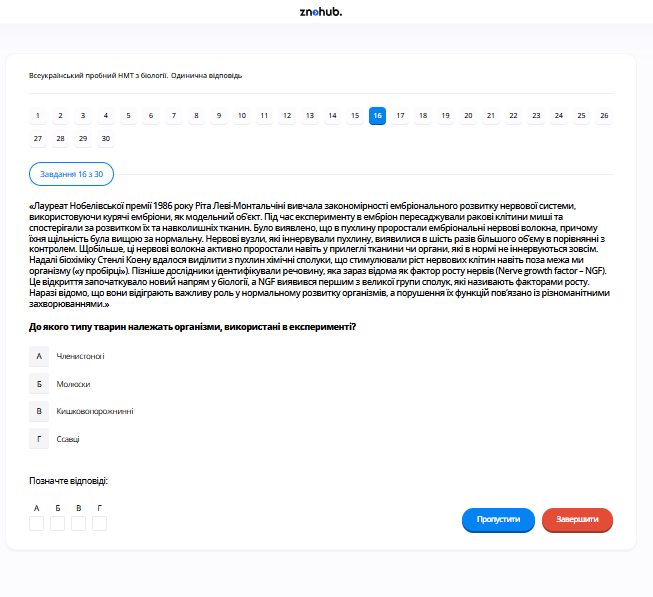

# Завдання 16

## Опис
Для вивчення особливостей передавання спадкової інформації використовували організми, що належать до різних царств. Укажіть правильну відповідність між організмом та його приналежністю до певного царства.

## Аналіз відповідності

На малюнку зображено:
1.  **Дрозофіла (Drosophila)**: Комаха. Належить до царства **Тварини**.
2.  **Дріжджі (Saccharomyces)**: Одноклітинні організми. Належать до царства **Гриби**.
3.  **Горох (Pisum)**: Насінна рослина. Належить до царства **Рослини**.
4.  **Кишкова паличка (E. coli)**: Бактерія (прокаріот). Належить до царства **Бактерії** (або Монери).

## Аналіз варіантів відповіді

*   **А) 1-Гриби, 2-Тварини, 3-Бактерії, 4-Рослини (Неправильно)**: Повна плутанина.
*   **Б) 1-Тварини, 2-Гриби, 3-Рослини, 4-Бактерії (Правильно)**: Кожен організм правильно віднесений до свого царства.
*   **В) 1-Рослини, 2-Бактерії, 3-Тварини, 4-Гриби (Неправильно)**: Неправильно.
*   **Г) 1-Тварини, 2-Рослини, 3-Гриби, 4-Бактерії (Неправильно)**: Дріжджі (2) — це гриби, а не рослини.

## Теорія: Царства живої природи
Систематика біологічних об'єктів базується на ієрархії таксонів. Класична система поділяє еукаріотів на три основні царства (з урахуванням четвертого — протестів) та прокаріотів (бактерії).
1. **Царство Тварини**: Гетеротрофні організми, клітини яких не мають щільної стінки та хлоропластів. Здатні до активного руху. **Дрозофіла** — класичний модельний об'єкт генетики (Т. Морган).
2. **Царство Гриби**: Гетеротрофи з осмотичним живленням. Мають клітинну стінку з хітину та запасають глікоген. **Дріжджі** використовуються як модель для вивчення еукаріотичної клітини та біотехнології.
3. **Царство Рослини**: Автотрофні організми (фотосинтетики). Мають целюлозну клітинну стінку та запасають крохмаль. **Горох** став першим об'єктом генетичних досліджень Г. Менделя.
4. **Царство Бактерії**: Прокаріоти (не мають сформованого ядра та мембранних органел). Генетичний матеріал — кільцева молекула ДНК (нуклеоїд). **E. coli** — головний об'єкт молекулярної біології.

---

# Pregunta 16

## Descripción
Para estudiar las características de la transmisión de la información genética se utilizaron organismos pertenecientes a diferentes reinos. Indique la correspondencia correcta entre el organismo y su pertenencia a un reino determinado.

## Análisis de Correspondencia

La imagen muestra cuatro organismos de laboratorio clave:
1.  **Drosophila (mosca de la fruta)**: Es un insecto. Pertenece al reino **Animalia (Animales)**.
2.  **Levadura (Saccharomyces cerevisiae)**: Es un hongo unicelular. Pertenece al reino **Fungi (Hongos)**.
3.  **Guisante (Pisum sativum)**: Es una planta con flores. Pertenece al reino **Plantae (Plantas)**.
4.  **Escherichia coli (E. coli)**: Es una bacteria. Pertenece al reino **Monera (Bacterias)**.

## Análisis de las Opciones

*   **A) 1-Hongos, 2-Animales, 3-Bacterias, 4-Plantas (Incorrecto)**: Confusión total.
*   **B) 1-Animales, 2-Hongos, 3-Plantas, 4-Bacterias (Correcto)**: Cada organismo está asignado correctamente a su reino.
*   **C) 1-Plantas, 2-Bacterias, 3-Animales, 4-Hongos (Incorrecto)**: Incorrecto.
*   **D) 1-Animales, 2-Plantas, 3-Hongos, 4-Bacterias (Incorrecto)**: La levadura (2) es un hongo, no una planta.

## Teoría: Los Grandes Reinos de la Naturaleza
La biodiversidad se organiza en reinos basados en el tipo de célula, nutrición y estructura multicelular.
1. **Reino Animal**: Organismos eucariotas multicelulares, heterótrofos y típicamente móviles. Carecen de pared celular. La mosca **Drosophila** fue crucial para descubrir el ligamiento al sexo y los mapas cromosómicos.
2. **Reino Hongo**: Eucariotas saprótrofos o parásitos. Poseen pared de quitina. Las **levaduras** son hongos unicelulares esenciales por ser el sistema modelo eucariota más simple en biología celular.
3. **Reino Planta**: Eucariotas multicelulares autótrofos que realizan la fotosíntesis. Poseen pared de celulosa. El **guisante** permitió a Gregor Mendel formular las leyes básicas de la herencia genética.
4. **Reino Monera (Bacterias)**: Organismos procariotas (sin núcleo definido). Son la forma de vida más antigua y diversa. **E. coli** es la herramienta fundamental de la ingeniería genética y la clonación de ADN.

---

# Question 16

## Description
To study the patterns of genetic information transmission, organisms belonging to different kingdoms were used. Indicate the correct correspondence between the organism and its belonging to a specific kingdom.

## Correspondence Analysis

The image illustrates common "model organisms":
1.  **Drosophila (Fruit fly)**: An insect, therefore it belongs to the kingdom **Animalia**.
2.  **Yeast (Saccharomyces)**: A single-celled fungus, therefore it belongs to the kingdom **Fungi**.
3.  **Pea (Pisum)**: A vascular plant used by Mendel, therefore it belongs to the kingdom **Plantea**.
4.  **E. coli**: A prokaryotic organism, therefore it belongs to the kingdom **Bacteria (Monera)**.

## Analysis of Options

*   **A) 1-Fungi, 2-Animals, 3-Bacteria, 4-Plants (Incorrect)**: Total confusion.
*   **B) 1-Animals, 2-Fungi, 3-Plants, 4-Bacteria (Correct)**: Each organism is matched with its respective biological kingdom.
*   **C) 1-Plants, 2-Bacteria, 3-Animals, 4-Fungi (Incorrect)**: Incorrect.
*   **D) 1-Animals, 2-Plants, 3-Fungi, 4-Bacteria (Incorrect)**: Yeast (2) is a fungus, not a plant.

## Theory: Kingdoms of Life
Biological classification helps scientists organize the vast diversity of life.
1. **Animal Kingdom**: Multicellular, heterotrophic eukaryotes that usually exhibit mobility. Their cells lack rigid walls. **Drosophila melanogaster** is a classic genetic model due to its short life cycle and giant chromosomes in salivary glands.
2. **Fungi Kingdom**: Heterotrophic eukaryotes that absorb nutrients (osmotrophy) and have chitinous cell walls. **Yeast** is a model for understanding basic eukaryotic cell functions like mitosis and protein secretion.
3. **Plant Kingdom**: Multicellular autotrophic eukaryotes that perform photosynthesis. They possess cellulose cell walls. Gregor Mendel's work with the **Pea plant** laid the foundation for modern genetics.
4. **Bacteria Kingdom**: Prokaryotic organisms lacking a membrane-bound nucleus or organelles. Their genome is typically a single circular double-stranded DNA molecule. **Escherichia coli** is the most widely studied organism in molecular biology and biotechnology.
