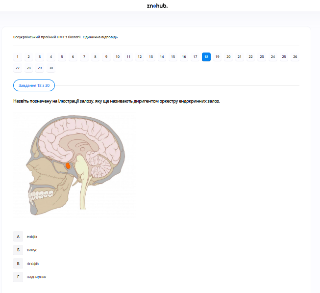

# Завдання 18

## Опис
На ілюстрації цифрою 1 позначено...

## Аналіз ілюстрації

На малюнку показано основні залози ендокринної системи людини.
*   **Цифра 1** вказує на залозу, розташовану на передній частині шиї, під гортанню. Це **щитоподібна залоза**.
*   Інші позначені органи: 2 — наднирники (над нирками), 3 — яєчник (у жінок).

## Аналіз варіантів відповіді

*   **А) щитоподібну залозу (Правильно)**: Чітко відповідає анатомічному розташуванню залози на шиї перед трахеєю.
*   **Б) вилочкову залозу / тимус (Неправильно)**: Тимус розташований за грудиною, нижче рівня щитоподібної залози.
*   **В) підшлункову залозу (Неправильно)**: Вона розташована в черевній порожнині позаду шлунка.
*   **Г) шишкоподібне тіло / епіфіз (Неправильно)**: Епіфіз розташований глибоко в головному мозку.

## Теорія: Ендокринна система людини
Ендокринна система складається із залоз внутрішньої секреції, які виділяють гормони безпосередньо в кров.
1. **Щитоподібна залоза**: Найбільша залоза внутрішньої секреції дорослої людини. Складається з двох часток, з'єднаних перешийком.
    *   **Гормони**: Основними є **тироксин** ($T_4$) та **трийодтиронін** ($T_3$). Вони містять **йод**. Також виробляє кальцитонін (регулює обмін кальцію).
    *   **Функція**: Контроль інтенсивності метаболізму, ріст та розвиток організму, регуляція температури тіла.
2. **Порушення функцій**:
    *   **Гіпофункція** (нестача): У дітей призводить до **кретинізму** (затримка фізичного та розумового розвитку). У дорослих — до **мікседеми** (набряклість, млявість). При нестачі йоду в їжі розвивається ендемічний зоб.
    *   **Гіперфункція** (надлишок): Призводить до **базедової хвороби** (підвищений обмін речовин, витрішкуватість, дратівливість, втрата ваги).
3. **Регуляція**: Робота щитоподібної залози контролюється тиреотропним гормоном (ТТГ) гіпофізу за принципом зворотного зв'язку.

---

# Pregunta 18

## Descripción
En la ilustración, el número 1 indica...

## Análisis de la ilustración

El dibujo muestra las glándulas principales del sistema endocrino humano:
*   El **número 1** señala la glándula situada en la parte anterior del cuello, por debajo de la laringe. Se trata de la **glándula tiroides**.
*   Otros órganos señalados son: 2 — glándula suprarrenal (sobre el riñón); 3 — ovario (en la mujer).

## Análisis de las Opciones

*   **A) glándula tiroides (Correcto)**: Se corresponde exactamente con la localización anatómica de esta glándula en el cuello, frente a la tráquea.
*   **B) glándula del timo (Incorrecto)**: El timo se sitúa detrás del esternón, en el mediastino superior, por debajo del nivel de la tiroides.
*   **C) páncreas (Incorrecto)**: El páncreas se localiza en la cavidad abdominal, detrás del estómago.
*   **D) glándula pineal / epífisis (Incorrecto)**: La glándula pineal está ubicada en el centro del cerebro.

## Teoría: La Glándula Tiroides y el Sistema Endocrino
La tiroides es una de las glándulas endocrinas más importantes del cuerpo humano.
1. **Anatomía**: Tiene forma de mariposa, con dos lóbulos laterales unidos por un istmo central. Se sitúa delante de la tráquea.
2. **Hormonas Tiroideas**: Produce **tiroxina** ($T_4$) y **triyodotironina** ($T_3$). Estas hormonas son únicas porque requieren **yodo** para su síntesis. También secreta calcitonina, involucrada en la regulación del calcio sanguíneo.
3. **Funciones**:
    *   Aumenta la tasa metabólica basal (consumo de oxígeno de las células).
    *   Regula la síntesis de proteínas.
    *   Es fundamental para el desarrollo del sistema nervioso durante la etapa fetal y la infancia.
4. **Trastornos**:
    *   **Hipotiroidismo**: Falta de hormonas. Puede causar bocio (aumento de tamaño de la glándula por falta de yodo), mixedema en adultos y **cretinismo** en niños (discapacidad intelectual y problemas de crecimiento).
    *   **Hipertiroidismo**: Exceso de hormonas (enfermedad de Graves). Causa pérdida de peso, nerviosismo, taquicardia y exoftalmos (ojos saltones).

---

# Question 18

## Description
In the illustration, the number 1 indicates...

## Illustration Analysis

The diagram represents the major glands of the human endocrine system:
*   **Number 1** points to the gland located in the anterior neck region, just below the larynx. This is the **thyroid gland**.
*   Other labeled organs include: 2 — adrenal gland (above the kidney); 3 — ovary (feminine reproductive gland).

## Analysis of Options

*   **A) thyroid gland (Correct)**: This is the correct anatomical identification of the butterfly-shaped gland located in the neck.
*   **B) thymus (Incorrect)**: The thymus is located behind the sternum in the chest, below the thyroid.
*   **C) pancreas (Incorrect)**: The pancreas is located in the abdomen, posterior to the stomach.
*   **D) pineal gland / epiphysis (Incorrect)**: The pineal gland is located deep within the brain.

## Theory: The Human Thyroid Gland
The thyroid is one of the largest endocrine glands and is vital for metabolic regulation.
1. **Anatomy**: It is positioned in front of the trachea. It consists of two lobes.
2. **Hormones**: It primarily produces **thyroxine** ($T_4$) and **triiodothyronine** ($T_3$). These hormones contain **iodine** as a core component. The gland also produces calcitonin, which helps lower blood calcium levels.
3. **Biological Role**:
    *   **Metabolism**: It controls how cells use energy and oxygen.
    *   **Growth**: It is essential for the normal physical and mental development of children.
    *   **Thermoregulation**: It plays a role in maintaining body temperature.
4. **Pathology and Disorders**:
    *   **Iodine Deficiency**: Can lead to an **endemic goiter** (enlargement of the gland).
    *   **Hypothyroidism**: Leads to slowed metabolism. In infants, untreated deficiency leads to **cretinism** (permanent cognitive and physical impairment).
    *   **Hyperthyroidism**: Leads to accelerated metabolism, weight loss, and Graves' disease.
5. **Control**: The hypothalamus and pituitary gland regulate thyroid activity through Thyroid-Stimulating Hormone (TSH).
