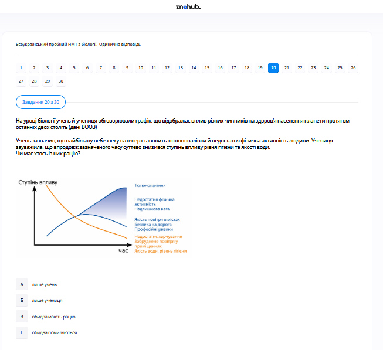

# Завдання 20

## Опис
Проаналізуйте діаграму, на якій відображено частку факторів, що впливають на здоров'я людини. Яка група факторів має найбільший вплив (50%)?

## Аналіз діаграми

На круговій діаграмі представлено чотири групи факторів:
1.  **Спадковість (генетика)** — 20%.
2.  **Стан навколишнього середовища (екологія)** — 20%.
3.  **Медичне обслуговування** — 10%.
4.  **Спосіб життя** — **50%**.

## Аналіз варіантів відповіді

*   **А) спосіб життя (Правильно)**: Згідно з даними ВООЗ та наведеною діаграмою, саме поведінкові фактори (харчування, рухова активність, відсутність шкідливих звичок) найбільше визначають стан здоров'я.
*   **Б) стан навколишнього середовища (Неправильно)**: Його вплив оцінюється у 20%.
*   **В) спадковість (Неправильно)**: Її вплив оцінюється у 20%.
*   **Г) рівень розвитку медицини (Неправильно)**: Всупереч поширеній думці, медицина впливає на здоров'я лише на 10%.

## Теорія: Фактори здоров'я людини
Здоров'я — це стан повного фізичного, духовного та соціального благополуччя, а не лише відсутність хвороб. Сучасна валеологія виділяє чотири основні блоки факторів:
1. **Спосіб життя (50%)**: Найважливіший фактор. Включає раціональне харчування, режим праці та відпочинку, рівень фізичної активності, а також наявність або відсутність шкідливих звичок (паління, алкоголь). Людина може безпосередньо контролювати цей фактор.
2. **Спадковість (20%)**: Генетична схильність до певних захворювань, особливості метаболізму та конституції тіла.
3. **Навколишнє середовище (20%)**: Стан повітря, води, рівень шуму, радіації та кліматичні умови. Екологічне благополуччя є необхідною умовою підтримання гомеостазу.
4. **Охорона здоров'я (10%)**: Якість медичної допомоги, профілактичні огляди та доступність ліків. Цей фактор стає вирішальним уже при виникненні хвороби, але має менший вплив на її запобігання.

---

# Pregunta 20

## Descripción
Analice el gráfico que muestra la proporción de factores que afectan a la salud humana. ¿Qué grupo de factores tiene mayor influencia (50%)?

## Análisis del gráfico

El gráfico circular presenta cuatro grupos de factores determinantes de la salud:
1.  **Herencia (genética)** — 20%.
2.  **Medio ambiente (ecología)** — 20%.
3.  **Atención médica** — 10%.
4.  **Estilo de vida** — **50%**.

## Análisis de las Opciones

*   **A) estilo de vida (Correcto)**: Según los datos de la OMS y el gráfico mostrado, son los factores conductuales (alimentación, actividad física, ausencia de hábitos nocivos) los que más determinan el estado de salud.
*   **B) medio ambiente (Incorrecto)**: Su influencia se estima en un 20%.
*   **C) herencia (Incorrecto)**: Su influencia se estima en un 20%.
*   **D) nivel de desarrollo médico (Incorrecto)**: Contrario a la opinión popular, la medicina solo influye en la salud en un 10%.

## Teoría: Determinantes de la Salud Humana
La salud es un estado multifactorial. El modelo de Marc Lalonde (que sustenta este gráfico) identifica cuatro variables clave:
1. **Estilo de Vida (50%)**: Es el factor con mayor peso y, afortunadamente, el más modificable por el individuo. Incluye la dieta equilibrada, el ejercicio regular, el manejo del estrés y evitar sustancias tóxicas. Aproximadamente la mitad de las enfermedades no transmisibles podrían evitarse con cambios en este ámbito.
2. **Factores Biológicos y Genéticos (20%)**: Incluye la carga genética que predispone a ciertas afecciones y el proceso natural de envejecimiento.
3. **Entorno o Medio Ambiente (20%)**: Factores físicos (contaminación, clima), químicos y sociales (condiciones de trabajo, vivienda) que rodean a la persona.
4. **Sistema Sanitario (10%)**: Se refiere a la calidad, cobertura y acceso a los servicios de salud (hospitales, médicos, fármacos). Aunque es vital para tratar enfermedades, tiene un peso menor en la creación de la salud general de una población en comparación con los hábitos de vida.

---

# Question 20

## Description
Analyze the diagram reflecting the share of factors influencing human health. Which group of factors has the greatest influence (50%)?

## Diagram Analysis

The pie chart presents four groups of health determinants:
1.  **Heredity (genetics)** — 20%.
2.  **Environmental state (ecology)** — 20%.
3.  **Medical care** — 10%.
4.  **Lifestyle** — **50%**.

## Analysis of Options

*   **A) lifestyle (Correct)**: According to WHO data and the provided chart, behavioral factors (diet, physical activity, avoidance of harmful habits) are the main determinants of health.
*   **B) environmental state (Incorrect)**: Its influence is estimated at 20%.
*   **C) heredity (Incorrect)**: Its influence is estimated at 20%.
*   **D) level of medical development (Incorrect)**: Despite current technological progress, medical intervention accounts for only 10% of overall health outcomes.

## Theory: Factors Influencing Human Health
Health is defined by the World Health Organization as a state of complete physical, mental, and social well-being. It is shaped by a complex interplay of factors:
1. **Lifestyle (50%)**: This is the most significant determinant. It covers nutrition, exercise, sleep hygiene, and personal choices regarding tobacco or alcohol. It is the factor over which an individual has the most control.
2. **Genetics and Biology (20%)**: Inherited traits and biological characteristics that may predispose an individual to certain health conditions.
3. **Environment (20%)**: Physical, chemical, and biological factors external to a person (e.g., air and water quality, climate, radiation levels). Social and economic environments also play a role.
4. **Health Care Services (10%)**: Access to and quality of medical services for disease prevention and treatment. While crucial for managing sickness, it is less influential in maintaining general population health than lifestyle and environment.
*Key takeaway*: At least 70% of a person's health (lifestyle + environment) depends on factors that are external to the medical system.
