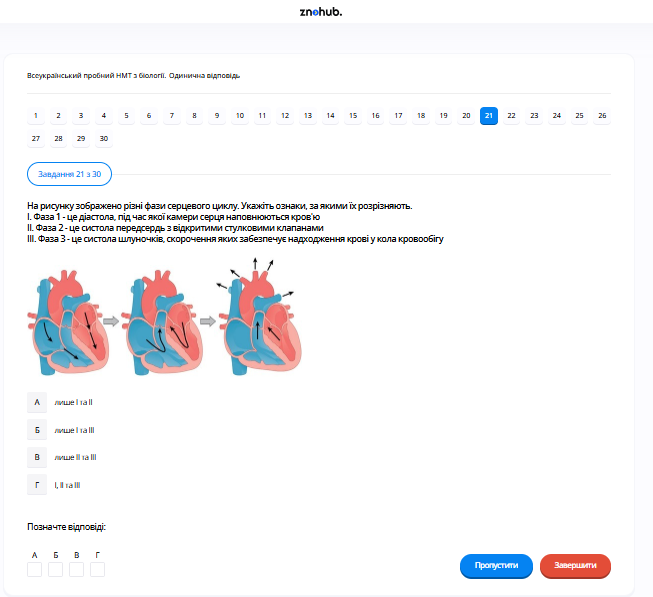

# Завдання 21

## Опис
Укажіть правильні характеристики фаз серцевого циклу, що зображені на схемі:
I. Фаза 1 — це діастола, під час якої камери серця заповнюються кров’ю.
II. Фаза 2 — це систола передсердь, при якій атріовентрикулярні (стулкові) клапани відкриті.
III. Фаза 3 — це систола шлуночків, скорочення яких виштовхує кров у кола кровообігу.

## Аналіз тверджень

*   **Твердження I правильне**: На першій схемі серце перебуває у розслабленому стані (загальна діастола), кров пасивно тече в передсердя та частково у шлуночки.
*   **Твердження II правильне**: Друга схема показує скорочення передсердь (систола передсердь), що виштовхує залишки крові через відкриті атріовентрикулярні клапани в шлуночки.
*   **Твердження III правильне**: Третя схема показує скорочення шлуночків (систола шлуночків). Атріовентрикулярні клапани закриваються, а півмісяцеві клапани відкриваються, дозволяючи крові виходити в аорту та легеневу артерію.

## Аналіз варіантів відповіді

*   **А) лише I та II (Неправильно)**: Твердження III також правильне.
*   **Б) лише I та III (Неправильно)**: Твердження II також правильне.
*   **В) лише II та III (Неправильно)**: Твердження I також правильне.
*   **Г) I, II та III (Правильно)**: Усі три твердження точно описують три основні фази серцевого циклу, як показано на ілюстрації.

---

# Pregunta 21

## Descripción
Identifique las características correctas de las fases del ciclo cardíaco mostradas en el diagrama:
I. La fase 1 es la diástole, durante la cual las cavidades cardiacas se llenan de sangre.
II. La fase 2 es la sístole auricular, con las válvulas auriculoventriculares (de aleta) abiertas.
III. La fase 3 es la sístole ventricular, cuya contracción bombea la sangre hacia los sistemas circulatorios.

## Análisis de las Afirmaciones

*   **La afirmación I es correcta**: El primer diagrama muestra el corazón en estado de relajación (diástole general), donde la sangre fluye pasivamente hacia las aurículas y parcialmente hacia los ventrículos.
*   **La afirmación II es correcta**: El segundo diagrama muestra las aurículas contrayéndose (sístole auricular), empujando el resto de la sangre a través de las válvulas auriculoventriculares abiertas hacia los ventrículos.
*   **La afirmación III es correcta**: El tercer diagrama muestra los ventrículos contrayéndose (sístole ventricular). Las válvulas auriculoventriculares se cierran y las válvulas semilunares se abren, permitiendo que la sangre sea expulsada hacia la aorta y la arteria pulmonar.

## Análisis de las Opciones

*   **A) solo I y II (Incorrecto)**: La afirmación III también es correcta.
*   **B) solo I y III (Incorrecto)**: La afirmación II también es correcta.
*   **C) solo II y III (Incorrecto)**: La afirmación I también es correcta.
*   **D) I, II y III (Correcto)**: Las tres afirmaciones describen con precisión las tres fases principales del ciclo cardíaco tal como se ilustran.

---

# Question 21

## Description
Identify the correct characteristics of the cardiac cycle phases shown in the diagram:
I. Phase 1 is diastole, during which heart chambers fill with blood.
II. Phase 2 is atrial systole, with open atrioventricular (flap) valves.
III. Phase 3 is ventricular systole, the contraction of which pumps blood into the circulatory systems.

## Analysis of Statements

*   **Statement I is correct**: The first diagram shows the heart in a relaxed state (general diastole), where blood flows passively into the atria and partially into the ventricles.
*   **Statement II is correct**: The second diagram shows the atria contracting (atrial systole), pushing the remaining blood through open atrioventricular valves into the ventricles.
*   **Statement III is correct**: The third diagram shows the ventricles contracting (ventricular systole). The atrioventricular valves close, and the semilunar valves open, allowing blood to be ejected into the aorta and pulmonary artery.

## Analysis of Options

*   **A) only I and II (Incorrect)**: Statement III is also correct.
*   **B) only I and III (Incorrect)**: Statement II is also correct.
*   **C) only II and III (Incorrect)**: Statement I is also correct.
*   **D) I, II, and III (Correct)**: All three statements accurately describe the three main phases of the cardiac cycle as illustrated.
