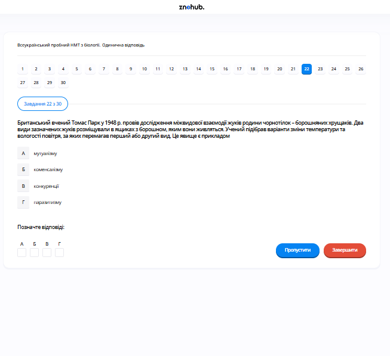

# Завдання 22

## Опис
У 1948 році Томас Парк провів експеримент, у якому два види борошняних хрущаків поміщали в спільне середовище. Через певний час, залежно від температури та вологості, один вид повністю витісняв інший. Це явище є прикладом...

## Аналіз

Коли два види займають одну екологічну нішу та використовують однакові обмежені ресурси (у даному випадку борошно), вони вступають у боротьбу за виживання. Це класичний випадок **міжвидової конкуренції**. Згідно з принципом Гаузе (принцип конкурентного виключення), два види, що конкурують за той самий ресурс, не можуть співіснувати нескінченно довго; один обов'язково виявиться ефективнішим і витіснить іншого.

## Аналіз варіантів відповіді

*   **А) мутуалізму (Неправильно)**: При мутуалізмі обидва види отримують користь від взаємодії. Тут же один вид зникає.
*   **Б) коменсалізму (Неправильно)**: Один вид отримує користь, а інший не відчуває впливу. Тут взаємодія є негативною принаймні для одного виду.
*   **В) конкуренції (Правильно)**: Суперництво за їжу та простір, що призводить до домінування одного виду, є визначенням конкуренції.
*   **Г) паразитизму (Неправильно)**: Один вид живе за рахунок іншого (господаря), не вбиваючи його відразу. Це не той випадок.

## Теорія: Біотичні зв’язки та принцип Гаузе
В екосистемах організми постійно взаємодіють між собою. Ці взаємодії поділяють на кілька типів:
1. **Конкуренція (-/-)**: Взаємодія, за якої два види (або особини одного виду) борються за одні й ті ж обмежені ресурси (їжу, територію, самок).
    *   **Принцип конкурентного виключення (Закон Гаузе)**: Два види з однаковими екологічними потребами не можуть співіснувати в одному місці тривалий час. Сильніший конкурент витіснить слабшого («виживання сильнішого»).
2. **Мутуалізм (+/+)**: Взаємовигідне співжиття (наприклад, лишайник — гриб + водорість).
3. **Коменсалізм (+/0)**: Один вид отримує користь, не завдаючи шкоди іншому (наприклад, риби-прилипали на акулах).
4. **Паразитизм (+/-)**: Один організм (паразит) використовує іншого (хазяїна) як джерело живлення та середовище існування, зазвичай не вбиваючи його миттєво.
5. **Хижацтво (+/-)**: Один вид ловить, убиває та поїдає іншого.
Експерименти Томаса Парка з хрущаками (*Tribolium*) показали, що результат конкуренції залежить від факторів середовища: один вид перемагав у теплому вологому кліматі, інший — у сухому та холодному.

---

# Pregunta 22

## Descripción
El experimento de Thomas Park en 1948 consistió en colocar dos especies de escarabajos de la harina en un entorno compartido. Dependiendo de la temperatura y la humedad, una especie acababa superando y sustituyendo a la otra. Este fenómeno es un ejemplo de...

## Análisis

Cuando dos especies ocupan el mismo nicho ecológico y utilizan los mismos recursos limitados (en este caso, la harina), entran en una lucha por la supervivencia. Se trata de un caso de **competencia interespecífica**. Según el Principio de Gause (principio de exclusión competitiva), dos especies que compiten por el mismo recurso no pueden coexistir indefinidamente; una será inevitablemente más eficiente y eliminará a la otra.

## Análisis de las Opciones

*   **A) mutualismo (Incorrecto)**: En el mutualismo, ambas especies se benefician de la interacción. Aquí, una especie desaparece.
*   **B) comensalismo (Incorrecto)**: Una especie se beneficia mientras que la otra no se ve afectada. Aquí, la interacción es negativa para al menos una de las especies.
*   **C) competencia (Correcto)**: La rivalidad por el alimento y el espacio que conduce al predominio de una especie es la definición de competencia.
*   **D) parasitismo (Incorrecto)**: Una especie vive a expensas de otra (el huésped) sin matarla inmediatamente. Este no es el caso aquí.

## Teoría: Interacciones Bióticas y el Principio de Gause
Las relaciones entre los seres vivos en un ecosistema determinan la estructura de las comunidades.
1. **Competencia**: Es una interacción biológica donde la aptitud de un organismo es reducida por la presencia de otro. Ocurre cuando dos poblaciones tienen requisitos solapados (nicho ecológico).
    *   **Principio de Exclusión Competitiva**: Formulado por G.F. Gause basándose en estudios con protozoos, establece que si dos especies compiten por exactamente el mismo recurso limitante, no pueden coexistir de forma estable. Una de ellas tendrá siempre una ligera ventaja sobre la otra y acabará por extinguirla localmente o forzarla a cambiar de nicho.
2. **Mutualismo**: Interacción obligatoria o facultativa donde ambos se benefician.
3. **Comensalismo**: Relación donde un individuo se beneficia y el otro no sale beneficiado ni perjudicado.
4. **Antagonismos (+/-)**: Incluyen la depredación y el parasitismo. En ambos casos, una especie se beneficia a expensas de la otra.
El experimento de Park es fundamental porque demostró que el ganador de la competencia no es absoluto, sino que depende de las condiciones físicas del ambiente (ambiente abiótico), lo que explica por qué diferentes especies dominan en diferentes climas.

---

# Question 22

## Description
Thomas Park's 1948 experiment involved placing two species of flour beetles in a shared environment. Depending on temperature and humidity, one species eventually outcompeted and replaced the other. This phenomenon is an example of...

## Analysis

When two species occupy the same ecological niche and use the same limited resources (in this case, flour), they enter into a struggle for survival. This is a classic case of **interspecific competition**. According to Gause's Principle (competitive exclusion principle), two species competing for the same resource cannot coexist indefinitely; one will inevitably be more efficient and eliminate the other.

## Analysis of Options

*   **A) mutualism (Incorrect)**: In mutualism, both species benefit from the interaction. Here, one species disappears.
*   **B) commensalism (Incorrect)**: One species benefits while the other is unaffected. Here, the interaction is negative for at least one species.
*   **C) competition (Correct)**: The rivalry for food and space leading to the dominance of one species is the definition of competition.
*   **D) parasitism (Incorrect)**: One species lives at the expense of another (the host) without immediately killing it. This is not the case here.

## Theory: Biotic Interactions and Gause's Principle
Biotic factors are the relationships between living organisms in an ecosystem. These interactions drive natural selection and community structure.
1. **Competition (-/-)**: Occurs when organisms of the same or different species strive for the same limited resources like nutrients, space, or mates.
    *   **Gause's Law of Competitive Exclusion**: States that two species with identical ecological niches cannot coexist at constant population values. The species that has even a slight advantage will eventually dominate, leading to the local extinction of the weaker competitor or an evolutionary shift towards a different niche (niche partitioning).
2. **Symbiosis**: Describes close, long-term interactions:
    *   **Mutualism (+/+)**: Both species benefit (e.g., bees and flowers).
    *   **Commensalism (+/0)**: One benefits, the other is neutral (e.g., barnacles on whales).
    *   **Parasitism (+/-)**: One benefits (parasite) at the cost of the other (host).
Thomas Park used *Tribolium* beetles to demonstrate that the outcome of competition is often stochastic and heavily influenced by abiotic factors (temperature and humidity). This highlighted that "fitness" is relative to the environment.
  
