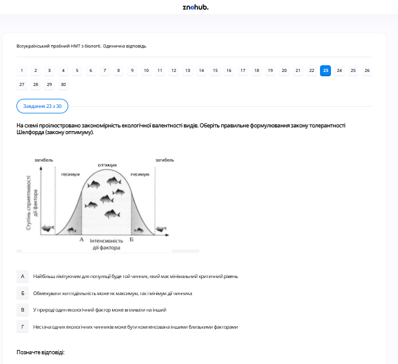

# Завдання 23

## Опис
На рисунку зображено графік межі витривалості виду до екологічного чинника (закон оптимуму). Виберіть правильне формулювання закону толерантності Шелфорда.

## Аналіз

Закон Шелфорда стверджує, що успішність організму залежить від комплексу умов, і будь-яка умова, що наближається до меж витривалості або перевищує їх, може бути лімітуючим чинником.

*   **Зона оптимуму**: Діапазон, де вид почувається найкраще.
*   **Зони пригнічення (пессімуму)**: Діапазони, де вид може вижити, але з фізіологічними труднощами.
*   **Межі витривалості**: Максимальна та мінімальна точки, за якими вид гине.

## Аналіз варіантів відповіді

*   **А) Лімітуючим для популяції буде той чинник, який має мінімальний критичний рівень (Неправильно)**: Це закон мінімуму Лібіха, що фокусується лише на дефіцитних ресурсах.
*   **Б) Життєдіяльність може бути обмежена як максимумом, так і мінімумом дії чинника (Правильно)**: Це основа закону Шелфорда, що ілюструється двома зонами «загибелі» з обох боків шкали.
*   **В) У природі один екологічний чинник може впливати на інший (Неправильно)**: Це правда (принцип взаємодії чинників), але це не основне визначення закону толерантності.
*   **Г) Дефіцит деяких екологічних чинників може бути компенсований іншими чинниками (Неправильно)**: Це принцип взаємозамінності чинників, а не закон Шелфорда.

## Теорія: Екологічні чинники та закон толерантності
Кожен організм пристосований до певного діапазону значень екологічних чинників (температури, вологості, солоності тощо).
1. **Закон оптимуму**: Будь-який екологічний чинник має певні межі позитивного впливу на організми.
    *   *Оптимум*: Значення чинника, найбільш сприятливі для життєдіяльності.
    *   *Межі витривалості*: Мінімальне та максимальне значення, за якими існування неможливе.
2. **Закон толерантності (В. Шелфорд, 1913)**: Обмежуючим фактором для виживання організму може бути як мінімальний, так і максимальний екологічний вплив. Тобто організм потрапляє в зону стресу не лише від дефіциту, а й від надлишку чинника.
3. **Екологічна пластичність (валентність)**: Здатність організмів пристосовуватися до певних коливань чинників.
    *   **Стенобіонти**: Мають вузькі межі толерантності (чутливі до змін, наприклад, форель потребує лише чистої холодної води).
    *   **Еврибіонти**: Мають широкі межі толерантності (можуть жити в різних умовах, наприклад, тарган, пацюк).
4. **Важливість**: Знання меж толерантності критичне для сільського господарства, охорони природи та прогнозування наслідків зміни клімату.

---

# Pregunta 23

## Descripción
El diagrama muestra la curva de campana de la tolerancia de una especie a un factor ambiental (ley del óptimo). Debe seleccionar la formulación correcta de la Ley de Tolerancia de Shelford.

## Análisis

La Ley de Shelford establece que el éxito de un organismo depende de un complejo de condiciones y que cualquier condición que se aproxime o supere los límites de tolerancia puede ser un factor limitante.

*   **Zona óptima**: El rango en el que la especie se desarrolla mejor.
*   **Zonas de estrés (pejus/pessimum)**: Rangos en los que la especie puede sobrevivir pero con un coste fisiológico.
*   **Límites de tolerancia**: Los puntos máximo y mínimo a partir de los cuales la especie muere.

## Análisis de las Opciones

*   **A) El factor que será más limitante para una población es aquel que tiene un nivel crítico mínimo (Incorrecto)**: Esta es la Ley del Mínimo de Liebig, que se centra únicamente en los recursos escasos.
*   **B) La actividad vital puede estar limitada tanto por el máximo como por el mínimo de la acción del factor (Correcto)**: Este es el núcleo de la Ley de Shelford, como ilustran las dos zonas de "Muerte" (загибель) en ambos extremos de la escala.
*   **C) En la naturaleza, un factor ecológico puede afectar a otro (Incorrecto)**: Esto es cierto (principio de interacción de factores), pero no es la definición principal de la Ley de Tolerancia.
*   **D) La falta de algunos factores ecológicos puede compensarse con otros factores (Incorrecto)**: Este es el principio de compensabilidad de los factores, no la ley de Shelford.

## Teoría: La Ecología de la Tolerancia
Los organismos interactúan con su entorno físico-químico dentro de rangos específicos de tolerancia.
1. **Ley del Óptimo**: Establece que para cada factor ambiental existe un nivel que favorece el máximo rendimiento biológico (reproducción y crecimiento). A medida que nos alejamos de ese valor óptimo hacia los extremos, el organismo entra en zonas de estrés.
2. **Ley de Tolerancia de Shelford**: Amplía la ley de Liebig. Indica que no solo la escasez de un recurso puede ser limitante, sino también su exceso. Por ejemplo, demasiada agua puede ser tan letal para una planta del desierto como su ausencia absoluta.
3. **Clasificación de los Organismos**:
    *   **Euri- (prefijo)**: Indica un rango amplio de tolerancia (ej: *euritermos* — soportan grandes cambios de temperatura).
    *   **Esteno- (prefijo)**: Indica un rango estrecho de tolerancia (ej: *estenohalinos* — solo viven en aguas con salinidad constante, como los corales).
4. **Factor Limitante**: Es cualquier factor que tiende a restringir el éxito de un organismo al acercarse a sus límites de tolerancia. La interacción de múltiples factores (temperatura + humedad) puede estrechar aún más estos límites.

---

# Question 23

## Description
The diagram shows the bell curve of a species' tolerance to an environmental factor (law of optimum). You need to select the correct formulation of Shelford's Law of Tolerance.

## Analysis

Shelford's Law states that the success of an organism is dependent on a complex of conditions and that any condition which approaches or exceeds the limits of tolerance may be a limiting factor.

*   **Zone of Optimum**: The range where the species thrives best.
*   **Zones of Stress (Pejus/Pessimum)**: Ranges where the species can survive but at a physiological cost.
*   **Limits of Tolerance**: The maximum and minimum points beyond which the species dies.

## Analysis of Options

*   **A) The most limiting for a population will be that factor that has a minimal critical level (Incorrect)**: This is Liebig's Law of the Minimum, which focuses only on the scarce resources.
*   **B) Vital activity can be limited by both the maximum and minimum of the factor's action (Correct)**: This is the core of Shelford's Law, as illustrated by the two "Death" (загибель) zones at both ends of the scale.
*   **C) In nature, one ecological factor can affect another (Incorrect)**: This is true (the principle of factor interaction) but it's not the primary definition of the Law of Tolerance.
*   **D) Lack of some ecological factors can be compensated by other factors (Incorrect)**: This is the principle of factor compensability, not Shelford's law.

## Theory: Ecological Tolerance and Limiting Factors
Every species has a specific range of values for any environmental factor (temperature, pH, light intensity, etc.) within which it can survive.
1. **The Law of the Optimum**: States that organisms function best at a specific intensity of an environmental factor. This peak is called the **Optimum**. Surrounding this peak are levels of higher and lower intensity where the organism is stressed (Stress Zones).
2. **Shelford's Law of Tolerance (1913)**: Unlike Liebig's earlier "Law of the Minimum" (which only acknowledged deficiency), Shelford recognized that **excess** can be just as limiting as deficiency. Thus, environmental factors act as limiting factors at both their minimum and maximum levels of intensity.
3. **Biological Valence (Plasticity)**:
    *   **Stenobionts**: Organisms with a narrow range of tolerance (e.g., tropical reef fish that cannot survive slight water temperature changes).
    *   **Eurybionts**: Organisms with a wide range of tolerance (e.g., dandelions or rats that can live in diverse climates and conditions).
4. **Environmental Monitoring**: Shelford's law is fundamental for ecological modeling. It explains species distribution and allows scientists to predict how populations might shift or shrink due to environmental pollution or climate change.
