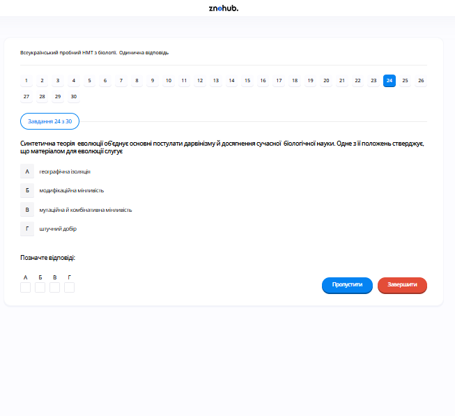

# Завдання 24

## Опис
Одне із положень синтетичної теорії еволюції (СТЕ) стверджує, що матеріалом для еволюції є...

## Аналіз

Синтетична теорія еволюції (вдосконалення теорії Дарвіна у XX столітті) ідентифікує джерела генетичної мінливості, які забезпечують сирий матеріал для дії природного добору.

## Аналіз варіантів відповіді

*   **А) географічна ізоляція (Неправильно)**: Ізоляція — це фактор еволюції, який сприяє розходженню популяцій та видоутворенню, але вона не є самим *матеріалом* (джерелом нових ознак).
*   **Б) модифікаційна мінливість (Неправильно)**: Також відома як фенотипова пластичність, це неспадкові зміни під впливом середовища. Оскільки вони не передаються нащадкам, вони не можуть бути матеріалом для довготривалої еволюції.
*   **В) мутаційна та комбінативна мінливість (Правильно)**: Мутації створюють нові алелі, а генетична рекомбінація (комбінативна мінливість) перемішує їх у нові комбінації. Ця генетична різноманітність є необхідним матеріалом для еволюції.
*   **Г) штучний добір (Неправильно)**: Це механізм еволюції під контролем людини, а не джерело генетичного матеріалу.

## Теорія: Синтетична теорія еволюції (СТЕ)
СТЕ виникла у 1930-40-х роках як синтез класичного дарвінізму та генетики. Вона пояснює механізми еволюції на рівні популяцій.
1. **Матеріал еволюції**: Спадкова мінливість.
    *   **Мутаційна мінливість**: Поява нових варіантів генів внаслідок раптових змін у структурі ДНК чи хромосом. Це первинне джерело нових ознак.
    *   **Комбінативна мінливість**: Виникає при статевому розмноженні за рахунок випадкового поєднання гамет, кросинговеру та незалежного розходження хромосом. Це забезпечує нескінченну кількість нових поєднань ознак у нащадків.
2. **Одиниця еволюції**: Популяція, а не окрема особина. Еволюція — це зміна частот алелів у генофонді популяції з часом.
3. **Елементарні фактори еволюції**: Мутаційний процес, популяційні хвилі, дрейф генів та ізоляція.
4. **Рушійна сила**: Природний добір. Він діє на фенотипи і, зберігаючи найпристосованіші з них, спрямовано змінює генофонд популяції.
5. **Видоутворення**: Результат тривалого накопичення мікроеволюційних змін, що призводить до репродуктивної ізоляції.

---

# Pregunta 24

## Descripción
Una de las disposiciones de la Teoría Sintética de la Evolución (TSE) establece que el material para la evolución es...

## Análisis

La Teoría Sintética de la Evolución (un perfeccionamiento de la teoría de Darwin en el siglo XX) identifica las fuentes de variación genética que proporcionan la materia prima sobre la que actúa la selección natural.

## Análisis de las Opciones

*   **A) aislamiento geográfico (Incorrecto)**: El aislamiento es un factor evolutivo que ayuda a la divergencia de las poblaciones y a la especiación, pero no es el *material* (la fuente de nuevos rasgos) en sí mismo.
*   **B) variabilidad por modificación (Incorrecto)**: También conocida como plasticidad fenotípica, son cambios no hereditarios provocados por el entorno. Al no transmitirse a la descendencia, no pueden ser la materia prima de la evolución a largo plazo.
*   **C) variabilidad mutacional y combinativa (Correcto)**: Las mutaciones crean nuevos alelos y la recombinación genética (variabilidad combinativa) los mezcla en nuevas combinaciones. Esta diversidad genética es el material esencial para la evolución.
*   **D) selección artificial (Incorrecto)**: Es un mecanismo de evolución controlado por el ser humano, no la fuente del material genético.

## Teoría: La Teoría Sintética de la Evolución (Neodarwinismo)
La TSE unifica la selección natural de Darwin con los principios de la genética mendeliana y de poblaciones. Sus pilares son:
1. **Fuentes de Variación Géntica (Materia Prima)**:
    *   **Mutaciones**: Alteraciones aleatorias en el ADN que generan nuevos alelos. Son la fuente última de toda la novedad genética.
    *   **Recombinación (Variabilidad Combinativa)**: Ocurre durante la meiosis (crossing-over y segregación independiente). No crea genes nuevos, pero genera nuevas combinaciones de alelos en cada individuo, lo que aumenta enormemente la diversidad del "pool" o fondo genético.
2. **La Población como Unidad Evolutiva**: La evolución se define como el cambio en las frecuencias alélicas de una población a través de las generaciones. Los individuos no evolucionan; las poblaciones sí.
3. **Mecanismos de Cambio**: Además de la selección natural (que es direccional y adaptativa), existen procesos aleatorios como la deriva genética y el flujo génico (migración).
4. **Aislamiento**: Es necesario para que una subpoblación se diferencie tanto de la original que ya no puedan cruzarse, dando lugar a una nueva especie (especiación).
5. **Gradualismo**: Los cambios evolutivos suelen ocurrir de forma lenta y gradual a través de periodos muy largos de tiempo.

---

# Question 24

## Description
One of the provisions of the Synthetic Theory of Evolution (STE) states that the material for evolution is...

## Analysis

The Synthetic Theory of Evolution (a 20th-century refinement of Darwin's theory) identifies the sources of genetic variation that provide the raw material for natural selection to act upon.

## Analysis of Options

*   **A) geographic isolation (Incorrect)**: Isolation is an evolutionary factor that helps in the divergence of populations and speciation, but it is not the *material* (the source of new traits) itself.
*   **B) modification variability (Incorrect)**: Also known as phenotypic plasticity, these are non-hereditary changes caused by the environment. Since they are not passed to offspring, they cannot be the raw material for long-term evolution.
*   **C) mutational and combinative variability (Correct)**: Mutations create new alleles, and genetic recombination (combinative variability) shuffles them into new combinations. This genetic diversity is the essential material for evolution.
*   **D) artificial selection (Incorrect)**: This is a mechanism of evolution controlled by humans, not the source of genetic material.

## Theory: The Synthetic Theory of Evolution (STE)
Also known as the Modern Synthesis, the STE emerged by merging Darwinian selection with Mendelian genetics and molecular biology.
1. **The Raw Material for Evolution**: Evolution requires variation.
    *   **Mutational Variability**: Sudden changes in the genome. Mutations are the primary source of new genetic variants (alleles). Most are neutral or harmful, but some provide advantages in specific environments.
    *   **Combinative Variability**: The reshuffling of existing genes during sexual reproduction (via crossing-over, independent assortment of chromosomes, and random fertilization). This ensures that every offspring is genetically unique.
2. **The Unit of Evolution**: The **Population** is considered the basic unit of evolution. Individuals live, reproduce, and die, but they do not evolve. Evolution is a change in the allele frequencies within a population's gene pool over time.
3. **Driving Forces**:
    *   **Natural Selection**: The non-random process that preserves individuals with beneficial traits.
    *   **Genetic Drift**: Random changes in allele frequencies, especially significant in small populations.
    *   **Gene Flow**: The transfer of alleles between populations through migration.
4. **Reproductive Isolation**: For speciation to occur, a portion of the population must become isolated (geographically or biologically) to prevent interbreeding, allowing genetic differences to accumulate.
5. **Conclusion**: Evolution is the directed change of genetic diversity through the selection of variants produced by mutation and recombination.
