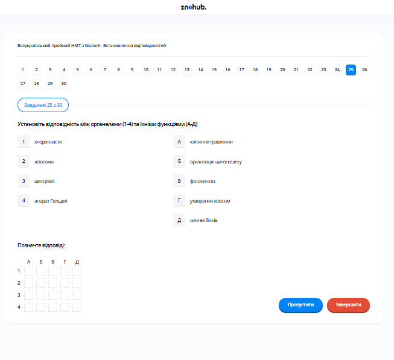

# Завдання 25

## Опис
Установіть відповідність між органелами (1-4) та функціями (А-Д), які вони виконують.

## Аналіз та відповідність

1.  **Хлоропласти**: Органели, відповідальні за перетворення енергії світла в енергію хімічних зв'язків.
    *   *Функція*: **Фотосинтез** -> Відповідність **1-В**.
2.  **Лізосоми**: Містять травні ферменти для розщеплення макромолекул та старих частин клітини.
    *   *Функція*: **Клітинне травлення** -> Відповідність **2-А**.
3.  **Центріолі**: Беруть участь в організації веретена поділу та допомагають організувати мікротрубочки.
    *   *Функція*: **Організація цитоскелету** -> Відповідність **3-Б**.
4.  **Апарат Гольджі**: Модифікує, сортує та пакує білки та ліпіди. Також виробляє деякі речовини.
    *   *Функція*: **Утворення лізосом** -> Відповідність **4-Г**.

*Примітка: Функція Д (Синтез білка) виконується рибосомами, які не вказані в лівому стовпчику.*

## Правильна відповідність
*   **1 -> В**
*   **2 -> А**
*   **3 -> Б**
*   **4 -> Г**

## Теорія: Рівні організації та функції клітинних органел
Еукаріотична клітина поділена на функціональні відсіки — органели.
1. **Двомембранні органели**:
    *   **Хлоропласти**: Належать до пластид. Містять хлорофіл. У тилакоїдах та стромі відбуваються світлова та темнова фази **фотосинтезу** (синтез глюкози з $CO_2$ та $H_2O$).
    *   **Мітохондрії**: Станції "енергозабезпечення", де відбувається синтез АТФ.
2. **Одномембранні органели**:
    *   **Ендоплазматична сітка (ЕПС)**: Транспортна мережа. Шорстка ЕПС (з рибосомами) синтезує білки, гладенька — ліпіди та вуглеводи.
    *   **Комплекс (Апарат) Гольджі**: Система сплощених цистерн. Тут отримані з ЕПС речовини «дозрівають» (модифікуються), сортуються та пакуються у везикули. Одним з результатів роботи Гольджі є **утворення лізосом**.
    *   **Лізосоми**: Пухирці з гідролітичними ферментами. Забезпечують внутрішньоклітинне травлення (автофагію — знищення старих органел, автоліз — саморуйнування клітини).
3. **Немембранні органели**:
    *   **Рибосоми**: Сайти синтезу білка (трансляції).
    *   **Клітинний центр (центріолі)**: Складається з двох перпендикулярних циліндрів. Утворює нитки веретена поділу та керує мережею мікротрубочок (**цитоскелету**).

---

# Pregunta 25

## Descripción
Establezca la correspondencia entre los orgánulos (1-4) y sus funciones (A-Д).

## Análisis y Emparejamiento

1.  **Cloroplastos (хлоропласти)**: Son los orgánulos encargados de convertir la energía luminosa en energía química.
    *   *Función*: **Fotosíntesis (фотосинтез)** -> Corresponde con **1-В**.
2.  **Lisosomas (лізосоми)**: Contienen enzimas digestivas para descomponer macromoléculas y partes viejas de la célula.
    *   *Función*: **Digestión intracelular (клітинне травлення)** -> Corresponde con **2-А**.
3.  **Centriolos (центріолі)**: Intervienen en la organización del huso mitótico y ayudan a organizar los microtúbulos.
    *   *Función*: **Organización del citoesqueleto (організація цитоскелету)** -> Corresponde con **3-Б**.
4.  **Aparato de Golgi (апарат Гольджі)**: Este orgánulo modifica, clasifica y empaqueta proteínas y lípidos. También fabrica algunas sustancias.
    *   *Función*: **Formación de lisosomas (утворення лізосом)** -> Corresponde con **4-Г**.

*Nota: La función Д (Síntesis de proteínas) la realizan los ribosomas, que no figuran en la columna de la izquierda.*

## Correspondencia Correcta
*   **1 -> В**
*   **2 -> А**
*   **3 -> Б**
*   **4 -> Г**

## Teoría: Estructura y Función Celular
La célula eucariota está compartimentada para realizar múltiples reacciones bioquímicas simultáneamente.
1. **Cloroplastos**: Son un tipo de plastidios presentes en plantas y algas. Tienen su propio ADN y ribosomas. Su función es la **fotosíntesis**, proceso que transforma materia inorgánica en orgánica utilizando luz.
2. **Lisosomas**: Vesículas membranosas que contienen enzimas ácidas (hidrolasas). Actúan como el "sistema digestivo" de la célula. Se encargan de la lisis celular de patógenos y del reciclaje de componentes celulares dañados.
3. **Complejo de Golgi**: Funciona como una planta de empaquetado y envío. Recibe proteínas del retículo endoplasmático, las modifica (glucosilación) y las envía a su destino final mediante vesículas de secreción o vesículas que se convertirán en lisosomas.
4. **Centriolos**: Están formados por tripletes de microtúbulos de tubulina. Son exclusivos de las células animales (y algunas plantas inferiores). Forman parte del centrosoma y son vitales para el ensamblaje del huso acromático durante la división celular, permitiendo el reparto equitativo de los cromosomas. También organizan los cilios y flagelos.

---

# Question 25

## Description
Establish the correspondence between the organelles (1-4) and their functions (A-Д).

## Analysis and Matching

1.  **Chloroplasts (хлоропласти)**: These are the organelles responsible for converting light energy into chemical energy.
    *   *Function*: **Photoynthesis (фотосинтез)** -> Match **1-В**.
2.  **Lysosomes (лізосоми)**: These contain digestive enzymes to break down macromolecules and old cell parts.
    *   *Function*: **Intracellular digestion (клітинне травлення)** -> Match **2-А**.
3.  **Centrioles (центріолі)**: These are involved in the organization of the mitotic spindle and help organize microtubules.
    *   *Function*: **Organization of cytoskeleton (організація цитоскелету)** -> Match **3-Б**.
4.  **Golgi apparatus (апарат Гольджі)**: This organelle modifies, sorts, and packages proteins and lipids. It also manufactures some substances.
    *   *Function*: **Formation of lysosomes (утворення лізосом)** -> Match **4-Г**.

*Note: Function Д (Protein synthesis) is performed by ribosomes, which are not listed in the left column.*

## Correct Correspondence
*   **1 -> В**
*   **2 -> А**
*   **3 -> Б**
*   **4 -> Г**

## Theory: Cell Compartmentalization and Organelle Function
Eukaryotic cells are defined by the presence of membrane-bound organelles that perform specific tasks to maintain life.
1. **Chloroplasts**: Part of the plastid family in plants. They contain thylakoids where the light-dependent reactions of **photosynthesis** happen, using chlorophyll to capture photons. The stroma (fluid) hosts the Calvin Cycle to fix carbon.
2. **Lysosomes**: These are acidic sacs formed from the Golgi apparatus. They store over 40 types of enzymes that can break down proteins, nucleic acids, lipids, and complex sugars. They are crucial for programmed cell death (apoptosis) and clearing debris.
3. **Golgi Complex**: A series of flattened, stacked membranes (cisternae). It serves as a warehouse and processing center. It modifies glycoproteins and packs products into vesicles for transport. It is the site where secondary lysosomes are generated.
4. **Centrioles and the Cell Center**: Found in the centrosome of animal cells. They are made of microtubule triplets. During cell division, they replicate and move to opposite poles, serving as anchors for the spindle fibers which pull sister chromatids apart. They also serve as precursors for basal bodies that form the structure of cilia and flagella.
5. **Ribosomes**: While not listed, ribosomes are the primary site of **protein synthesis**. They can be free-floating in the cytoplasm or attached to the rough endoplasmic reticulum.
  
