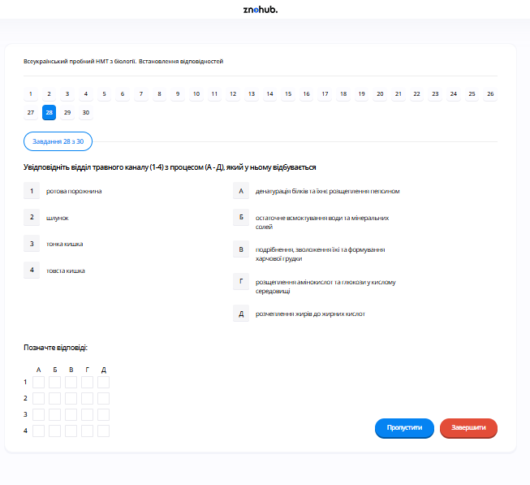

# Завдання 28

## Опис
Увідповідніть відділ травного каналу (1-4) з процесом (А-Д), який у ньому відбувається.

## Аналіз та відповідність

1.  **Ротова порожнина**: Тут починається механічна обробка їжі та хімічне розщеплення вуглеводів за допомогою ферментів слини.
    *   *Процес*: **Первинне розщеплення вуглеводів** (амілазою) -> Відповідність **1-Б**.
2.  **Шлунок**: Орган, де їжа затримується для дезінфекції соляною кислотою та початку розщеплення складних білків.
    *   *Процес*: **Початкове розщеплення білків** (пепсином) -> Відповідність **2-А**.
3.  **Тонкий кишечник**: Основний відділ, де завершується розщеплення всіх поживних речовин та відбувається їх всмоктування в кров та лімфу.
    *   *Процес*: **Всмоктування поживних речовин** (через ворсинки) -> Відповідність **3-Г**.
4.  **Товстий кишечник**: Тут завершується всмоктування води, формування калових мас та відбувається розщеплення клітковини бактеріями.
    *   *Процес*: **Синтез вітаміну K та групи B** (мікрофлорою) -> Відповідність **4-Д**.

*Примітка: Процес В (Знешкодження токсинів) відбувається в печінці, яка є залозою, а не відділом травного каналу.*

## Правильна відповідність
*   **1 -> Б**
*   **2 -> А**
*   **3 -> Г**
*   **4 -> Д**

## Теорія: Процеси травлення в організмі людини
Травна система забезпечує надходження поживних речовин до внутрішнього середовища організму.
1. **Ротова порожнина**: Механічне подрібнення зубами, змочування слиною. **Слина** містить ферменти (амілазу та мальтазу), які розщеплюють крохмаль до простих цукрів.
2. **Шлунок**: Містить шлунковий сік (соляна кислота + фермент **пепсин**). Соляна кислота знищує бактерії та активує пепсин, який розщеплює білки на коротші ланцюги пептидів.
3. **Тонкий кишечник**: Поділяється на дванадцятипалу, порожню та клубову кишки. Тут діють ферменти підшлункової залози та жовч печінки. Відбувається остаточне розщеплення білків, жирів та вуглеводів. Слизова оболонка має **ворсинки**, які значно збільшують площу **всмоктування** амінокислот, глюкози та жирних кислот.
4. **Товстий кишечник**: Основна функція — всмоктування води та формування калових мас. Важливу роль відіграють бактерії-симбіонти (кишкова паличка та інші), які розщеплюють целюлозу (клітковину) та синтезують вітаміни (K, $B_{12}$).
5. **Печінка**: Виконує бар'єрну функцію (знешкодження токсинів), бере участь в обміні речовин та виробляє жовч, яка емульгує жири.

---

# Pregunta 28

## Descripción
Haga corresponder cada sección del canal digestivo (1-4) con el proceso (A-Д) que tiene lugar en ella.

## Análisis y Emparejamiento

1.  **Cavidad bucal (ротова порожнина)**: Comienza el procesamiento mecánico y la descomposición química de los carbohidratos mediante las enzimas de la saliva.
    *   *Proceso*: **Descomposición primaria de los carbohidratos** (mediante amilasa) -> Corresponde con **1-Б**.
2.  **Estómago (шлунок)**: Órgano donde el alimento se desinfecta con ácido clorhídrico y comienza la digestión de las proteínas complejas.
    *   *Proceso*: **Descomposición inicial de las proteínas** (mediante pepsina) -> Corresponde con **2-А**.
3.  **Intestino delgado (тонкий кишечник)**: Sección principal donde se completa la degradación de todos los nutrientes y se produce su paso a la circulación.
    *   *Proceso*: **Absorción de nutrientes** (a través de las vellosidades) -> Corresponde con **3-Г**.
4.  **Intestino grueso (товстий кишечник)**: Aquí finaliza la absorción de agua, se forman las heces y las bacterias descomponen la celulosa.
    *   *Proceso*: **Síntesis de vitaminas K y del grupo B** (por la microbiota) -> Corresponde con **4-Д**.

*Nota: El proceso В (Desintoxicación de toxinas) ocurre en el hígado, que es una glándula aneja y no una sección del canal alimentario.*

## Correspondencia Correcta
*   **1 -> Б**
*   **2 -> А**
*   **3 -> Г**
*   **4 -> Д**

## Teoría: Fisiología de la Digestión Humana
El sistema digestivo transforma los polímeros de los alimentos en monómeros absorbibles.
1. **Boca**: La saliva contiene mucina para lubricar y **ptialina (amilasa salival)** para degradar el almidón.
2. **Estómago**: El medio es muy ácido ($pH \approx 2$) por el HCl secretado por las células del epitelio. Esto activa a la **pepsina**, la enzima que rompe los enlaces peptídicos de las proteínas. Aquí se forma el quimo.
3. **Intestino Delgado**: En el duodeno se vierten la bilis (emulsiona grasas) y el jugo pancreático (contiene tripsina, lipasa y amilasa). La mucosa posee millones de **microvellosidades** intestinales que transportan los nutrientes hacia los capilares sanguíneos y los vasos quilíferos (linfa).
4. **Intestino Grueso**: Carece de vellosidades. Su función es reabsorber agua y electrolitos. Alberga la **flora intestinal** (bacterias comensales y simbiontes). Estas bacterias son vitales porque fabrican vitaminas esenciales que nosotros no podemos producir, como la vitamina K (clave para la coagulación).
5. **Hígado y Vesícula Biliar**: El hígado es el laboratorio químico del cuerpo; filtra la sangre que viene del intestino (función barrera) y produce bilis para facilitar la digestión de los lípidos.

---

# Question 28

## Description
Match the section of the digestive tract (1-4) with the process (A-Д) occurring within it.

## Analysis and Matching

1.  **Oral cavity (ротова порожнина)**: Mechanical processing by teeth and chemical breakdown of starch begin here.
    *   *Process*: **Primary breakdown of carbohydrates** (by amylase) -> Match **1-Б**.
2.  **Stomach (шлунок)**: A muscular sac where food is mixed with gastric juice to begin protein digestion.
    *   *Process*: **Initial breakdown of proteins** (by pepsin) -> Match **2-А**.
3.  **Small intestine (тонкий кишечник)**: The longest part of the tract where final digestion and nutrient uptake occur.
    *   *Process*: **Absorption of nutrients** (via villi) -> Match **3-Г**.
4.  **Large intestine (товстий кишечник)**: This section focuses on water recovery and houses millions of beneficial bacteria.
    *   *Process*: **Synthesis of vitamins K and B group** (by microflora) -> Match **4-Д**.

*Note: Process В (Neutralization of toxins) is a function of the liver, which is an accessory gland, not a segment of the digestive canal through which food passes.*

## Correct Correspondence
*   **1 -> Б**
*   **2 -> А**
*   **3 -> Г**
*   **4 -> Д**

## Theory: The Human Digestive System and Enzymatic Activity
Digestion is the breakdown of large insoluble food molecules into small water-soluble food molecules so that they can be absorbed into the watery blood plasma.
1. **The Mouth**: Saliva contains **amylase**, which breaks down polysaccharides into disaccharides (maltose).
2. **The Stomach**: Gastric glands produce hydrochloric acid (HCl) and **pepsinogen**. HCl converts pepsinogen into the active enzyme **pepsin**, which starts hydrolyzing protein chains into peptides. The resulting semi-liquid mass is called chyme.
3. **The Small Intestine**: Enzymatic digestion is completed by pancreatic juice and intestinal juice.
    *   **Absorption**: The inner wall is covered with tiny finger-like projections called **villi**. These increase the surface area enormously. Glucose and amino acids pass into blood capillaries, while fatty acids and glycerol enter the lacteals of the lymphatic system.
4. **The Large Intestine**: Its primary job is to extract water and salts from the remains of the food.
    *   **Microbiome**: Symbiotic bacteria inhabit the colon. They break down dietary fiber (cellulose) that humans can't digest and produce **vitamin K** and several **B vitamins** as metabolic byproducts, which are then absorbed by our body.
5. **The Liver**: All blood from the digestive tract passes through the liver first. The liver processes nutrients, stores glucose as glycogen, and acts as a "filter" to eliminate toxins (metabolic detoxification).
  
