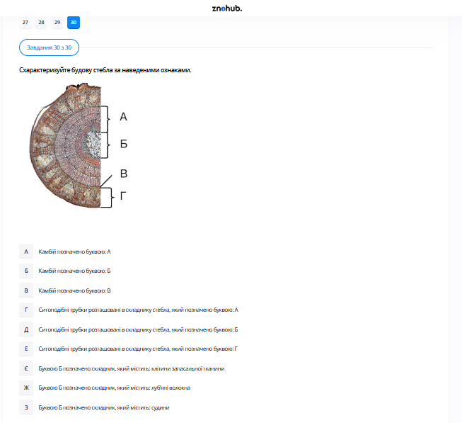

# Завдання 30

## Опис
Схарактеризуйте будову дерев'янистого стебла за наведеними ознаками за поперечним зрізом.

## Анатомічний аналіз

На малюнку зображено поперечний зріз гілки дерева. Основні шари від периферії до центру:
*   **А: Кора** (1). Складається зі шкірки (або заторковілого корка) та лубу (флоема).
*   **Б: Камбій** (2). Твірна тканина, що забезпечує ріст стебла в товщину.
*   **В: Деревина** (3). Основна частина стебла, що містить судини (ксилему). Тут помітні **річні кільця**.
*   **Г: Серцевина** (4). Центральна частина, де запасаються поживні речовини.

## Вибір ознак за колонками

1.  **Назва шару 1 (А)**: Це зовнішній шар.
    *   *Варіант*: **1 (Кора)**.
2.  **Назва шару 2 (Б)**: Це тонкий шар між корою та деревиною.
    *   *Варіант*: **1 (Камбій)**.
3.  **Функція шару 3 (В)**: Деревина забезпечує транспорт води та мінеральних солей від кореня вгору.
    *   *Варіант*: **1 (Висхідний потік)**.

## Правильні відповіді за колонками
*   **А -> 1** (Кора)
*   **Б -> 1** (Камбій)
*   **В -> 1** (Висхідний потік)

## Теорія: Будова дерев’янистого стебла
Стебло — це надземний орган рослини, що виконує опорну та провідну функції. У дерев’янистих рослин воно має багаторічну структуру.
1. **Кора**:
    *   *Корок*: Зовнішній захисний шар.
    *   *Луб (Флоема)*: Містить ситоподібні трубки, якими рухаються органічні речовини від листків до коренів (**низхідний потік**).
2. **Камбій**: Шар твірної тканини (меристеми). Його клітини постійно діляться: назовні вони відкладають клітини лубу, а всередину — клітини деревини. Завдяки йому дерево росте в товщину.
3. **Деревина (Ксилема)**: Головна частина стовбура. Складається з судин та механічних волокон. Проводить воду та мінерали (**висхідний потік**). 
    *   **Річні кільця**: Утворюються внаслідок нерівномірного поділу клітин камбію протягом року (весною клітини великі і тонкостінні, восени — дрібні і товстостінні). За ними можна визначити вік дерева та кліматичні умови минулих років.
4. **Серцевина**: Центральна, зазвичай пухка тканина. Виконує переважно запасальну функцію.

---

# Pregunta 30

## Descripción
Caracterice la estructura de un tallo leñoso según los rasgos indicados en el corte transversal.

## Análisis Anatómico

La imagen muestra una sección transversal de una rama. Las capas desde el exterior al centro son:
*   **A: Corteza** (1). Incluye la epidermis (o súber) y el líber (floema).
*   **B: Cámbium** (2). Tejido meristemático responsable del crecimiento en grosor.
*   **C: Madera** (3). La parte principal del tronco que contiene los vasos conductores (xilema). Se aprecian los **anillos anuales**.
*   **D: Médula** (4). La parte central que almacena nutrientes.

## Selección de Rasgos por Columnas

1.  **Nombre de la capa 1 (А)**: Es la superficie exterior del tronco.
    *   *Opción*: **1 (Corteza / Кора)**.
2.  **Nombre de la capa 2 (Б)**: Es la capa fina entre la corteza y la madera.
    *   *Opción*: **1 (Cámbium / Камбій)**.
3.  **Función de la capa 3 (В)**: La madera se encarga de transportar el agua y las sales minerales desde las raíces hacia arriba.
    *   *Opción*: **1 (Flujo ascendente / Висхідний потік)**.

## Respuestas Correctas por Columnas
*   **А -> 1**
*   **Б -> 1**
*   **В -> 1**

## Teoría: Anatomía del Tallo Leñoso
El tallo de las plantas dicotiledóneas leñosas se organiza en círculos concéntricos de tejidos especializados.
1. **Corteza**: Capa protectora externa. Contiene el **floema** (líber), que transporta la savia elaborada (fotosintatos) desde las hojas hacia el resto de la planta (**flujo descendente**).
2. **Cámbium Vascular**: Es un meristemo lateral. Sus células se dividen activamente por mitosis. Hacia afuera produce floema y hacia adentro produce xilema (madera). Este proceso causa el crecimiento secundario del árbol.
3. **Madera (Xilema)**: Compuesta por vasos leñosos y traqueidas endurecidas con lignina. Su función es el transporte de savia bruta (**flujo ascendente**) y dar soporte estructural.
    *   **Anillos de crecimiento**: El aspecto de la madera varía según la estación. En primavera el crecimiento es rápido (células claras y anchas), en verano/otoño es más lento (células oscuras y estrechas), creando los anillos visibles que indican la edad del árbol.
4. **Médula Central**: Tejido fundamental (parénquima) situado en el centro, encargado de almacenar sustancias de reserva como el almidón.

---

# Question 30

## Description
Characterize the structure of a woody stem based on the given features from the cross-section.

## Anatomical Analysis

The diagram depicts a cross-section of a tree branch. Layers from the periphery to the center are:
*   **A: Bark** (1). Includes the outer protective cork and the inner bast (phloem).
*   **B: Cambium** (2). A thin layer of lateral meristematic tissue allowing growth in diameter.
*   **C: Wood** (3). The largest portion, containing xylem vessels. **Annual rings** are visible here.
*   **D: Pith** (4). The innermost core used for storage.

## Selection of Features by Columns

1.  **Name of layer 1 (А)**: The outer layer of the stem.
    *   *Option*: **1 (Bark / Кора)**.
2.  **Name of layer 2 (Б)**: The active growing layer between bark and wood.
    *   *Option*: **1 (Cambium / Камбій)**.
3.  **Function of layer 3 (В)**: Wood (xylem) facilitates the movement of water and dissolved minerals from the roots to the leaves.
    *   *Option*: **1 (Ascending flow / Висхідний потік)**.

## Correct Answers by Columns
*   **А -> 1**
*   **Б -> 1**
*   **В -> 1**

## Theory: The Structure of Woody Stems
The stem of a woody plant (like a tree or shrub) is a complex organ designed for support and transportation over many years.
1. **Bark**: The protective outer "skin." Its inner part contains the **phloem**, which conducts organic nutrients (sugar) from the sources (leaves) to the sinks (roots) via **descending flow**.
2. **Cambium**: This is the "growth engine" of the trunk. It is only a few cells thick. It produces new layers of phloem to the outside and new layers of xylem to the inside every year.
3. **Wood (Xylem)**: This tissue provides the mechanical strength of the tree.
    *   **Conductivity**: Xylem carries the "raw sap" (water + minerals) through hollow tubes via **ascending flow**. 
    *   **Dendrochronology**: The **annual rings** represent one year of growth. The width of a ring is influenced by climate (rainfall, temperature), allowing scientists to study past environmental conditions.
4. **Pith**: Located at the very center, it consists of soft, spongy parenchyma cells that store starch and nutrients for the plant's future use.
  
