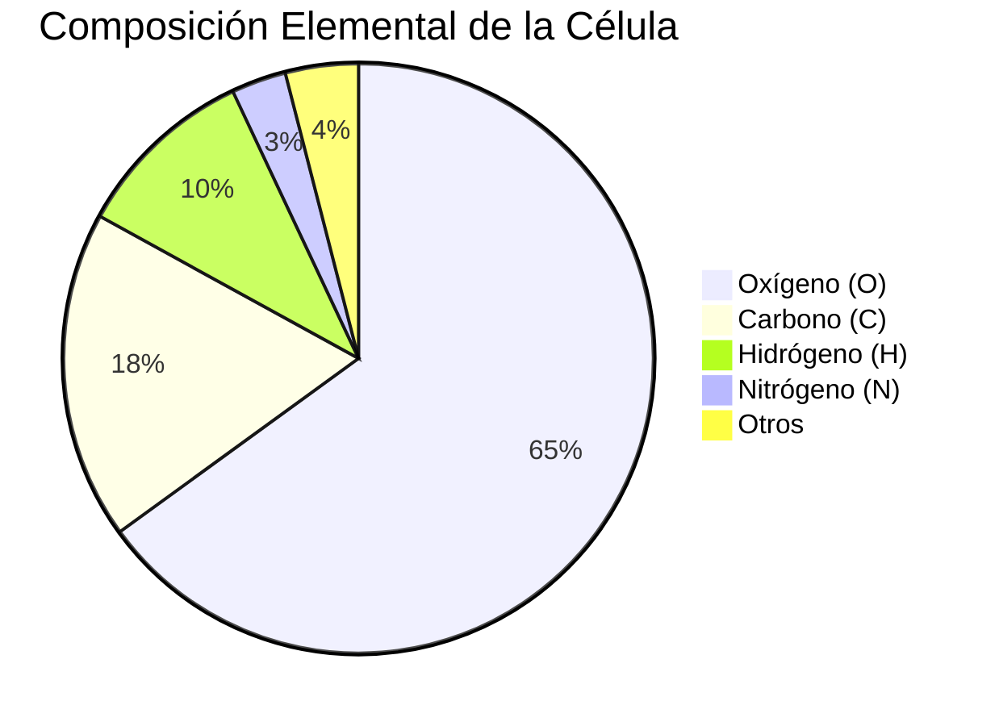
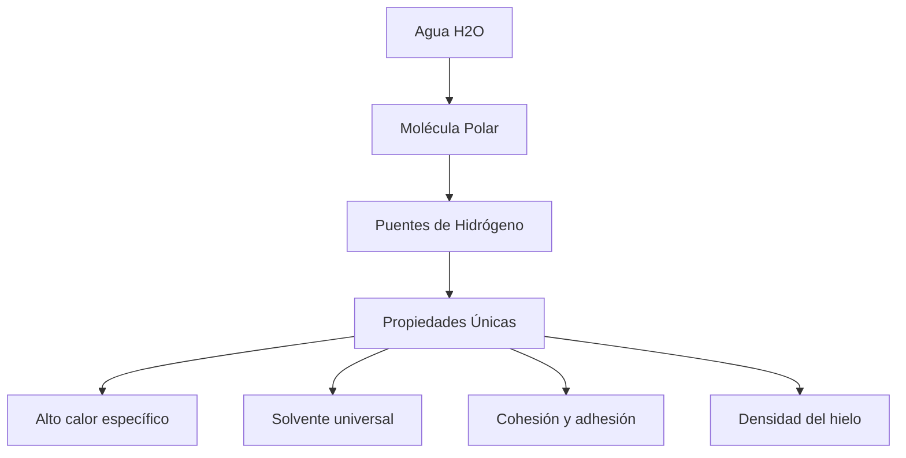
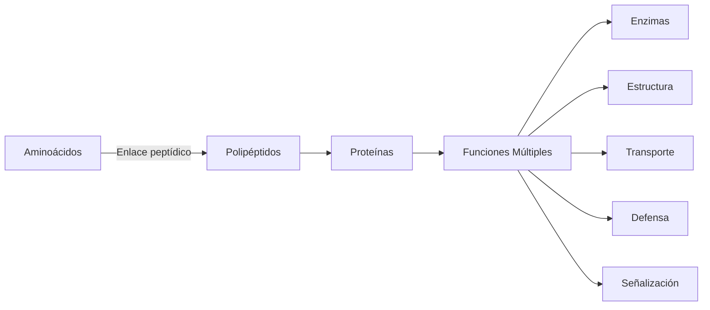
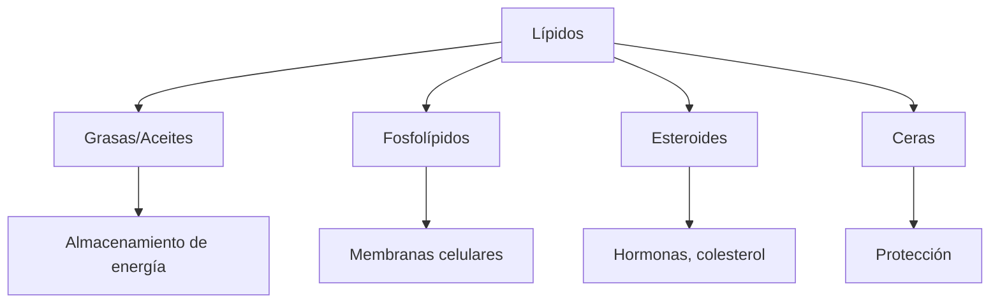
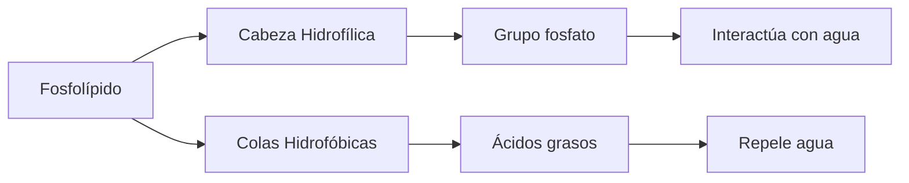
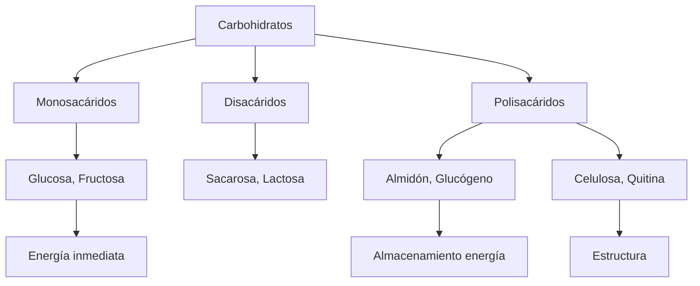
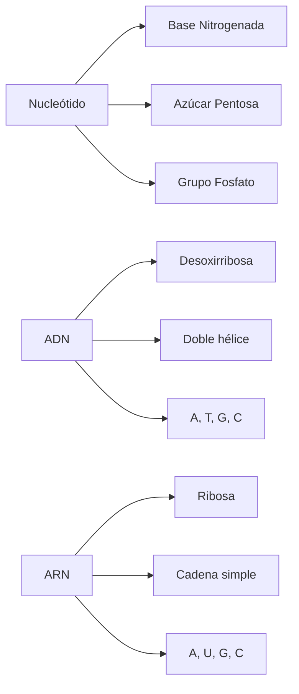
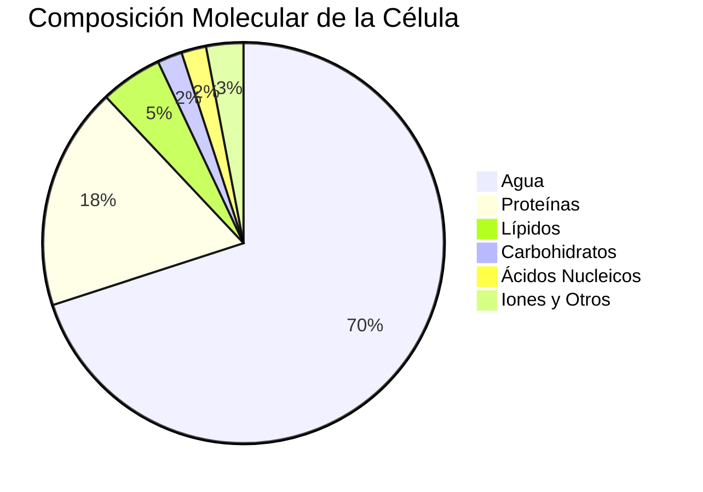

# U01: Composición Química de la Célula

## 📹 Video de la Lección

**Enlace:** [НМТ-2024. Biología. Seminario 1. Composición Química de la Célula](https://www.youtube.com/watch?v=iwgmJjEO9g0)

## 📚 Contenido de la Unidad

### Objetivos de Aprendizaje

Al completar esta unidad, deberás ser capaz de:

- ✅ Identificar los elementos químicos principales que componen las células
- ✅ Comprender la estructura y función de las macromoléculas biológicas
- ✅ Explicar el papel del agua en los sistemas biológicos
- ✅ Describir la composición química de proteínas, lípidos, carbohidratos y ácidos nucleicos
- ✅ Resolver problemas y preguntas tipo NMT sobre composición celular

### Composición Elemental de las Células

> [!IMPORTANT]
> Las células están compuestas principalmente de agua, iones inorgánicos y moléculas orgánicas basadas en carbono.

#### Elementos Biogénicos Principales

Los elementos más abundantes constituyen aproximadamente el **99% de la masa celular**:

| Elemento | Símbolo | % Masa | Función Principal |
|----------|---------|--------|-------------------|
| **Oxígeno** | O | ~65% | Agua, moléculas orgánicas, respiración |
| **Carbono** | C | ~18% | Esqueleto de todas las moléculas orgánicas |
| **Hidrógeno** | H | ~10% | Agua, moléculas orgánicas, transferencia de energía |
| **Nitrógeno** | N | ~3% | Aminoácidos (proteínas), nucleótidos (ADN/ARN) |
| **Fósforo** | P | ~1% | Ácidos nucleicos, ATP, fosfolípidos |
| **Azufre** | S | ~0.25% | Aminoácidos (cisteína, metionina) |

#### Elementos Traza

Presentes en pequeñas cantidades pero cruciales:

| Elemento | Función |
|----------|---------|
| **Calcio (Ca)** | Señalización celular, estructura ósea |
| **Potasio (K)** | Potencial de membrana, señalización nerviosa |
| **Sodio (Na)** | Balance osmótico, impulsos nerviosos |
| **Magnesio (Mg)** | Cofactor enzimático, estructura de clorofila |
| **Hierro (Fe)** | Transporte de oxígeno (hemoglobina) |

### Agua: La Molécula de la Vida

> [!IMPORTANT]
> El agua constituye el **70% o más** de la masa celular total.

#### Propiedades del Agua

**Funciones del Agua en la Célula:**
1. **Solvente:** Disuelve sustancias polares e iónicas
2. **Medio de reacciones:** Facilita reacciones bioquímicas
3. **Transporte:** Mueve nutrientes y desechos
4. **Regulación térmica:** Estabiliza la temperatura celular
5. **Estructura:** Mantiene la forma celular (turgencia)
6. **Hidrólisis:** Participa en la ruptura de enlaces

### Macromoléculas Biológicas

#### 1. Proteínas (~18% del peso celular)

##### Estructura de las Proteínas

| Nivel | Descripción | Ejemplo |
|-------|-------------|---------|
| **Primaria** | Secuencia de aminoácidos | Cadena lineal |
| **Secundaria** | Hélice α, lámina β | Estructuras locales |
| **Terciaria** | Plegamiento 3D | Proteína globular |
| **Cuaternaria** | Múltiples subunidades | Hemoglobina (4 subunidades) |

##### Funciones de las Proteínas

- **Enzimas:** Catalizan reacciones bioquímicas
- **Estructurales:** Colágeno, queratina, actina
- **Transporte:** Hemoglobina (O₂), canales de membrana
- **Defensa:** Anticuerpos, interferones
- **Regulación:** Hormonas (insulina), factores de transcripción
- **Movimiento:** Actina y miosina en músculos

#### 2. Lípidos

##### Fosfolípidos: Base de las Membranas

**Estructura de la Bicapa Lipídica:**
- **Cabezas hidrofílicas** hacia el exterior (contacto con agua)
- **Colas hidrofóbicas** hacia el interior (evitan agua)
- Forma **barrera selectiva** de la membrana celular

##### Funciones de los Lípidos

| Tipo | Función | Ejemplo |
|------|---------|---------|
| **Grasas** | Almacenamiento de energía | Triglicéridos |
| **Fosfolípidos** | Membranas celulares | Bicapa lipídica |
| **Esteroides** | Hormonas, estructura | Colesterol, testosterona |
| **Ceras** | Protección, impermeabilización | Cutícula de plantas |

#### 3. Carbohidratos

##### Clasificación y Funciones

| Tipo | Ejemplos | Función |
|------|----------|---------|
| **Monosacáridos** | Glucosa (C₆H₁₂O₆), Fructosa | Fuente inmediata de energía |
| **Disacáridos** | Sacarosa, Lactosa, Maltosa | Transporte de azúcares |
| **Polisacáridos** | Almidón, Glucógeno | Almacenamiento de energía |
| **Polisacáridos** | Celulosa, Quitina | Estructura celular |

**Fórmula General:** (CH₂O)ₙ

#### 4. Ácidos Nucleicos (ADN y ARN)

##### Comparación ADN vs ARN

| Característica | ADN | ARN |
|----------------|-----|-----|
| **Azúcar** | Desoxirribosa | Ribosa |
| **Bases** | A, T, G, C | A, U, G, C |
| **Estructura** | Doble hélice | Generalmente simple |
| **Función** | Almacenamiento genético | Síntesis de proteínas |
| **Ubicación** | Núcleo (eucariotas) | Núcleo y citoplasma |
| **Tamaño** | Muy grande | Más pequeño |

##### Funciones de los Ácidos Nucleicos

- **ADN:** Almacena información genética hereditaria
- **ARN mensajero (ARNm):** Lleva información del ADN a los ribosomas
- **ARN ribosómico (ARNr):** Componente estructural de ribosomas
- **ARN de transferencia (ARNt):** Transporta aminoácidos durante síntesis proteica

### Iones Inorgánicos

> [!NOTE]
> Los iones son esenciales para mantener el equilibrio osmótico, impulsos nerviosos y otros procesos celulares.

| Ion | Función Principal |
|-----|-------------------|
| **Na⁺** | Balance osmótico, impulsos nerviosos |
| **K⁺** | Potencial de membrana, activación enzimática |
| **Ca²⁺** | Señalización celular, contracción muscular |
| **Mg²⁺** | Cofactor enzimático, estabilización de ADN/ARN |
| **Cl⁻** | Balance osmótico, digestión (HCl) |
| **PO₄³⁻** | ATP, ácidos nucleicos, fosfolípidos |

### Resumen de Composición Celular

### Ejercicios Prácticos

#### Ejercicio 1: Identificación de Macromoléculas

Identifica el tipo de macromolécula:
1. Hemoglobina → **Proteína**
2. Glucosa → **Carbohidrato**
3. Fosfolípido → **Lípido**
4. ADN → **Ácido nucleico**

#### Ejercicio 2: Funciones

Relaciona la molécula con su función principal:
1. Celulosa → **Estructura (pared celular vegetal)**
2. Insulina → **Regulación (hormona)**
3. ATP → **Energía**
4. ARNm → **Información genética**

#### Ejercicio 3: Elementos

¿Qué elemento NO es un componente principal de las proteínas?
a) Carbono
b) Hidrógeno
c) Fósforo ✓
d) Nitrógeno

### Errores Comunes

> [!WARNING]
> **Evita estos errores frecuentes:**

1. **Confundir ADN y ARN:**
   - ADN tiene timina (T), ARN tiene uracilo (U)
   - ADN es doble hélice, ARN generalmente simple

2. **Olvidar el papel del agua:**
   - El agua NO es solo un "relleno"
   - Es esencial para todas las reacciones bioquímicas

3. **Confundir estructura y función:**
   - Los lípidos NO solo almacenan energía
   - También forman membranas (fosfolípidos)

## 📝 Resumen

La composición química de la célula incluye:
- **Elementos biogénicos:** C, H, O, N, P, S (99% de la masa)
- **Agua:** 70% de la masa celular, solvente universal
- **Proteínas:** 18%, funciones estructurales, enzimáticas, transporte
- **Lípidos:** Membranas, almacenamiento de energía, hormonas
- **Carbohidratos:** Energía inmediata y almacenamiento
- **Ácidos nucleicos:** ADN (información genética), ARN (síntesis proteica)
- **Iones inorgánicos:** Balance osmótico, señalización

## 🔗 Recursos Adicionales

- Video de la lección: https://www.youtube.com/watch?v=iwgmJjEO9g0
- Material oficial NMT: [testportal.gov.ua](https://testportal.gov.ua)
- Modelos moleculares interactivos
- Tablas periódicas biológicas

## ✅ Autoevaluación

- [ ] He visto el video completo
- [ ] Conozco los elementos biogénicos principales
- [ ] Comprendo las propiedades del agua
- [ ] Puedo identificar las 4 macromoléculas principales
- [ ] Entiendo la diferencia entre ADN y ARN
- [ ] Conozco las funciones de proteínas, lípidos y carbohidratos
- [ ] Puedo resolver ejercicios sobre composición celular

---

**Última actualización:** Enero 2026  
**Fuente:** Programa oficial NMT 2026 - UCEQA
