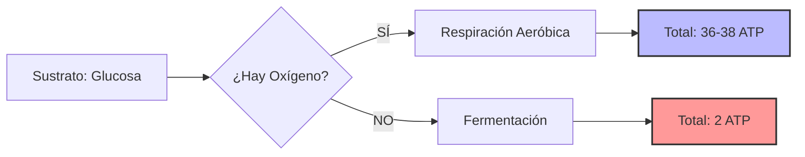

# U01bis: Metabolismo y Transformación de Energía

## 📹 Video de la Lección

**Enlace:** [Metabolismo y Transformación de Energía](https://www.youtube.com/watch?v=A7uU9U9U9U9) *(Nota: Enlace de referencia al tema general)*

## 📚 Contenido de la Unidad

### Objetivos de Aprendizaje

Al completar esta unidad, deberás ser capaz de:

- ✅ Definir **metabolismo** (anabolismo y catabolismo).
- ✅ Explicar el papel del **ATP** como moneda energética.
- ✅ Describir las fases de la **Fotosíntesis** (luminosa y oscura).
- ✅ Analizar las etapas de la **Respiración Celular** (Glucólisis, Ciclo de Krebs, Cadena de transporte).
- ✅ Comparar la eficiencia energética entre respiración aeróbica y **fermentación**.

---

### 1. Conceptos Fundamentales de Metabolismo

El metabolismo es el conjunto de reacciones químicas en la célula.

| Proceso | Descripción | Energía | Ejemplo |
|---------|-------------|---------|---------|
| **Anabolismo** | Síntesis de moléculas complejas a partir de simples. | Consume energía (ATP). | Fotosíntesis, Síntesis de proteínas. |
| **Catabolismo** | Degradación de moléculas complejas a simples. | Libera energía (ATP). | Respiración celular, Glucólisis. |

---

### 2. Fotosíntesis: Captura de Energía Solar

Ocurre en los **cloroplastos** de plantas y algas.

#### Fase Luminosa (en los tilacoides):
- Requiere luz.
- Se rompe el agua (**Fotólisis**) liberando **Oxígeno**.
- Se produce **ATP** y **NADPH**.

#### Fase Oscura / Ciclo de Calvin (en el estroma):
- No requiere luz directa (usa la energía de la fase luminosa).
- Se fija el **CO₂** para producir **Glucosa** (C₆H₁₂O₆).

---

### 3. Respiración Celular: Obtención de ATP

Proceso catabólico para extraer energía de la glucosa.

1. **Glucólisis (en el Citosol):**
   - La glucosa se rompe en 2 piruvatos.
   - Ganancia neta: **2 ATP**. (No requiere oxígeno).

2. **Ciclo de Krebs (en la Matriz Mitocondrial):**
   - El piruvato entra en la mitocondria.
   - Libera **CO₂** y produce acarreadores de electrones (NADH, FADH₂).
   - Ganancia: **2 ATP**.

3. **Cadena de Transporte y Fosforilación (en la Cresta Mitocondrial):**
   - Los electrones pasan por proteínas de membrana.
   - El **Oxígeno** es el aceptor final (se forma agua).
   - Ganancia: **~32-34 ATP**.

---

### 4. Fermentación (Vía Anaeróbica)

Si no hay oxígeno, la célula solo realiza Glucólisis y luego fermentación.
- **Láctica:** Produce ácido láctico (en músculos humanos o bacterias del yogur).
- **Alcohólica:** Produce etanol y CO₂ (levaduras del pan/vino).
- **Rendimiento:** Solo **2 ATP** por glucosa (muy ineficiente comparado con los 36-38 del sistema aeróbico).

---

### 🛠️ Balance Energético

### Errores Comunes en el NMT

> [!WARNING]
> - **¡Cuidado!** La fase oscura de la fotosíntesis SI puede ocurrir de día; su nombre solo indica que no requiere luz *directamente*.
> - El **Oxígeno** que respiramos proviene de la fotólisis del agua en la fotosíntesis, NO del CO₂.
> - La **fermentación** ocurre íntegramente en el citoplasma, nunca entra en la mitocondria.

## 📝 Resumen

- El **ATP** almacena energía en sus enlaces de fosfato.
- La **fotosíntesis** convierte energía lumínica en química (glucosa).
- la **respiración celular** convierte la energía de la glucosa en ATP.
- La presencia de **Oxígeno** multiplica por 18 la eficiencia energética de la célula.

## 🔗 Recursos Adicionales

- Simulador de respiración celular: [BioDigital](https://www.biodigital.com)
- Animación de la ATP Sintasa.

## ✅ Autoevaluación

- [ ] ¿En qué orgánulo ocurre el ciclo de Krebs?
- [ ] ¿Cuál es el producto de desecho de la fase luminosa de la fotosíntesis?
- [ ] ¿Cuántos ATP netos produce la glucólisis?
- [ ] ¿Por qué nos duelen los músculos tras ejercicio intenso sin oxígeno? (Fermentación láctica).

---

**Última actualización:** Enero 2026
**Fuente:** Programa oficial NMT 2026 - Biología Celular
