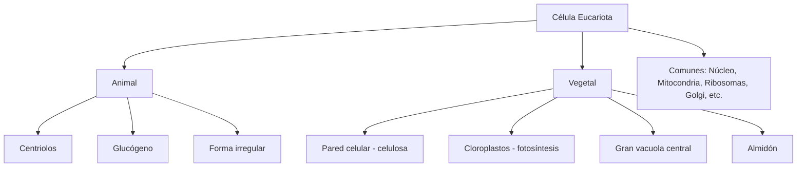
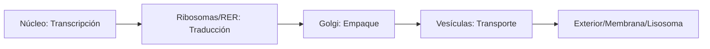

# U02: Estructura y Funcionamiento de Células Eucariotas

## 📹 Video de la Lección

**Enlace:** [Estructura y Funcionamiento de Células Eucariotas](https://www.youtube.com/watch?v=o40iVQflTTw)

## 📚 Contenido de la Unidad

### Objetivos de Aprendizaje

Al completar esta unidad, deberás ser capaz de:

- ✅ Identificar los componentes principales de una célula eucariota.
- ✅ Describir la función de cada orgánulo celular.
- ✅ Comparar las estructuras de las células animales y vegetales.
- ✅ Comprender el modelo de mosaico fluido de la membrana plasmática.
- ✅ Resolver preguntas tipo NMT sobre citología.

---

### 1. La Célula Eucariota: Conceptos Clave

A diferencia de las procariotas, las células eucariotas poseen un **núcleo definido** por una membrana y orgánulos membranosos especializados.

#### Membrana Plasmática (Modelo de Mosaico Fluido)
- **Estructura:** Bicapa de fosfolípidos con proteínas incrustadas, colesterol y carbohidratos.
- **Función:** Barrera selectiva, transporte de sustancias y comunicación celular.

---

### 2. Orgánulos Celulares y sus Funciones

| Orgánulo | Función Principal | Analogía |
|----------|-------------------|----------|
| **Núcleo** | Almacena ADN, control celular. | Centro de mando |
| **Mitocondria** | Respiración celular, síntesis de ATP. | Central eléctrica |
| **Ribosomas** | Síntesis de proteínas. | Fábrica |
| **Rer. Endoplásmico Rugoso (RER)** | Transporte y síntesis proteica (con ribosomas). | Cinta transportadora |
| **Rer. Endoplásmico Liso (REL)** | Síntesis de lípidos, detoxificación. | Refinería |
| **Aparato de Golgi** | Modificación, empaque y envío de proteínas. | Oficina de correos |
| **Lisosomas** | Digestión intracelular (enzimas hidrolíticas). | Planta de reciclaje |
| **Citoesqueleto** | Forma celular, movimiento y transporte interno. | Vigas y carreteras |

---

### 3. Comparación: Célula Animal vs. Vegetal

#### Diferencias Clave:

| Característica | Célula Animal | Célula Vegetal |
|----------------|---------------|----------------|
| **Pared Celular** | Ausente | Presente (Celulosa) |
| **Cloroplastos** | Ausente | Presente |
| **Vacuolas** | Pequeñas y temporales | Gran vacuola central (Turgencia) |
| **Reserva Energética** | Glucógeno | Almidón |
| **Centriolos** | Presentes | Ausentes (en la mayoría) |

---

### 4. Ciclo de Vida de las Proteínas

---

### Errores Comunes en el NMT

> [!WARNING]
> **No olvides:**
> - Las **mitocondrias** están presentes en AMBAS células (animal y vegetal). No pienses que las plantas solo tienen cloroplastos.
> - La **pared celular** es externa a la membrana plasmática.
> - Los **ribosomas** NO tienen membrana (también están en procariotas).

## 📝 Resumen

- La célula eucariota es compartimentada.
- El **núcleo** es el cerebro, las **mitocondrias** el motor, y el **Golgi** la logística.
- Las plantas se distinguen por su **pared celular** rígida y **cloroplastos**.
- La comunicación se da a través de la **membrana selectiva**.

## 🔗 Recursos Adicionales

- Video de la lección: https://www.youtube.com/watch?v=o40iVQflTTw
- Tour virtual por la célula: [Learn.Genetics](https://learn.genetics.utah.edu/)
- Atlas de Histología: [MMEG](https://mmeg.ucm.es/)

## ✅ Autoevaluación

- [ ] ¿Cuál es la función principal de los lisosomas?
- [ ] ¿Qué orgánulo realiza la fotosíntesis y en qué células se encuentra?
- [ ] Explica la diferencia entre RER y REL.
- [ ] ¿Qué molécula compone principalmente la pared celular vegetal?
- [ ] ¿Por qué se dice que la membrana es un "mosaico fluido"?

---

**Última actualización:** Enero 2026
**Fuente:** Programa oficial NMT 2026 - UCEQA
