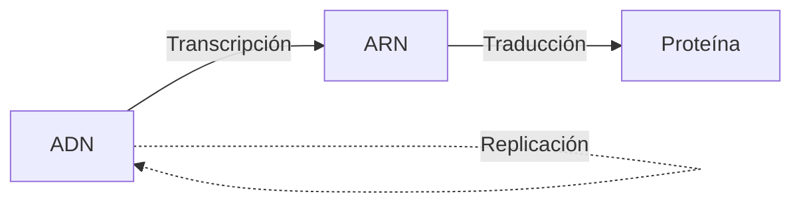
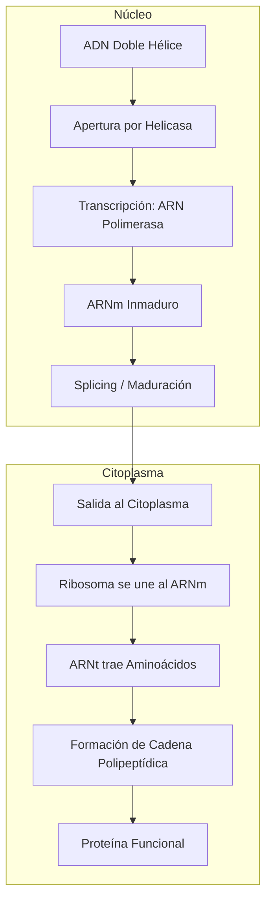

# U03: Preservación e Implementación de Información Hereditaria

## 📹 Video de la Lección

**Enlace:** [Genética: Preservación e Implementación de Información Hereditaria](https://www.youtube.com/watch?v=PlzR_oVjR8U)

## 📚 Contenido de la Unidad

### Objetivos de Aprendizaje

Al completar esta unidad, deberás ser capaz de:

- ✅ Explicar el proceso de **replicación del ADN** y su importancia.
- ✅ Describir las etapas de la **transcripción** (síntesis de ARN).
- ✅ Comprender el mecanismo de la **traducción** (síntesis de proteínas).
- ✅ Conocer las características del **código genético**.
- ✅ Identificar los tipos de **mutaciones** y sus efectos.

---

### 1. Replicación del ADN (Preservación)

Es el proceso por el cual el ADN crea una copia exacta de sí mismo antes de la división celular.

- **Mecanismo:** Semiconservativo (cada nueva doble hélice tiene una cadena vieja y una nueva).
- **Enzimas clave:**
  - **Helicasa:** "Abre" la doble hélice.
  - **ADN Polimerasa:** Añade nuevos nucleótidos complementarios (A-T, G-C).
  - **Ligasa:** Une los fragmentos de ADN.

---

### 2. Implementación: Del Gen a la Proteína (El Dogma Central)

#### Transcripción (En el Núcleo)
El ADN sirve como molde para sintetizar **ARNm** (ARN mensajero).
- Enzima: **ARN Polimerasa**.
- Regla de complementariedad: A-**U**, T-A, G-C, C-G.

#### Traducción (En los Ribosomas)
El ARNm se "lee" para construir una cadena de aminoácidos.
- **Codón:** Grupo de 3 nucleótidos en el ARNm que codifica un aminoácido.
- **Anticodón:** Secuencia en el **ARNt** (ARN de transferencia) que reconoce al codón.

---

### 3. El Código Genético

Es el "diccionario" que traduce nucleótidos a aminoácidos.

- **Características:**
  1. **Triplete:** 3 bases = 1 codón.
  2. **Universal:** Es el mismo para casi todos los seres vivos.
  3. **Degenerado:** Varios codones pueden codificar el mismo aminoácido.
  4. **No solapado:** Se lee de 3 en 3 sin saltos.

---

### 4. Mutaciones: Alteraciones de la Información

Son cambios permanentes en la secuencia de nucleótidos del ADN.

| Tipo | Descripción | Ejemplo |
|------|-------------|---------|
| **Génicas (Puntuales)** | Cambio en un solo nucleótido. | Sustitución, Inserción, Deleción. |
| **Cromosómicas** | Afectan la estructura del cromosoma. | Duplicación, Inversión, Translocación. |
| **Genómicas** | Cambio en el número de cromosomas. | Trisomía 21 (Síndrome de Down). |

> [!WARNING]
> **Mutaciones por desplazamiento (Frameshift):** Las inserciones o deleciones que no son múltiplos de 3 cambian toda la lectura posterior, alterando gravemente la proteína.

---

### 🛠️ Procesos Moleculares

### Errores Comunes en el NMT

> [!CAUTION]
> **¡Cuidado con la complementariedad!**
> - En la **replicación** (ADN-ADN): A va con **T**.
> - En la **transcripción** (ADN-ARN): A va con **U** (Uracilo). No hay Timina en el ARN.

## 📝 Resumen

- El ADN se **replica** para heredar la información.
- El ADN se **transcribe** a ARNm para enviar órdenes.
- El ARNm se **traduce** a proteínas en los ribosomas.
- El **código genético** es la clave de traducción.
- Las **mutaciones** generan variabilidad (pero también enfermedades).

## 🔗 Recursos Adicionales

- Simulador de síntesis de proteínas: [PhET Interactive Simulations](https://phet.colorado.edu/)
- Video detallado: https://www.youtube.com/watch?v=PlzR_oVjR8U
- Tabla interactiva del código genético: [NCBI](https://www.ncbi.nlm.nih.gov/)

## ✅ Autoevaluación

- [ ] ¿Cuál es la diferencia entre un codón y un anticodón?
- [ ] ¿Qué enzima es responsible de la síntesis de ARNm?
- [ ] Explica por qué el código genético es "degenerado".
- [ ] ¿Qué ocurre en una mutación por deleción?
- [ ] ¿En qué parte de la célula ocurre la traducción?

---

**Última actualización:** Enero 2026
**Fuente:** Programa oficial NMT 2026 - UCEQA
