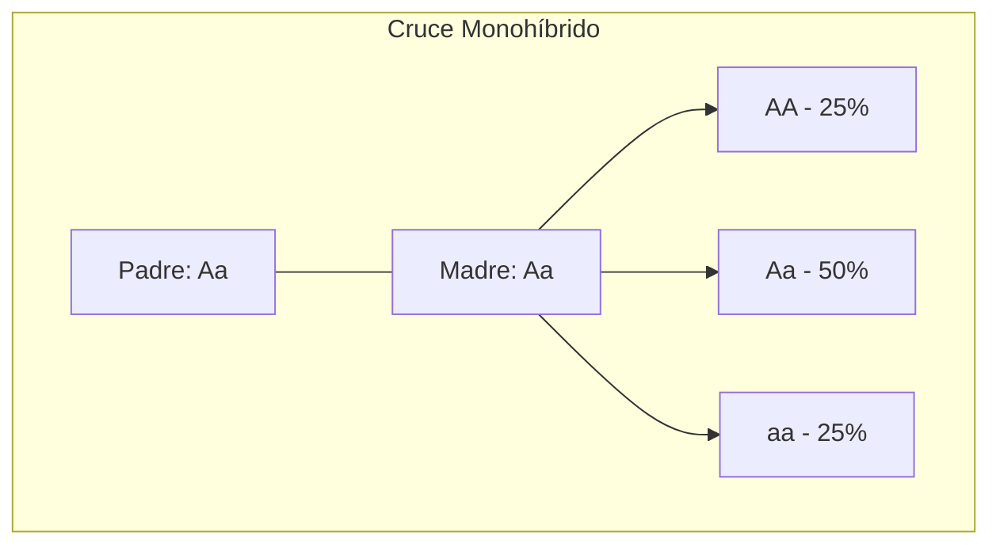

# U04: Patrones de Herencia y Variabilidad

## 📹 Video de la Lección

**Enlace:** [Patrones de Herencia y Variabilidad](https://www.youtube.com/watch?v=KLkQGfTzsfE)

## 📚 Contenido de la Unidad

### Objetivos de Aprendizaje

Al completar esta unidad, deberás ser capaz de:

- ✅ Aplicar las **Leyes de Mendel** para resolver cruces genéticos.
- ✅ Comprender la herencia ligada al sexo y sus enfermedades (Hemofilia, Daltonismo).
- ✅ Explicar la **herencia ligada** de Morgan y el efecto del **crossing-over**.
- ✅ Diferenciar entre interacción de genes alélicos y no alélicos.
- ✅ Distinguir entre **variabilidad modificacional** (no hereditaria) y **mutacional** (hereditaria).

---

### 1. Las Leyes de Mendel (Herencia Monohíbrida y Dihíbrida)

Gregor Mendel estableció las bases de la genética con sus experimentos en guisantes (*Pisum sativum*).

1.  **Ley de la Uniformidad (1ª Ley):** Al cruzar dos razas puras (AA x aa), toda la descendencia F1 es igual entre sí (Aa).
2.  **Ley de la Segregación (2ª Ley):** Al cruzar la F1 entre sí (Aa x Aa), los rasgos se separan en proporción **3:1** (fenotipo) o **1:2:1** (genotipo).
3.  **Ley de la Independencia (3ª Ley):** Los rasgos diferentes se heredan de forma independiente (ej. color y forma), resultando en una proporción **9:3:3:1** en la F2 (solo si los genes están en cromosomas diferentes).

---

### 2. Genética de Morgan: Herencia Ligada y Crossing-over

Thomas Morgan demostró que la 3ª Ley de Mendel no siempre se cumple.

- **Herencia Ligada:** Genes que están en el mismo cromosoma tienden a heredarse juntos (forman un **grupo de ligamiento**).
- **Crossing-over (Sobrecruzamiento):** Intercambio de fragmentos entre cromosomas homólogos durante la meiosis. Esto rompe el ligamiento y crea nuevas combinaciones genéticas.
- **Distancia génica:** Cuanto más lejos estén dos genes en un cromosoma, más probable es que ocurra crossing-over entre ellos.

---

### 3. Herencia Ligada al Sexo

Se refiere a genes situados en los cromosomas sexuales (X e Y).

- **Herencia ligada al X (Recesiva):** 
  - **Daltonismo:** Dificultad para distinguir colores.
  - **Hemofilia:** Fallo en la coagulación sanguínea.
  - *Nota:* Los hombres (XY) la padecen con un solo gen afectado; las mujeres (XX) suelen ser portadoras.
- **Holándrica (Ligada al Y):** Solo se transmite de padres a hijos varones.

---

### 4. Interacción de Genes No Alélicos

A veces un carácter no depende de un solo gen, sino de varios:
- **Complementariedad:** Dos genes dominantes deben estar juntos para que aparezca un rasgo.
- **Epistasis:** Un gen enmascara la expresión de otro gen totalmente distinto.
- **Polimeria:** Varios genes suman su efecto para un solo rasgo (ej. color de piel, altura).

---

### 5. Variabilidad: No Hereditaria vs. Hereditaria

| Tipo de Variabilidad | Causa | ¿Es hereditaria? |
|----------------------|-------|------------------|
| **Modificacional** | Factores ambientales (luz, dieta). | **No** (solo afecta al fenotipo). |
| **Mutacional** | Cambios en el ADN (radiación, virus). | **Sí** (afecta al genotipo). |

- **Norma de Reacción:** El límite de variabilidad modificacional que permite un genotipo.

---

### 📊 Cuadros de Punnett y Cruces

### Errores Comunes en el NMT

> [!WARNING]
> **¡No olvides!**
> - La **3ª Ley de Mendel** SOLO se aplica a genes en cromosomas DIFERENTES.
> - Si te dicen que dos genes están "ligados", usa las reglas de Morgan, no las de Mendel.
> - En problemas de hemofilia, siempre dibuja los cromosomas X e Y para no equivocarte.

## 📝 Resumen

- **Mendel:** 3:1 (mono) y 9:3:3:1 (di).
- **Morgan:** Los genes viajan en paquetes (cromosomas) pero pueden saltar (crossing-over).
- **Herencia ligada al sexo:** Afecta más a hombres (hemofilia/daltonismo).
- **Ambiente:** Cambia el fenotipo dentro de una "norma de reacción".

## 🔗 Recursos Adicionales

- Generador de Cuadros de Punnett: [Punnett Square Calculator](https://www.scienceprimer.com/)
- Video de la lección: https://www.youtube.com/watch?v=KLkQGfTzsfE
- Laboratorio virtual de Drosophila: [Virtual FlyLab](http://www.sciencecourseware.org/)

## ✅ Autoevaluación

- [ ] ¿Cuál es la proporción fenotípica de un cruce monohíbrido (Aa x Aa)?
- [ ] ¿Por qué la hemofilia es más común en hombres?
- [ ] ¿Qué proceso permite que genes ligados se separen?
- [ ] Define "genotipo" y "fenotipo".
- [ ] ¿Qué pasa si una mutación ocurre en una célula somática vs. una célula germinal?

---

**Última actualización:** Enero 2026
**Fuente:** Programa oficial NMT 2026 - UCEQA
